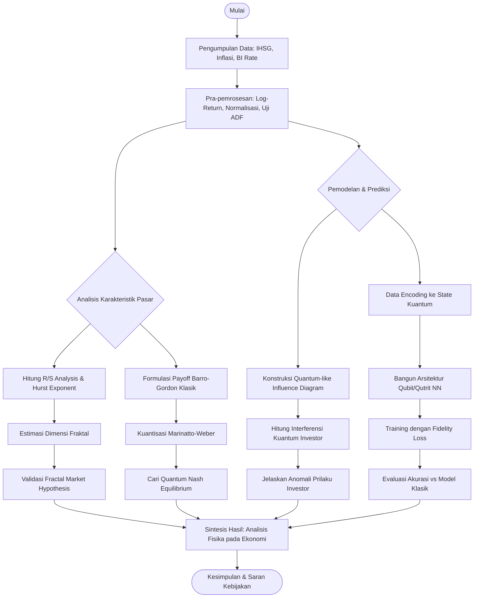

# Bab 3: Metodologi Penelitian

Bab ini menguraikan tahapan sistematis yang dilakukan untuk mencapai tujuan penelitian, mulai dari pengumpulan data, pra-pemrosesan, hingga implementasi model matematika dan komputasi. Pendekatan yang digunakan adalah **Ekonofisika Komputasional**, di mana data empiris keuangan dianalisis menggunakan formalisme fisika statistik dan mekanika kuantum.

## 3.1 Desain Penelitian
Penelitian ini bersifat **kuantitatif-komputasional**. Metode ini tidak melakukan eksperimen laboratorium fisik, melainkan melakukan simulasi numerik dan pemodelan matematis pada "laboratorium pasar" menggunakan data sekunder.

## 3.2 Pengumpulan Data
Data yang digunakan adalah data sekunder time-series harian dan bulanan yang diperoleh dari sumber terbuka:
1.  **Data Pasar Saham (IHSG & Saham LQ45):**
    *   *Sumber:* Yahoo Finance / Bursa Efek Indonesia (IDX).
    *   *Periode:* 5-10 tahun terakhir (mencakup periode krisis seperti COVID-19 untuk melihat efek ekor gemuk).
    *   *Variabel:* Harga Penutupan (*Closing Price*), Volume Perdagangan.
2.  **Data Makroekonomi:**
    *   *Sumber:* Bank Indonesia & Badan Pusat Statistik (BPS).
    *   *Variabel:* Tingkat Inflasi Bulanan, Suku Bunga Acuan (BI-Rate).

## 3.3 Tahapan Penelitian

### 3.3.1 Pra-pemrosesan Data (Preprocessing)
Sebelum masuk ke pemodelan fisika, data mentah harus diolah agar memenuhi syarat matematis:
1.  **Log-Return Calculation:** Mengubah harga mutlak menjadi *log-return* untuk mendekati stasioneritas.
    $$ r_t = \ln(P_t) - \ln(P_{t-1}) $$
2.  **Uji Stasioneritas:** Menggunakan *Augmented Dickey-Fuller (ADF) Test*.
3.  **Normalisasi:** Scaling data ke rentang $[0,1]$ atau $[-1,1]$ untuk input Neural Networks (QNN).

### 3.3.2 Analisis Fraktal dan Hurst Exponent (Tujuan 2)
Untuk mengukur "kekasaran" pasar dan memvalidasi *Fractal Market Hypothesis*:
1.  **Rescaled Range (R/S) Analysis:** Menghitung rentang fluktuasi data yang dinormalisasi terhadap standar deviasi pada berbagai skala waktu.
2.  **Estimasi Hurst Exponent ($H$):** Melakukan regresi linear pada plot log-log dari R/S.
    *   Jika $H = 0.5$: Pasar acak (Random Walk/Brownian Motion).
    *   Jika $0.5 < H < 1$: Pasar memiliki memori panjang (Persisten/Trend).
    *   Jika $0 < H < 0.5$: Pasar *anti-persisten* (Mean-reverting).
3.  **Dimensi Fraktal ($D$):** Dihitung dengan rumus $D = 2 - H$.

### 3.3.3 Pemodelan Kognisi Kuantum (Tujuan 1)
Memodelkan keputusan investor yang tidak rasional:
1.  **Konstruksi Ruang Hilbert:** Mendefinisikan basis state keputusan $|	ext{Beli}
angle$ dan $|	ext{Jual}
angle$.
2.  **Quantum-like Influence Diagram (QLID):** Membangun jaringan probabilitas yang menyertakan amplitudo kompleks.
3.  **Interference Term Calculation:** Menghitung suku interferensi ($2\sqrt{P_A P_B} \cos \theta$) yang menyebabkan penyimpangan dari probabilitas klasik (pelanggaran *Sure Thing Principle*).

### 3.3.4 Game Theory Kuantum: Model Barro-Gordon (Tujuan 3)
Merumuskan strategi kebijakan moneter:
1.  **Matriks Payoff Klasik:** Menyusun fungsi utilitas Bank Sentral (menjaga inflasi rendah) vs Masyarakat (ekspektasi upah/harga).
2.  **Kuantisasi Marinatto-Weber:**
    *   Menetapkan state awal $|{\psi}_{in}\rangle = |00\rangle$.
    *   Menerapkan operator unitaris $\hat{U}_A$ (Bank Sentral) dan $\hat{U}_B$ (Publik).
    *   Menghitung ekspektasi payoff menggunakan operator densitas $\rho$.
3.  **Pencarian Nash Equilibrium:** Mencari strategi (parameter rotasi kuantum) di mana tidak ada pihak yang mau mengubah strateginya secara sepihak.

### 3.3.5 Prediksi Menggunakan Qubit/Qutrit Neural Networks (Tujuan 4)
Implementasi algoritma *machine learning* terinspirasi kuantum:
1.  **Encoding:** Mengubah data klasik (harga saham) menjadi state kuantum (Amplitudo/Phase Encoding).
2.  **Arsitektur QNN:** Membangun layer jaringan saraf yang mensimulasikan gerbang kuantum (rotasi qubit/qutrit).
3.  **Training:** Menggunakan *Fidelity-based Loss Function* untuk meminimalkan error prediksi.
4.  **Evaluasi:** Membandingkan akurasi (RMSE/MAPE) QNN dengan model klasik (LSTM/ARIMA).

## 3.4 Alat Bantu Komputasi
Penelitian ini akan dilakukan menggunakan bahasa pemrograman **Python** dengan pustaka pendukung:
*   **Analisis Numerik:** `NumPy`, `Pandas`, `SciPy`.
*   **Simulasi Kuantum:** `QuTiP` (Quantum Toolbox in Python) atau `PennyLane`.
*   **Deep Learning:** `TensorFlow` atau `PyTorch`.
*   **Visualisasi:** `Matplotlib`, `Seaborn`.

## 3.5 Diagram Alir Penelitian (Flowchart)

Berikut adalah alur pengerjaan tesis dari awal hingga akhir:

