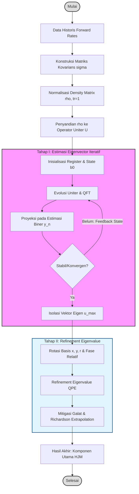

# Metodologi Penelitian: Implementasi qPCA pada Model Heath-Jarrow-Morton (HJM)

Dokumen ini merinci urutan metodologi yang digunakan dalam paper *"Toward pricing financial derivatives with an IBM quantum computer"* (Phys. Rev. Research 3, 013167), mulai dari akuisisi data hingga ekstraksi hasil pada platform komputasi kuantum.

## 1. Persiapan Data dan Penyandian (Classical Setup)
Tahap awal melibatkan pengolahan data historis pasar keuangan untuk membangun fondasi stokastik model.
- **Konstruksi Matriks Kovarians:** Menghitung matriks korelasi silang $\sigma$ dari perubahan *forward rates*.
- **Normalisasi Density Matrix:** Mengubah matriks menjadi $\rho$ dengan syarat $\text{tr}[\rho] = 1$ agar dapat dipetakan ke sirkuit kuantum.
- **Unitary Encoding:** Menyandi matriks $\rho$ ke dalam operator evolusi waktu $U = e^{2\pi i \rho}$.

## 2. Tahap I: Estimasi Eigenvector Iteratif
Karena vektor eigen tidak diketahui secara *a priori*, digunakan protokol iteratif untuk mengisolasinya.
- **Inisialisasi:** Memulai dengan *random state* $|b_0\rangle$.
- **Protokol Iteratif:** Menerapkan evolusi uniter dan proyeksi pada estimasi biner $n$-bit untuk eigenvalue tertinggi.
- **Konvergensi:** Hasil pengukuran diumpankan kembali (*feedback*) sebagai input iterasi berikutnya hingga vektor eigen $|u_{max}\rangle$ stabil.

## 3. Estimasi Fase dan Refinement (Quantum Execution)
Setelah vektor eigen kasar didapatkan, dilakukan penyempurnaan akurasi.
- **Rotasi Basis:** Melakukan pengukuran pada basis $x, y, \text{dan } r$ untuk menentukan fase kompleks relatif antar qubit.
- **Tahap II (Refinement):** Menggunakan vektor eigen yang telah dikonvergensi sebagai input untuk algoritma *Quantum Phase Estimation* (QPE) dengan presisi bit yang lebih tinggi guna mendapatkan eigenvalue $\lambda_{max}$ yang akurat.

## 4. Mitigasi Galat dan Hasil Akhir
Langkah terakhir untuk menjamin integritas data pada sistem NISQ (*Noisy Intermediate-Scale Quantum*).
- **Error Mitigation:** Menggunakan *Richardson's extrapolation* dan teknik mitigasi galat pembacaan (*readout error mitigation*).
- **Outcome Akhir:** Ekstraksi komponen utama (eigenvalue dan eigenvector) yang akan digunakan sebagai input profil volatilitas dalam simulasi model HJM untuk penetapan harga derivatif.

## 5. Diagram Alir Metodologi

