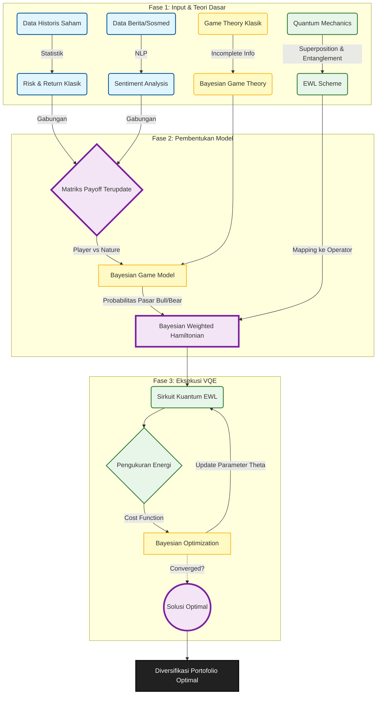

```mermaid
graph TD
    %% Styling Definitions
    classDef finance fill:#e1f5fe,stroke:#01579b,stroke-width:2px;
    classDef math fill:#fff9c4,stroke:#fbc02d,stroke-width:2px;
    classDef physics fill:#e8f5e9,stroke:#2e7d32,stroke-width:2px;
    classDef core fill:#f3e5f5,stroke:#7b1fa2,stroke-width:4px;
    classDef output fill:#212121,stroke:#000,stroke-width:2px,color:#fff;

    %% --- PHASE 1: TITIK MENYEBAR (INPUT DOMAINS) ---
    subgraph INPUTS [Fase 1: Input & Teori Dasar]
        A1(Data Historis Saham) -->|Statistik| A2(Risk & Return Klasik)
        B1(Data Berita/Sosmed) -->|NLP| B2(Sentiment Analysis)
        C1(Game Theory Klasik) -->|Incomplete Info| C2(Bayesian Game Theory)
        D1(Quantum Mechanics) -->|Superposition & Entanglement| D2(EWL Scheme)
    end

    %% --- PHASE 2: INTEGRASI DATA & MODEL ---
    subgraph MODELING [Fase 2: Pembentukan Model]
        A2 & B2 -->|Gabungan| E{Matriks Payoff Terupdate}
        E -->|Player vs Nature| F[Bayesian Game Model]
        C2 --> F
        F -->|Probabilitas Pasar Bull/Bear| G[Bayesian Weighted Hamiltonian]
        D2 -->|Mapping ke Operator| G
    end

    %% --- PHASE 3: EKSEKUSI KUANTUM ---
    subgraph QUANTUM [Fase 3: Eksekusi VQE]
        G --> H(Sirkuit Kuantum EWL)
        H --> I{Pengukuran Energi}
        I -->|Cost Function| J[Bayesian Optimization]
        J -->|Update Parameter Theta| H
        J -.->|Converged?| K((Solusi Optimal))
    end

    %% --- PHASE 4: HASIL AKHIR ---
    K --> L[Diversifikasi Portofolio Optimal]

    %% Applying Classes
    class A1,A2,B1,B2 finance;
    class C1,C2,F,J math;
    class D1,D2,H,I physics;
    class E,G,K core;
    class L output;
```
