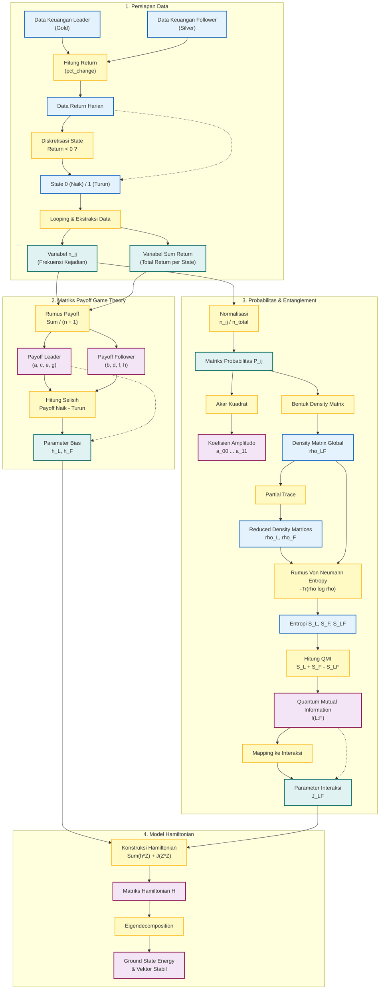

```mermaid
graph TD
    %% Styles
    classDef data fill:#e3f2fd,stroke:#1565c0,stroke-width:2px;
    classDef process fill:#fff9c4,stroke:#fbc02d,stroke-width:2px;
    classDef param fill:#e0f2f1,stroke:#00695c,stroke-width:2px;
    classDef result fill:#f3e5f5,stroke:#880e4f,stroke-width:2px;

    subgraph Data_Preparation [1. Persiapan Data]
        InputL["Data Keuangan Leader<br/>(Gold)"]:::data
        InputF["Data Keuangan Follower<br/>(Silver)"]:::data
        
        InputL & InputF --> CalcReturn["Hitung Return<br/>(pct_change)"]:::process
        CalcReturn --> Returns["Data Return Harian"]:::data
        
        Returns --> Discretize["Diskretisasi State<br/>Return < 0 ?"]:::process
        Discretize --> States["State 0 (Naik) / 1 (Turun)"]:::data
        
        States --> Aggregation["Looping & Ekstraksi Data"]:::process
        Aggregation --> Nij["Variabel n_ij<br/>(Frekuensi Kejadian)"]:::param
        Aggregation --> SumRet["Variabel Sum Return<br/>(Total Return per State)"]:::param
    end

    subgraph Payoff_Matrix [2. Matriks Payoff Game Theory]
        Nij & SumRet --> CalcPayoff["Rumus Payoff<br/>Sum / (n + 1)"]:::process
        CalcPayoff --> PayoffL["Payoff Leader<br/>(a, c, e, g)"]:::result
        CalcPayoff --> PayoffF["Payoff Follower<br/>(b, d, f, h)"]:::result
        
        PayoffL & PayoffF --> CalcBias["Hitung Selisih<br/>Payoff Naik - Turun"]:::process
        CalcBias --> ParamH["Parameter Bias<br/>h_L, h_F"]:::param
    end

    subgraph Quantum_State [3. Probabilitas & Entanglement]
        Nij --> CalcProb["Normalisasi<br/>n_ij / n_total"]:::process
        CalcProb --> ProbMat["Matriks Probabilitas P_ij"]:::param
        
        ProbMat --> CalcAmp["Akar Kuadrat"]:::process
        CalcAmp --> Amps["Koefisien Amplitudo<br/>a_00 ... a_11"]:::result
        
        ProbMat --> CalcRho["Bentuk Density Matrix"]:::process
        CalcRho --> Rho["Density Matrix Global<br/>rho_LF"]:::data
        
        Rho --> PartialTrace["Partial Trace"]:::process
        PartialTrace --> RedRho["Reduced Density Matrices<br/>rho_L, rho_F"]:::data
        
        RedRho & Rho --> CalcEntropy["Rumus Von Neumann Entropy<br/>-Tr(rho log rho)"]:::process
        CalcEntropy --> Entropies["Entropi S_L, S_F, S_LF"]:::data
        
        Entropies --> CalcQMI["Hitung QMI<br/>S_L + S_F - S_LF"]:::process
        CalcQMI --> QMI["Quantum Mutual Information<br/>I(L:F)"]:::result
        
        QMI --> MapJ["Mapping ke Interaksi"]:::process
        MapJ --> ParamJ["Parameter Interaksi<br/>J_LF"]:::param
    end

    subgraph Hamiltonian_Model [4. Model Hamiltonian]
        ParamH & ParamJ --> ConstH["Konstruksi Hamiltonian<br/>Sum(h*Z) + J(Z*Z)"]:::process
        ConstH --> MatH["Matriks Hamiltonian H"]:::result
        
        MatH --> EigenSol["Eigendecomposition"]:::process
        EigenSol --> GroundState["Ground State Energy<br/>& Vektor Stabil"]:::result
    end

    %% Linkages
    Returns -.-> States
    PayoffL -.-> ParamH
    QMI -.-> ParamJ
```