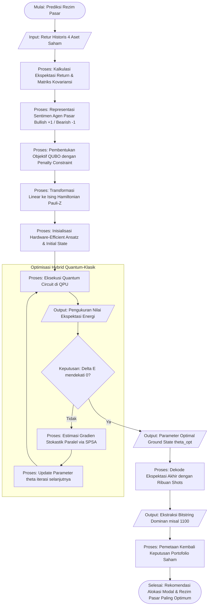

# Rencana Penjelasan Analitik: Prediksi Rezim Pasar menggunakan Algoritma VQE dan Ising Hamiltonian

Dokumen ini memuat penjelasan analitik lengkap mengenai bagaimana Quantum Bayesian Game Theory (QBGT) dan pendekatan fisika kuantum digunakan untuk memprediksi rezim pasar. Penjelasan ini mencakup proses end to end, mulai dari ekstraksi parameter Hamiltonian hingga pencarian energi terendah menggunakan Variational Quantum Eigensolver (VQE).

## 1. Pembentukan Ising Hamiltonian dari Model Markowitz

Dalam optimasi portofolio dengan Model Markowitz, tujuan utamanya adalah memilih kombinasi aset yang meminimalkan risiko (variansi) dan memaksimalkan *return*. Kita memodelkan portofolio dengan kumpulan $N$ aset berisiko. Setiap aset memiliki *return* (tingkat keuntungan) $r_1, \dots, r_N$. 

### A. Ekspektasi Return dan Matriks Kovariansi

![[Latex/PakHeru_Presentasi4/Efficient_frontier.png]]
sumber: [[Markowitz_Model_Investment_Portfolio_Optimization.pdf]]

Pertama, dari data pergerakan riil historikal, kita mendefinisikan dua elemen probabilistik utama:
1. **Ekspektasi *Return*** untuk setiap aset $i$ dirumuskan sebagai $\mu_i = E[r_i]$. Jika direpresentasikan dalam notasi vektor, $\mu = (\mu_1, \dots, \mu_N)^T$.
2. **Matriks Kovariansi**, $\Sigma = [\sigma_{ij}]$, yang mengukur pergerakan korelasi risiko antara aset $i$ dan $j$, dengan $\sigma_{ij} = \text{Cov}(r_i, r_j)$.

Keputusan kepemilikan aset direpresentasikan oleh vektor *weight* biner $x = (x_1, \dots, x_N)^T$, di mana $x_i \in \{0, 1\}$. Jika $x_i = 1$, aset ke-$i$ dipilih dalam portofolio, dan $0$ jika tidak.

Berdasarkan definisi tersebut, sifat agregat keseluruhan dari portofolio dapat dijabarkan sebagai berikut:
- **Ekspektasi *Return* Portofolio**: $E[r_p] = \sum_{i=1}^N \mu_i x_i = \mu^T x$
- **Variansi (Risiko) Portofolio**: $\text{Var}(r_p) = \sum_{i=1}^N \sum_{j=1}^N \sigma_{ij} x_i x_j = x^T \Sigma x$

### B. Formulasi Objektif Quadratic Unconstrained Binary Optimization (QUBO)

Objektif dari Model Markowitz adalah meminimalkan risiko (variansi) sekaligus memaksimalkan keuntungan (*return*). Hal ini setara dengan masalah minimalisasi:
$$ \min_{x} \left( w \cdot \text{Var}(r_p) - (1-w) \cdot E[r_p] \right) $$
Atau dalam bentuk sigma bersacht (*scalarization*):
$$ \min_x \quad w \sum_{i,j} \sigma_{ij} x_i x_j - (1-w) \sum_i \mu_i x_i $$
Di mana $w$ adalah parameter toleransi risiko / penghindaran risiko (*risk aversion tolerance parameter*, $w \in [0, 1]$). Semakin besar $w$, semakin investor menolak risiko variansi, sementara sebaliknya jika mengejar keuntungan ekstrem.

Algoritma VQE mengoptimasi fungsi ranah tak terbatas (*unconstrained*). Hal ini bermasalah jika kita memiliki batas toleransi investasi tertentu (misalnya, menetapkan portofolio wajib memilih tepat $B$ dari keseluruhan emiten saham, atau $\sum_{i=1}^N x_i = B$). 
Kendala restriktif (*constraint*) tersebut diubah dengan mengkuadratkannya menjadi **suku penalti (*penalty term*)**:
$$ P \left( \sum_{i=1}^N x_i - B \right)^2 $$
Di mana $P$ adalah besaran penalti skalar (*Lagrangian multiplier*) yang nilainya sangat tinggi, sedemikian rupa sehingga bila batasan tersebut dilanggar dalam ruang observasi VQE, objektif keseluruhan langsung dinilai tidak optimum. Maka fungsi batas (*cost function*) keseluruhan dapat digabungkan menjadi formulasi QUBO:
$$ C(x) = w \sum_{i,j} \sigma_{ij} x_i x_j - (1-w) \sum_i \mu_i x_i + P \left( \sum_i x_i - B \right)^2 $$

### C. Pemetaan Transformasi ke Ising Hamiltonian Kuantum ($\hat{H}$)

Formulasi matematis QUBO sebelumnya berinteraksi pada ranah komputasi tradisional biner $\{0, 1\}$. Untuk bisa disimulasikan menggunakan sirkuit bit kuantum (qubit) seperti *Variational Quantum Eigensolver* (VQE), variabel aljabar biner ini $(x_i \in \{0, 1\})$ harus dipetakan menjadi variabel sistem spin fisika statis kuantum atau matriks *observable*: $\hat{Z}_i \in \{+1, -1\}$. Operator $\hat{Z}_i$ mewakili rotasi *qubit* berdasarkan nilai komputasi *Pauli-Z matrix*. 

Oleh karenanya, kita mengaplikasikan persamaan transformasi linear:
$$ x_i = \frac{1 - \hat{Z}_i}{2} $$

Substitusikan formula matriks Pauli-Z ke dalam ekuasi QUBO:
$$ C(Z) = w \sum_{i,j} \sigma_{ij} \left( \frac{1 - \hat{Z}_i}{2} \right) \left( \frac{1 - \hat{Z}_j}{2} \right) - (1-w) \sum_i \mu_i \left( \frac{1 - \hat{Z}_i}{2} \right) + P \left( \sum_i \frac{1 - \hat{Z}_i}{2} - B \right)^2 $$

Dengan menjabarkan setiap ekspansi persamaan polinomial dan mengelompokkan ulang koefisien-koefisien matematis terpisah, kita akan mendiferensiasi mereka atas suku linear ($\hat{Z}_i$), suku kuadratik/kopling korelasi ($\hat{Z}_i \hat{Z}_j$), serta nilai konstanta:
$$ \hat{H} = \sum_{i=1}^N h_i \hat{Z}_i + \sum_{i<j} J_{ij} \hat{Z}_i \hat{Z}_j + \text{konstanta} $$

Kita telah sukses merumuskan **Ising Hamiltonian ($\hat{H}$)** yang sepenuhnya dibentuk oleh operator spin kuantum. Definisi variabel tereduksinya:
- $h_i$ (**bias lokal**): Mewakili bobot interaksi komputasi eigen yang tersintesis dari komponen ekspektasi *return* $\mu_i$, kendali bobot risiko, serta kendala batas anggaran penalti.
- $J_{ij}$ (**kopling resistensi/interaksi**): Kombinasi linier matriks kovariansi (risiko antar saham) dan bobot penalty konstan.

Tujuan dari masalah optimasi portofolio kita kini secara ekuivalen divalidasi oleh "Pencarian konfigurasi spin kuantum pada *Ground State* (Energi Terendah) dari fungsi Ising Hamiltonian." Konfigurasi susunan *steady state* paling stabil dari *observable* merepresentasikan **portofolio dan rezim pasar finansial yang diprediksi paling optimum**.

---

## 2. Paradigma Variational Quantum Eigensolver (VQE)

Karena mencari Hamiltonian *Ground State* setara dengan permasalahan *NP-hard* (seperti Kombinatorial QUBO / TSP), kita menggunakan proyektor komputasi kuantum *hybrid* via **VQE**. VQE melibatkan sirkuit *Parameterized Quantum Circuit* (PQC) serta optimisasi klasik.

### A. Formulasi Fungsi Objektif VQE

Landasan utama kalkulasi dari VQE berakar dari **Prinsip Variasional Schrodinger** (sebagaimana diaplikasikan secara historis melalui metode Rayleigh-Ritz pada fisika kuantum). Prinsip teoretis ini mempostulatkan batas bawah fundamental: untuk sebuah Hamiltonian mekanika independen waktu $\hat{H}$, nilai ekspektasi energi dari sembarang fungsi gelombang percobaan (*trial wavefunction*) termodinamika $|\psi_{trial}\rangle$ akan selalu membatasi energi aktual keadaan dasar sejati (*ground-state energy*) $E_0$ dari atas:
$$ E_0 \leq \frac{\langle \psi_{trial} | \hat{H} | \psi_{trial} \rangle}{\langle \psi_{trial} | \psi_{trial} \rangle} $$

Dalam infrastruktur komputasi kuantum *hybrid* via VQE, kita secara dinamis mengeksplorasi subset fungsi gelombang percobaan yang disuntikkan secara terparameterisasi, diwakili notasi $|\psi(\theta)\rangle$. Representasi state matematis ini secara praktis didesain dengan merangkai gerbang-gerbang logika uniter (*Parameterized Quantum Circuit/Ansatz*) $\hat{U}(\theta)$ yang memodifikasi *ground state* qubit alamiah:
$$ |\psi(\theta)\rangle = \hat{U}(\theta) |0\rangle^{\otimes N} $$
![[Quantum_gates.png]]
sumber: [[VQE_termpaper.pdf]]

Karena mekanisme transformasi gerbang sirkuit kuantum bersifat uniter (mempertahankan probabilitas), maka spektrum state komputasi yang direalisasikan secara absolut teregulasi dinormalisasikan (artinya $\langle \psi(\theta) | \psi(\theta) \rangle = 1$). Dengan utilitas spesifik ini, ketidaksamaan prinsip variasional ekspektasi Schrodinger langsung direduksi dan diformulasikan menjadi fungsional energi parametrik $E(\theta)$:
$$ E(\theta) = \langle \psi(\theta) | \hat{H} | \psi(\theta) \rangle \geq E_0 $$

Untuk merekonstruksi state rezim pasar portofolio yang paling optimum matematis, metodologi *hybrid loop* komputasi kuantum-klasik bertugas mengekstrak estimasi nilai ekspektasi $\langle \hat{H} \rangle$ secara sirkuler dan mengarahkan data pengukurannya pada utilitas optimisasi klasik (seperti gradient-descent). Oleh karena itu, rumusan objektif iterasi komputasional VQE difinalisasi sebagai *fungsi minimasi berkelanjutan*:
$$ \min_{\theta} E(\theta) = \min_{\theta} \langle \psi(\theta) | \hat{H} | \psi(\theta) \rangle $$
![[VQE_scheme.png]]
sumber: [https://quantum.cloud.ibm.com/learning/en/modules/computer-science/vqe#introduction](https://quantum.cloud.ibm.com/learning/en/modules/computer-science/vqe#introduction)
### B. Desain VQE Ansatz (*Hardware-Efficient Ansatz*)

Untuk mengeksplorasi ruang *Hilbert* secara efisien pada perangkat *Noisy Intermediate-Scale Quantum* (NISQ), kita menggunakan *Hardware-Efficient Ansatz* (HEA). Berbeda dengan *chemistry-inspired ansatz* (seperti UCCSD) yang membutuhkan operator fermionik panjang, HEA dibangun secara langsung di ruang '*qubit* komputasi' dengan memprioritaskan gerbang-gerbang (gates) yang secara *native* mudah diimplementasikan oleh prosesor kuantum. Strategi inkremental ini mengurangi kedalaman sirkuit secara signifikan.

Berdasarkan metodologi *Qubit Coupled Cluster* dan blok topologi HEA umum, state gelombang percobaan diformulasikan secara matematis melalui struktur produk fungsi:
$$ |\psi(\theta)\rangle = \hat{U}_{ent}(\tau) |\Phi(\epsilon)\rangle $$

**1. Penyiapan State Kuasi-Independen (*Mean-Field State*)**
Eksplorasi berawal dari *initial state* referensi asimetris $|\Phi(\epsilon)\rangle$ yang dipersiapkan sebagai konfigurasi independen produk state-state qubit tunggal:
$$ |\Phi(\epsilon)\rangle = \bigotimes_{j=1}^N |\phi_j(\epsilon)\rangle $$
Setiap state qubit tunggal direpresentasikan melalui rotasi *Bloch sphere* dengan parameter sudut uniter $\theta_j$ dan fase $\phi_j$:
$$ |\phi_j\rangle = \cos\left(\frac{\theta_j}{2}\right) |\uparrow_j\rangle + e^{i\phi_j} \sin\left(\frac{\theta_j}{2}\right) |\downarrow_j\rangle $$
Fase rotasi individual inilah yang mengendalikan probabilitas amplitudo awal aset/agen untuk diklasifikasikan sebagai *Bullish/Bearish*.

**2. Lapisan Keterbelitan Kuantum (*Entanglement Blocks*)**
Korelasi antar-aset tidak dapat ditangkap oleh *mean-field state*. Pada HEA, lapisan-lapisan *entanglement* ($\hat{U}_{ent}$) diperkenalkan secara berulang melalui topologi blok gerbang multi-qubit padat (*dense blocks*), misalnya jaringan *CNOT* atau gerbang pertukaran (*exchange gates*), yang ditumpuk dengan *Parameterized Rotational Gates* ($R_x, R_y, R_z$). Interaksi kolektif ini menghasilkan ekspansi uniter:
$$ \hat{U}_{ent}(\tau) = \prod_{l=1}^L \left( \hat{U}_{CXP} \prod_{j=1}^N \hat{R}_j(\tau_l) \right) $$
Atau dalam kerangka kerja parametrik langsung seperti *Qubit Coupled Cluster*, *entanglement* ini bisa didefinisikan sebagai rotasi string konjugat Pauli murni (*Pauli strings* $\hat{P}_k$):
$$ \hat{U}_{ent}(\tau) = \prod_{k=1}^{N_{ent}} e^{-i\tau_k \hat{P}_k / 2} $$
Sirkulasi HEA ini menciptakan superposisi massif dari kombinasi state yang menangkap dinamika topologi *Hamiltonian* kopling teoretis ($J_{ij}$) dengan jumlah parameter variabel ($\tau$, $\epsilon$) komputasi seminimum mungkin agar algoritma iteratif terhindar dari fenomena gradien statis memudar (*Barren Plateaus*).

![[VQE_Materials_Theory.png]] sumber: [[VQE_method_a_short_survey.pdf]]

---

## 3. Klasikal Optimisasi VQE dengan Pendekatan *SPSA*

Setelah sirkuit kuantum tereksekusi, nilai ekspektasi energi terukur akan diteruskan ke **Classical Optimizer** untuk meminimalkan *cost function*. Pada perangkat *Noisy Intermediate-Scale Quantum* (NISQ) di dunia nyata, pengukuran pada QPU akan disertai dengan *noise* intrinstik yang dapat dimodelkan menjadi sebuah fungsi output bernoise: $y(\theta) = E(\theta) + \varepsilon$.

Secara konvensional, evaluasi gradien diferensial sirkuit kuantum menggunakan metrik presisi *parameter-shift rule* mengharuskan kalkulasi turunan parsial terhadap setiap parameter bebas secara sekuesial. Jika terdapat $p$ parameter komputasi, ia membutuhkan setidaknya $2p$ evaluasi sirkuit per tahap optimisasi, menghasilkan skala sumber daya komputasional secara global $O(pn)$ (di mana $n$ adalah banyak iterasi *step*). Batasan logistik sirkuit ini menjadi rintangan masif (*bottleneck*) eksponensial pada resolusi sistem berdimensi tinggi.

### A. Mekanisme Simultaneous Perturbation Stochastic Approximation (SPSA)

Sebagai teknik algoritma berbasis resolusi stokastik pada dimensi multivariabel, **SPSA** mengaproksimasi nilai gradien teoretis keseluruhan *hanya dengan konstan dua kali eksekusi sirkuit* per iterasi, memberikan skala penjalan sumber daya reduktif impresif $O(n)$, terlepas dari seberapa masifnya ukuran matriks parameter ansat ($p$). 

Aturan pembaruan (*update rule*) iteratif dari susunan parameter $\theta$ pada fase ke-$k$ mewarisi prinsip turunan dinamis *Gradient Descent* klasik:
$$ \hat{\theta}_{k+1} = \hat{\theta}_k - a_k \hat{g}_k(\hat{\theta}_k) $$
Di mana $a_k$ merepresentasikan hiperparameter laju pembelajaran (*learning rate*) yang meregulasi ukuran langkah optimisasi pada tiap putaran.

SPSA memanfaatkan konsep *perturbasi simultan arah acak* (*simultaneous shifted variation*) untuk mengaproksimasi metrik gradien eksak, mensimulasikan representasi matematis vektor estimasi parsial parameter ke-$i$, $\hat{g}_{ki}$:
$$ \hat{g}_{ki}(\hat{\theta}_k) = \frac{y(\hat{\theta}_k + c_k \Delta_k) - y(\hat{\theta}_k - c_k \Delta_k)}{2 c_k \Delta_{ki}} $$
Definisi fungsional tiap komponen persamaan:
- $c_k$: Skala perturbasi teoretikal komputasi (*shift scaling value* positif).
- $\Delta_k = (\Delta_{k_1}, \dots, \Delta_{k_p})^T$: Parameter vektor perturbasi asimetris komprehensif. Pada setiap sumbu iterasi $k$, komponen sampel independen terstruktur ini dihasilkan dari pangkalan distribusi statistik bebas probabilitas nilai harapan-nol (*zero-mean*). Lazimnya parameter menggunakan model **Distribusi Rademacher**, di mana setiap variabel disampling mutlak fluktuasi acaknya secara konstan $\pm 1$.

### B. Resiliensi Algoritma Terhadap Profil *Noise*

Eksploitasi rotasi mendisrupsi seluruh variabilitas parameter *hybrid* secara serentak (*simultaneous perturbation*) pada SPSA merangsang formasi ketahanan perisai adaptif toleransi derau perangkat (*noise-resilience*). Anomali presisi injeksi intervensi dekoherensi atau inefisiensi peluncuran gerbang qubit di QPU ($\varepsilon$) akan di-*absorb* (diserap linear) ke dalam alur optimisasi model estimasi dari titik rancangan awal yang sudah dinaturalisasi stokastis asimetris. Model *framework* ini menghalangi efek memudar (*divergence parameters*) probabilitas konvergensi *cost function* deterministik konvensional. 

**Prosedur Iterasi Konvergensi *Hybrid* VQE:**
1. **Pembangkitan Vektor:** Sistem menskalakan ruang perturbasi *random* probabilitas diskrit $\Delta_k$.
2. **Eksekusi Evaluasi Kombinatorial:** Lapisan memori komputasi superposisi QPU dipanggil dua kali (satu sirkuit pergeseran positif $\hat{\theta}_k + c_k \Delta_k$ dan satu pergeseran asimetris negatif).
3. **Kalkulasi Estimasi Gradien:** Optimizer komputasi klasik menarik selisih *cost* fungsi observabel untuk mensintesis matriks gradien aproksimasi stokastik ($\hat{g}_k$).
4. **Pembaruan Topologi Iterasi:** Algoritma mengkalkulasi dan menyiagakan siklus arsitektur *Ansatz* kuantum untuk evaluasi fase selanjutnya ($\hat{\theta}_{k+1}$).
5. **Kondisi Penghentian Eksplorasi:** Siklus sinkronisasi ini terus direplikasi melingkar sampai titik global derivatif turunan terendah memvalidasi absolut $\Delta E \approx 0$ (konvergensi *Ground State* portofolio *Markowitz* telah dikomputasi).

---

## 4. Konklusi Metodologi: Algoritma Kuantum untuk Prediksi Rezim Pasar pada 4 Aset Saham

Sebagai penutup, seluruh alur komputasi VQE dalam mengorkestrasi portofolio investasi dapat dirangkum melalui empat fase yang kohesif:

**1. Representasi Matriks Kondisi Pasar (Fase Game Theory)**
Proses analisis diawali dengan memetakan rekam interaksi harga historis 4 aset saham ke dalam matriks *payoff* Game Theory. Setiap agen aset (saham) direpresentasikan oleh variabel biner kompetitif yang mendikte proyektif ekspektasi arah tren pergerakannya: sentimen akumulasi/naik (Bullish / $+1$) atau sentimen distribusi/turun (Bearish / $-1$). Dinamika kompetisi agen ini mengukur profil risiko dan siapa yang saling diuntungkan atau dirugikan akibat aliran likuiditas modal makro.

**2. Transisi Transformasional ke Formulasi Ising Hamiltonian**
Matriks fungsi interaksi pasar murni tersebut tidak stabil dieksekusi begitu saja ke perangkat kuantum. Oleh karenanya, objektif fungsi meminimalisasi variansi pergerakan dipetakan secara matematis beriringan dengan fungsi penalti (*Penalty Constraint*) menuju formulasi model *Quadratic Unconstrained Binary Optimization* (QUBO). Persamaan abstrak probabilitas ekonomi makro tersebut ditranskripsikan eksak menjadi properti fisika kuantum statistik nyata, berupa matriks observabel **Ising Hamiltonian ($\hat{H}$)**, di mana profil keseimbangan portofolio diwujudkan dalam nilai fiksi interaksi spin partikel (*Observable* Pauli-Z).

**3. Implementasi Skala Hybrid VQE, *Hardware-Efficient Ansatz*, dan SPSA**
Dimensi komputasional ruang probabilitas biner ($2^4 = 16$ probabilitas observasi) tidak dapat diukur linier pada skala ribuan konfigurasi parameter. Di sinilah arsitektur *Variational Quantum Eigensolver* (VQE) diterjunkan.
Sistem disimulasikan menggunakan struktur *Hardware-Efficient Ansatz* (HEA) yang sangat tangguh mengeksplorasi susunan keterbelitan permodalan (*entanglement* qubit) tanpa mengalami distorsi kedalaman sirkuit di *hardware* NISQ lokal. Bersamaan dengan hal itu, pengontrolan optimisasi siklus berulang di-handle cerdas oleh **SPSA Optimizer**. Metode stokastik asimetris toleran distorsi (*noise-resilient*) SPSA menavigasi nilai parameter fungsional ansat hanya dengan mengevaluasi turunan kecondongan minimal secara simultan hingga titik energi ekuilibrium energi absolut ditemukan ($\min E(\theta)$ tercapai ketika $\Delta E \approx 0$).

**4. Interpretasi Eksekusi dan Realisasi Pemetaan Portofolio Optimal**
Ketika *hybrid loop* optimizer konvergen sempurna pada ambang batas terendahnya (*Ground State* / $|\psi(\theta_{opt})\rangle$), eksekusi kalkulasi final sirkuit parameter menghasilkan probabilitas distribusi (*shots measurement* ribuan kali). Observasi statistik ini biasanya memuncakkan pada satu ekspektasi *bitstring* final dengan *probability mass* tertinggi (misalnya, resolusi `|1100>`). Susunan bit string ekuilibrium absolut inilah wujud "Tingkat Energi Terendah" dari Hamiltonian kita tadi. Susunan akhir ini mengkoding ulang kondisi portofolio agen secara eksplisit di dunia nyata, dengan mengembalikan variabel kuantum $\hat{Z}$:
- Posisi Saham A: $+1$ (Diproyeksikan Bullish/Direkomendasikan alokasi modal)
- Posisi Saham B: $+1$ (Diproyeksikan Bullish/Direkomendasikan alokasi modal)
- Posisi Saham C: $-1$ (Diproyeksikan Bearish)
- Posisi Saham D: $-1$ (Diproyeksikan Bearish)

**Logika Signifikansi Algoritma Terhadap Prediksi Rezim Pasar**
Metode hibrida algoritma *Quantum Game Theory* (menggunakan mesin VQE) ini sangat relevan dan inovatif dalam memecah batasan ekonofisika standar. Prediksi *rezim portofolio pasar* tidak berpegang naif pada tren deret waktu sentimen momentum individu semata (*trend following*), melainkan mensimulasikan keseimbangan perlawanan *Zero-Sum* yang terjadi antar aset yang mendasari iklim finansial saham secara kohesif. Konfigurasi akhir komputasi komprehensif ini menawarkan keyakinan di luar probabilitas deterministik standar tentang alokasi formasi portofolio 4 saham mana yang mampu menyajikan ketahanan kolektif paling optimal terhadap guncangan anomali *market*.

![[VQE_pipeline.png]]
sumber: [[VQE_termpaper.pdf]]

---

## 5. Diagram Alir (*Flowchart*) Algoritma

---
---
# NEXT TASK
1. bikin presentasi latex
2. bikin penurunan rumus tiap gerbang
3. bikin penurunan rumus ansatz
pertanyaan kritis: mengapa anda yakin algoritma ini dapat memprediksi rezim pasar secara riil? 

pertanyaan random: bagaimana takdir bekerja?