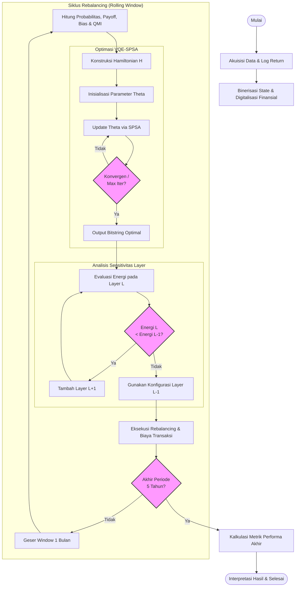

# Metodologi Penelitian

## 1. Diagram Alir Penelitian

## 2. Deskripsi Prosedur Penelitian

### 2.1. Akuisisi Data dan Digitalisasi Finansial
Tahap awal penelitian melibatkan pengambilan data harga penutupan historis empat saham sektoral melalui *interface* `yfinance`. Data tersebut ditransformasi menjadi *log return* $R_t = \ln(P_t / P_{t-1})$ untuk menjamin stasioneritas dan sifat aditif. Selanjutnya, dilakukan diskretisasi status menjadi variabel biner $s_i \in \{+1, -1\}$, di mana kenaikan dipetakan ke basis $|0\rangle$ dan penurunan ke basis $|1\rangle$.

### 2.2. Pemodelan Game Theory dan Ekstraksi Parameter
Dalam setiap jendela observasi (*sliding window*), distribusi probabilitas gabungan $P(s_i, s_j)$ dihitung dari frekuensi kemunculan konfigurasi biner historis. Probabilitas ini merepresentasikan *mixed strategy* dari setiap pasangan aset dalam mencapai keseimbangan pasar. Interaksi strategis antar aset dimodelkan melalui matriks imbalan (*payoff matrix*) yang berisi nilai *return* historis rata-rata. Parameter *bias* ($h_i$) diderivasi melalui selisih nilai harapan imbalan (*expected payoff*), sementara parameter interaksi ($J_{ij}$) diderivasi dari *Quantum Mutual Information* (QMI) menggunakan entropi *Von Neumann*.

### 2.3. Iterasi Optimasi VQE dan Penentuan Layer
Proses optimasi dilakukan melalui algoritma *Variational Quantum Eigensolver* (VQE). Terdapat dua simpul iterasi utama pada tahap ini:
1.  **Loop SPSA:** Parameter sirkuit $\theta$ diperbarui secara iteratif menggunakan *Simultaneous Perturbation Stochastic Approximation* hingga mencapai kriteria konvergensi atau batas maksimal iterasi.
2.  **Loop Layering:** Jumlah lapisan pada *ansatz* `EfficientSU(2)` ditentukan secara dinamis. Algoritma akan terus menambah *layer* selama energi sistem menunjukkan penurunan signifikan. Jika penambahan *layer* justru meningkatkan energi (indikasi *over-parameterization*), sistem akan kembali ke konfigurasi *layer* sebelumnya.

### 2.4. Protokol Backtesting Bulanan
Validasi strategi dilakukan melalui simulasi *backtest* selama lima tahun dengan mekanisme *rolling window*. Setiap bulan, portofolio melakukan *rebalancing* berdasarkan *state* biner dengan probabilitas tertinggi dari hasil pengukuran VQE. Iterasi ini terus berlanjut hingga akhir periode data, di mana setiap transaksi dicatat dengan memperhitungkan biaya operasional (*slippage* dan komisi).

### 2.5. Evaluasi Metrik Performa
Setelah seluruh iterasi selesai, metrik performa dihitung secara akumulatif. Evaluasi difokuskan pada *Sharpe Ratio*, *Maximum Drawdown*, dan total *return* dibandingkan dengan *benchmark* klasik. Interpretasi akhir dilakukan untuk menilai efektivitas integrasi Hamiltonian kuantum dalam menavigasi volatilitas pasar finansial.
