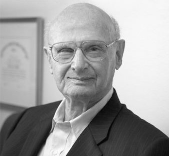
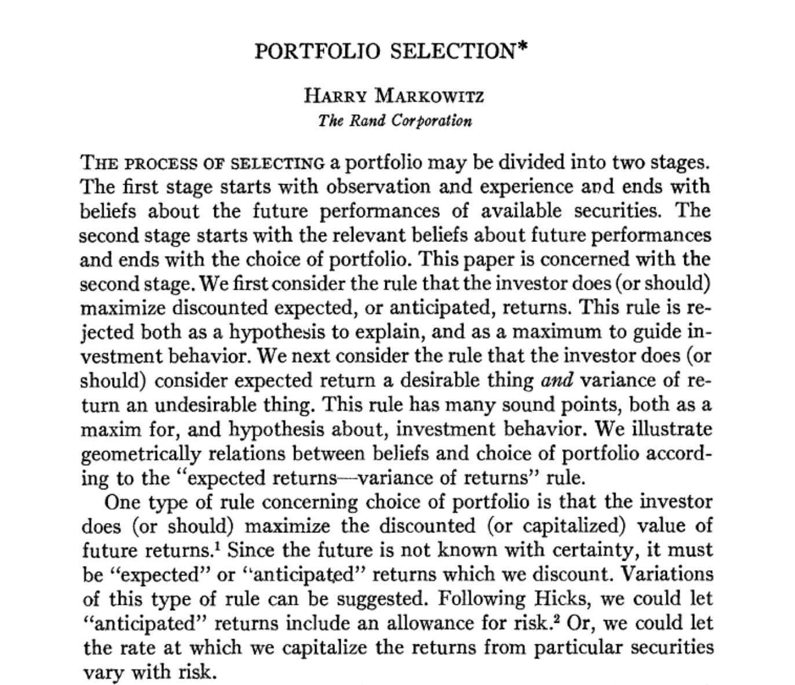
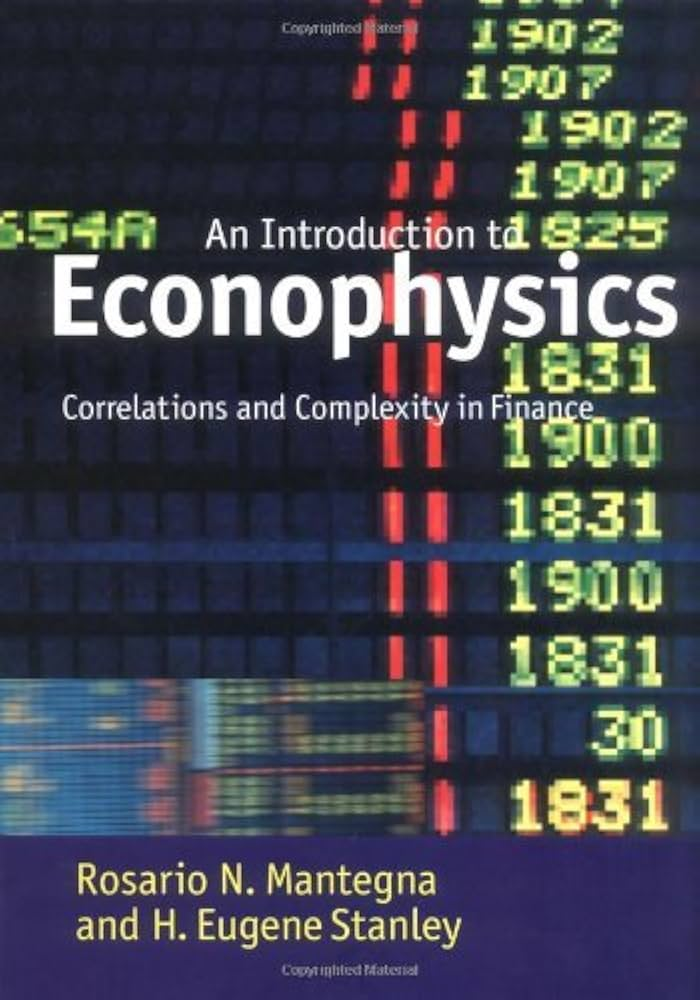
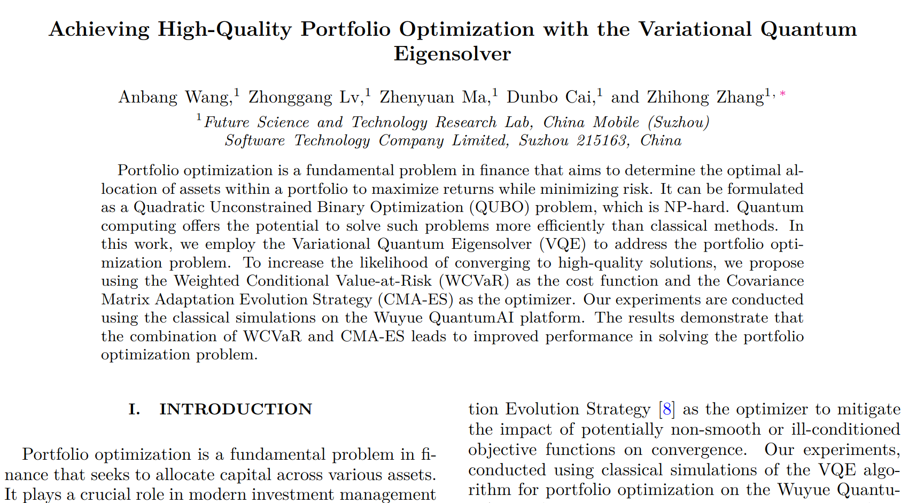
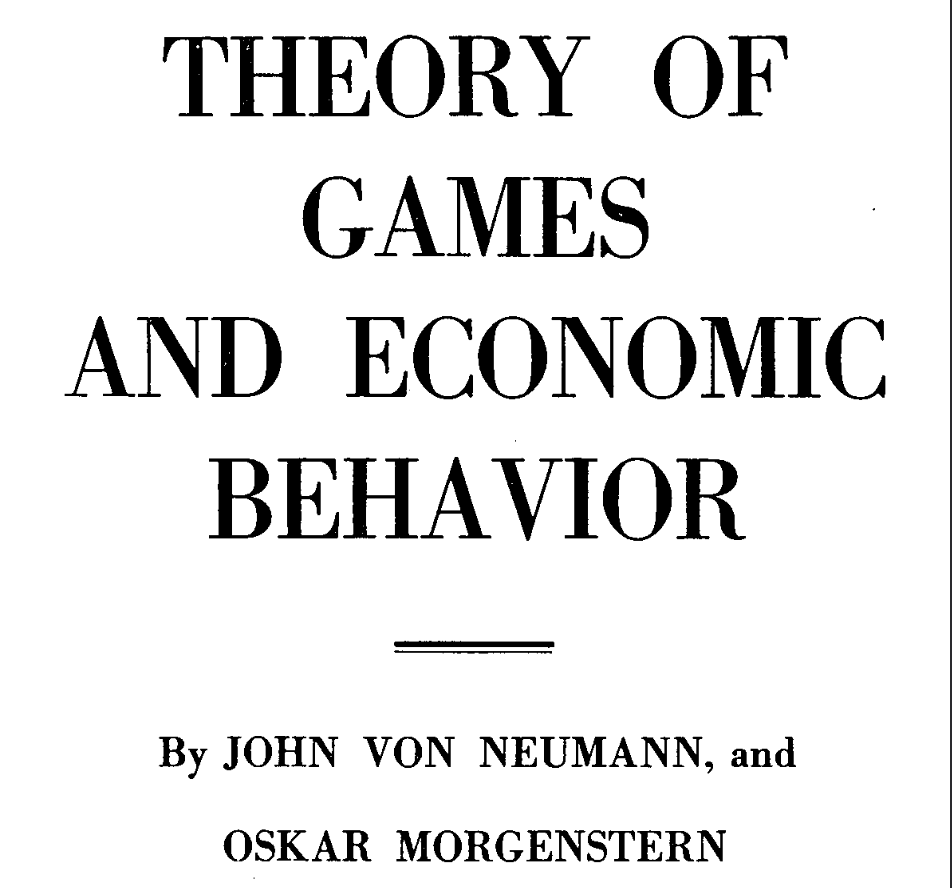

# Fase 0: Pendahuluan

## Latar Belakang Masalah
:::: {.columns}

::: {.column width="50%"}

::: {.fragment .fade-in}
{width="30%" style="border-radius: 10px; margin-bottom: 10px;"}
:::

::: {.fragment .fade-in}
{width="45%" style="border-radius: 10px;"}
:::

:::

::: {.column width="50%"}

::: {.fragment .fade-in}
{width="30%" style="border-radius: 10px; margin-bottom: 10px;"}
:::

::: {.fragment .fade-in}
{width="45%" style="border-radius: 10px;"}
:::

:::

::::

---

## Penelitian Terdahulu dan Research Gap

:::: {.columns}

::: {.column width="23%"}

Penelitian Terdahulu

**Wang dkk. (2025)**

VQE + WCVaR + CMA-ES

Stabilisasi konvergensi energi.

:::

::: {.column width="4%"}

➜

:::

::: {.column width="23%"}

Penelitian Terdahulu

**Wei dkk. (2025)**

Quantum-Classical Hybrid Annealing

Memecah masalah QUBO kompleks menjadi submasalah.

:::

::: {.column width="4%"}

➜

:::

::: {.column width="23%"}

Research Gap

Masih bergantung pada

**inisialisasi acak**

yang rentan mengalami

**Barren Plateau**

:::

::: {.column width="23%"}

Solusi

Menggunakan **Nash Equilibrium** sebagai **Warm-Start Initialization**

:::
::::

Sumber: Wang *et al.* (2025); Wei *et al.* (2025)

---

## Tujuan Penelitian

1. Menganalisis formulasi bias aset sebagai parameter medan lokal ($h_i$) dan interaksi antar aset sebagai koefisien kopling ($J_{ij}$) melalui pendekatan fungsi potensial dalam sistem Hamiltonian berbasis *Exact Potential Game* (EPG).
2. Mengevaluasi kontribusi strategi *warm-start* berbasis *Nash Equilibrium* dalam meningkatkan efisiensi pencarian solusi optimal pada algoritma VQE.
3. Menguji kapabilitas algoritma VQE yang menggunakan optimasi SPSA dan *Ansatz EfficientSU(2)* untuk menghasilkan keputusan alokasi aset yang optimal dalam kondisi pasar yang kompleks.

---

## Batasan Masalah (1/2)

1. Portofolio yang dianalisis dibatasi pada pemilihan 1 aset dari 2 pilihan aset pada sistem $N=2$ dan 2 aset dari 4 pilihan aset pada sistem $N=4$.
2. Model permainan yang digunakan adalah skema *non zero-sum game* dalam kerangka *Exact Potential Game*.
3. Simulasi dan implementasi algoritma dilakukan menggunakan simulator *Pennylane* tanpa mempertimbangkan *noise*.

---

## Batasan Masalah (2/2)

4. Tugas akhir ini hanya merupakan *proof-of-concept* dari implementasi *warm-start* ekuilibrium Nash terhadap performa algoritma VQE dalam menemukan solusi *ground state* pada model portofolio hibrida.
5. Analisis Entropi Von Neumann dibatasi sebagai indikator perubahan distribusi probabilitas keadaan kuantum selama proses optimasi VQE dan tidak digunakan sebagai kajian mendalam mengenai sifat keterbelitan dari *ansatz*.
6. Analisis berfokus pada pengaruh *warm-start* ekuilibrium Nash terhadap proses optimasi VQE, bukan untuk membuktikan keunggulan komputasi kuantum terhadap metode klasik.
