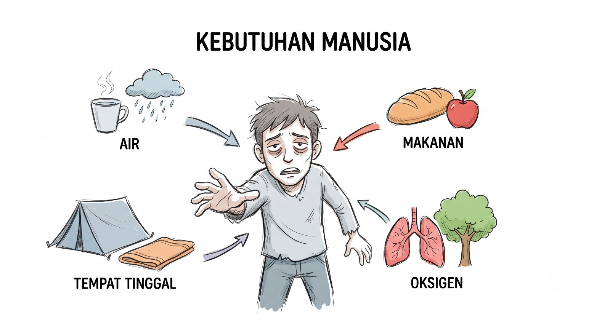
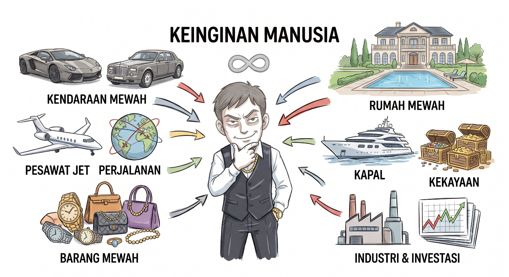
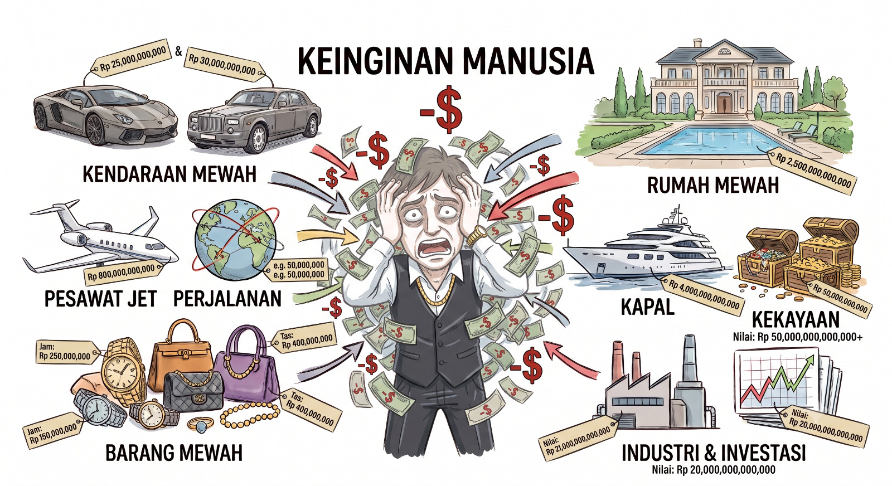
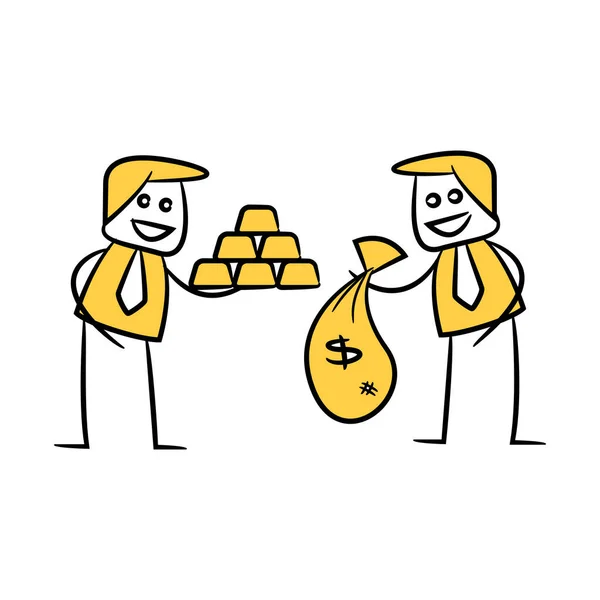
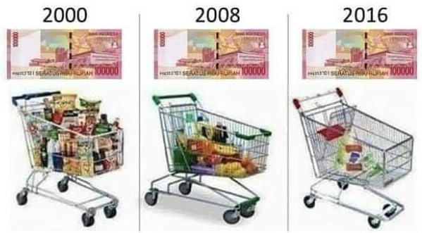
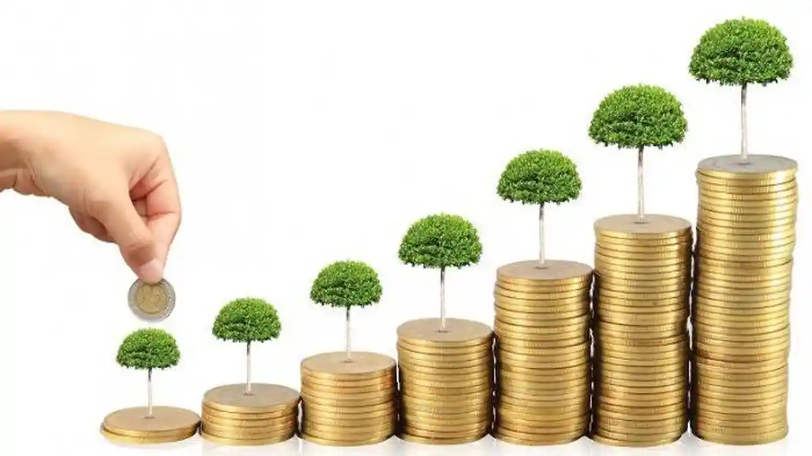
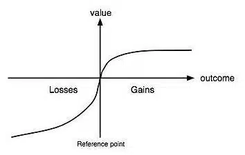

# Fase 1: Landasan Finansial

<!-- ## Konsep Uang {auto-animate="true"}

::: {style="display: flex; justify-content: center; align-items: center; height: 70vh;"}
:::

## Konsep Uang {auto-animate="true"}

::: {style="display: flex; justify-content: center; align-items: center; height: 70vh;"}
{data-id="uang1" width="50%"}
:::

## Konsep Uang {auto-animate="true"}

::: {style="display: flex; justify-content: center; align-items: center; height: 70vh; gap: 50px;"}
{data-id="uang1" width="30%"}
{data-id="uang2" width="30%"}
:::

## Konsep Uang {auto-animate="true"}

::: {style="display: flex; justify-content: center; align-items: center; height: 70vh; gap: 20px;"}
{data-id="uang1" width="30%"}
{data-id="uang2" width="30%"}
{data-id="uang3" width="30%"}
:::

## Sejarah dan Evolusi Uang {auto-animate="true"}

::: {style="display: flex; justify-content: center; align-items: center; height: 70vh;"}
:::

## Sejarah dan Evolusi Uang {auto-animate="true"}

::: {style="display: flex; justify-content: center; align-items: center; height: 70vh;"}
{data-id="img1" width="50%"}
:::

## Sejarah dan Evolusi Uang {auto-animate="true"}

::: {style="display: flex; justify-content: center; align-items: center; height: 70vh; gap: 50px;"}
{data-id="img1" width="25%"}
{data-id="img2" width="25%"}
:::

## Sejarah dan Evolusi Uang {auto-animate="true"}

::: {style="display: flex; justify-content: center; align-items: center; height: 70vh; gap: 30px;"}
{data-id="img1" width="20%"}
{data-id="img2" width="20%"}
{data-id="img3" width="20%"}
:::

## Sejarah dan Evolusi Uang {auto-animate="true"}

::: {style="display: flex; justify-content: center; align-items: center; height: 70vh; gap: 20px;"}
{data-id="img1" width="20%"}
{data-id="img2" width="20%"}
{data-id="img3" width="20%"}
{data-id="img4" width="20%"}
::: -->

## Inflasi

::: {style="display: flex; justify-content: center; align-items: center; height: 70vh; gap: 50px;"}
{width="40%"}
{width="50%"}
:::

## Investasi

:::: {.columns style="display: flex; align-items: center; height: 70vh;"}
::: {.column width="50%"}
Investasi merupakan usaha untuk memperoleh keuntungan dari penempatan dana pada aset tertentu yang memiliki tujuan:

* **Proteksi Aset**
* **Pemutar Ekonomi**
* **Risk-Return & Risk Profile**
:::
::: {.column width="50%"}
{width="80%"}
:::
::::

## Teori Prospek

:::: {.columns style="display: flex; align-items: center; height: 70vh;"}
::: {.column width="50%"}
* **Loss Aversion (Teori Prospek)**: 

Individu cenderung merasakan sakit kerugian lebih besar daripada kebahagiaan atas keuntungan walaupun nilainya kerugian dan keuntungannya sama.
:::
::: {.column width="50%"}
{width="100%"}
:::
::::

Sumber: Kahneman & Tversky (1979)

