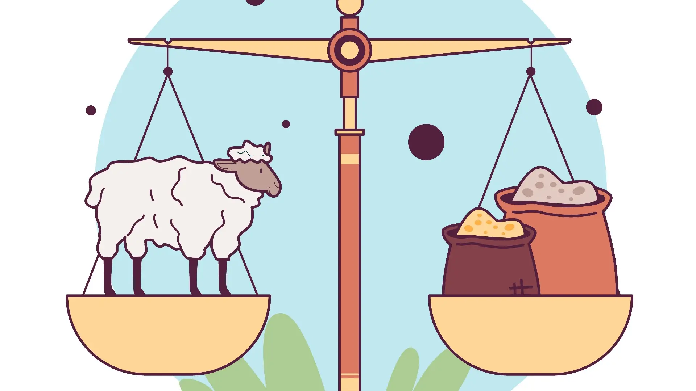
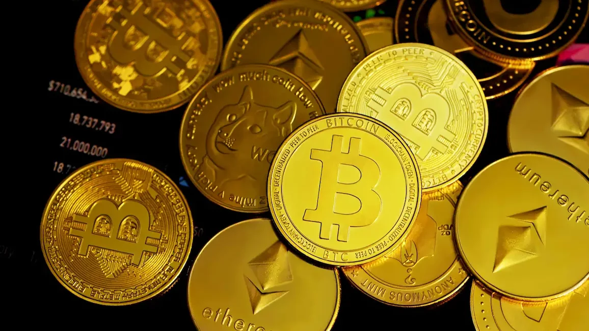

# Fase 1: Landasan Finansial

## Konsep Uang
* Kebutuhan manusia yang terbatas, namun keinginan tidak terbatas.
* Sumber daya alam bersifat terbatas.
* Uang berfungsi sebagai alat penyeimbang antara sumber daya yang ada dan keinginan manusia.

## Sejarah dan Evolusi Uang
:::: {.columns}
::: {.column width="50%"}
* **Barter:** Sistem pertukaran barang secara langsung.
* **Uang Logam/Komoditas:** Menggunakan nilai intrinsik barang (misal: emas, perak).
* **Uang Kertas Basis Logam:** Representasi fisik dari logam mulia.
* **Uang Fiat:** Nilai uang tidak didukung aset fisik, melainkan kebijakan pemerintah dan kepercayaan.
:::
::: {.column width="50%"}
{width=20%}
{width=20%}
{width=20%}
{width=20%}
:::
::::

## Inflasi
:::: {.columns}
::: {.column width="55%"}
* **Penyebab Inflasi:** Uang fiat dapat dicetak dan diedarkan seiring dengan kebijakan pemerintah (*Nixon Shock 1971* - akhir dari standar emas).
* **Dampak:** Nilai uang terdegradasi seiring waktu; daya beli menurun.
* **Solusi:** Menjaga kekayaan dari inflasi melalui investasi.
:::
::: {.column width="45%"}

:::
::::

## Investasi
:::: {.columns}
::: {.column width="55%"}
* **Proteksi Aset:** Investasi sebagai instrumen untuk mempertahankan nilai kekayaan pribadi dari inflasi.
* **Pemutar Ekonomi:** Dibutuhkan oleh sistem ekonomi agar barang dan jasa dapat bertumbuh.
* **Risk-Return & Risk Profile:** Mengambil risiko terukur (*money management*) untuk mendapat imbal hasil di atas inflasi.
* **Loss Aversion (Teori Prospek):** Rasa sakit kehilangan lebih intens daripada kegembiraan dari keuntungan bernilai sama. Toleransi risiko menurun seiring usia dan meningkat seiring kekayaan.
:::
::: {.column width="45%"}

:::
::::
