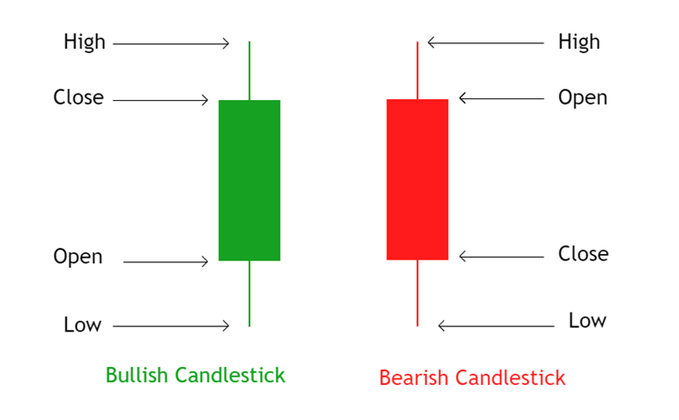
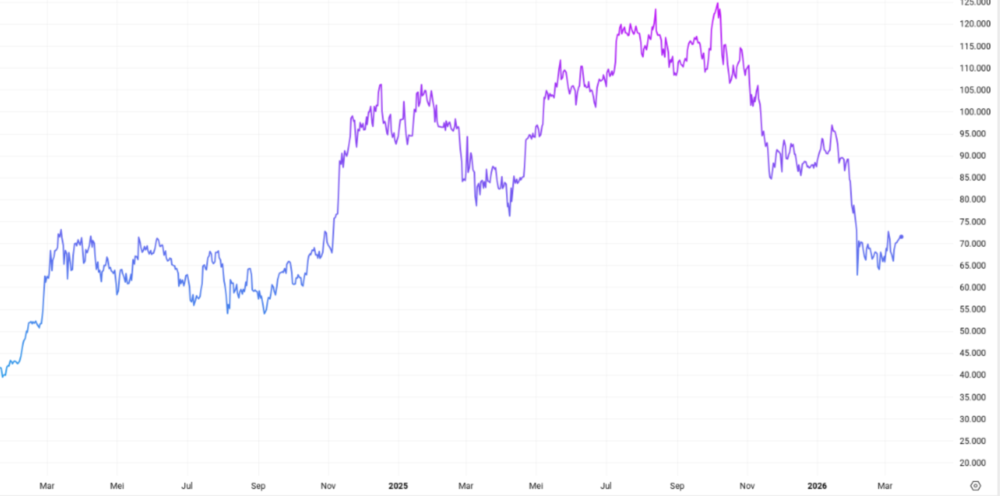

# Fase 2: Strategi Analisis Investasi

## Analisis Fundamental dan Teknikal

:::: {.columns}
::: {.column width="45%"}
**Analisis Fundamental**

{width="60%"}

Struktur laporan arus kas fundamental.

::: {style="font-size: 0.85em; margin-top: 15px;"}
* Ekonometrik Perusahaan
* Kesehatan Fiskal
* Sentimen Pasar
:::
:::

::: {.column width="55%"}
**Analisis Teknikal**

:::: {style="display: flex; justify-content: space-between; align-items: flex-end; text-align: center;"}
::: {style="width: 32%;"}

*Candlestick*

:::
::: {style="width: 32%;"}

*Price Chart*

:::
::: {style="width: 32%;"}

*Support & Resistance*

:::
::::

   

::: {style="font-size: 0.85em; margin-top: 15px;"}
* Representasi Psikologi Kolektif dari Agen Pasar
:::
:::
::::

---

## Analisis Kuantitatif
::::: {.columns}
:::: {.column width="35%"}
::: {style="font-size: 0.6em;"}
* **Simple Return ($R$):**
  $$ R_t = \frac{P_t - P_{t-1}}{P_{t-1}} $$
* **Expected Return ($\bar{R}$):**
  $$ \bar{R} = \frac{1}{n} \sum_{t=1}^n R_t $$
* **Variance ($\sigma^2$):**
  $$ \sigma^2 = \frac{1}{n-1} \sum_{t=1}^n (R_t - \bar{R})^2 $$
* **Covariance ($\sigma_{ij}$):**
  $$ \sigma_{ij} = \frac{1}{n-1} \sum_{t=1}^n (R_{i,t} - \bar{R}_i)(R_{j,t} - \bar{R}_j) $$
:::
::::
:::: {.column width="35%"}
::: {style="font-size: 0.6em;"}
* **Log Return ($r$):**
  $$ r_t = \ln\left(\frac{P_t}{P_{t-1}}\right) $$
* **Expected Return ($\bar{r}$):**
  $$ \bar{r} = \frac{1}{n} \sum_{t=1}^n r_t $$
* **Variance ($\sigma^2$):**
  $$ \sigma^2 = \frac{1}{n-1} \sum_{t=1}^n (r_t - \bar{r})^2 $$
* **Covariance ($\sigma_{ij}$):**
  $$ \sigma_{ij} = \frac{1}{n-1} \sum_{t=1}^n (r_{i,t} - \bar{r}_i)(r_{j,t} - \bar{r}_j) $$
:::
::::
:::: {.column width="30%"}

{width="100%"}

Transformasi pergerakan harga saham.

::: {style="font-size: 0.6em; margin-top: 15px;"}
* $P_t$: Harga pada waktu $t$
:::
::::
:::::

---

## Model Markowitz {.scrollable}

::: {.panel-tabset}
### Rumus Utama
::::: {.columns}
:::: {.column width="60%"}
::: {style="font-size: 0.75em;"}
* **Mean-Variance:**
  $$ \mathcal{L}(\mathbf{\omega}) = \sum_{i,j} \sigma_{ij} \omega_i \omega_j - \lambda \sum_i \mu_i \omega_i $$
* **Binerisasi:**
  $$ \mathcal{L}(\mathbf{x}) = \sum_{i,j} \sigma_{ij} \frac{x_i x_j}{K^2} - \lambda \sum_i \mu_i \frac{x_i}{K} $$
:::

::: {style="font-size: 0.75em"}
* $\mu_i$: Imbal hasil rata-rata aset ke-$i$
* $\sigma_{ij}$: Kovarians antara aset $i$ dan $j$
* $\omega_i$: Proporsi bobot kontinu aset ke-$i$
* $\lambda$: Parameter toleransi risiko
:::

  
::::
:::: {.column width="45%"}

{width="75%"}

Grafik Efficient Frontier

 

::: {style="font-size: 0.75em;"}
* Investor cenderung mencari portofolio pada *Efficient Frontier* untuk memaksimalkan *return* dengan risiko yang minimal.
:::
::::
:::::

### Penurunan Rumus

**Langkah 1 — Formulasi Lagrangian Kontinu (Markowitz):**

Fungsi biaya Markowitz dalam domain bobot $\omega_i$:

$$\mathcal{L}(\mathbf{\omega}) = \sum_{i,j} \sigma_{ij} \omega_i \omega_j - \lambda \sum_i \mu_i \omega_i$$

dengan syarat $\sum_i \omega_i = 1$ dan $\omega_i \geq 0$.

---

**Langkah 2 — Substitusi Variabel Biner:**

Variabel bobot kontinu $\omega_i$ diubah menjadi variabel biner $x_i \in \{0, 1\}$ melalui hubungan:

$$\omega_i = \frac{x_i}{K}$$

di mana $K$ adalah jumlah aset yang dipilih dari total $N$ kandidat.

---

**Langkah 3 — Substitusi ke Lagrangian:**

Substitusi $\omega_i = x_i/K$ ke dalam fungsi Lagrangian:

$$\mathcal{L}(\mathbf{x}) = \sum_{i,j} \sigma_{ij} \frac{x_i}{K} \frac{x_j}{K} - \lambda \sum_i \mu_i \frac{x_i}{K}$$

$$\therefore \mathcal{L}(\mathbf{x}) = \sum_{i,j} \sigma_{ij} \frac{x_i x_j}{K^2} - \lambda \sum_i \mu_i \frac{x_i}{K}$$

Nilai $x_i = 1$ merepresentasikan **beli**, sedangkan $x_i = 0$ merepresentasikan **tidak membeli**.

---

| Simbol | Domain Kontinu | Domain Biner |
|:---:|:---:|:---:|
| Variabel keputusan | $\omega_i \in [0, 1]$ | $x_i \in \{0, 1\}$ |
| Kendala | $\sum \omega_i = 1$ | $\sum x_i = K$ |

   

:::
