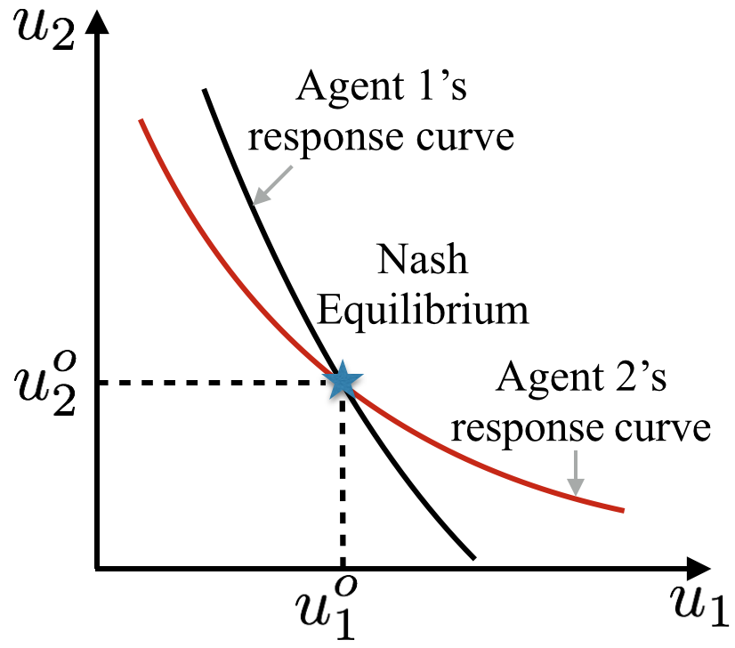

# Fase 3: Teori Permainan untuk *Warm-Start*

## Teori Permainan

::: {.r-stack}
:::: {.fragment .fade-out data-fragment-index="1"}

::::: {style="display: flex; flex-direction: column; align-items: center; gap: 20px;"}
:::::: {style="display: flex; justify-content: center; gap: 40px;"}
::::::: {style="text-align: center;"}
{height="250px"}

:::::::: {style="font-size: 0.8em; margin-top: 10px;"}
John von Neumann
::::::::
:::::::

::::::: {style="text-align: center;"}
{height="250px"}

:::::::: {style="font-size: 0.8em; margin-top: 10px;"}
Oskar Morgenstern
::::::::
:::::::
::::::

{height="250px"}
:::::

::::

:::: {.fragment .fade-in data-fragment-index="1"}
::::: {.columns style="display: flex; align-items: center;"}
::: {.column width="60%"}

* **Teori Permainan:** Cabang matematika terapan yang mengkaji bagaimana agen rasional membuat keputusan strategis di bawah ketergantungan tindakan agen yang lain.
  
* **Komponen Utama:** Agen (Pemain), Himpunan Strategi, dan Fungsi Utilitas (*Payoff*).
  
* **Nash Equilibrium:** Kondisi paling stabil di mana tidak ada satu pun agen yang bisa meningkatkan utilitasnya dengan mengubah strateginya sendiri secara sepihak.

:::
::: {.column width="40%"}
{width="100%"}
:::
:::::
::::
:::

## Jenis-Jenis Permainan (*Game Types*)
Contoh klasik *Game Theory* dengan matriks *payoff*:

:::: {.columns}
::: {.column width="33%"}

*Stag Hunt*

:::
::: {.column width="33%"}

*Prisoner's Dilemma*

:::
::: {.column width="33%"}

*Battle of the Sexes*

:::
::::

---

## Exact Potential Game (EPG)

::: {.r-stack}
:::: {.fragment .fade-out data-fragment-index="1" style="width: 100%;"}
* **Definisi:** Model permainan yang memiliki fungsi potensial global ($\Phi$), di mana setiap perubahan utilitas individu akibat perubahan strategi sepenuhnya tercermin oleh perubahan nilai $\Phi$.
* **Makna "Potensial" & "Global":**
  - **Potensial:** Sistem agen berdinamika menuju nilai ekuilibrium (maksimalisasi utilitas), yang secara fundamental ekuivalen dengan prinsip minimisasi energi ($H = -\Phi$) dalam fisika fisis.
  - **Global:** $\Phi$ merangkum seluruh utilitas individu ke dalam satu fungsi skalar tunggal untuk merepresentasikan kualitas konfigurasi strategi permainan secara keseluruhan.
::::

:::: {.fragment .fade-in data-fragment-index="1" style="width: 100%;"}
* **Kondisi *Nash Equilibrium*:** Perubahan utilitas lokal ($\Delta u_i$) sebanding persis dengan perubahan potensial global ($\Delta \Phi$).
  $$ \Delta \Phi = \Phi(s_i', s_{-i}) - \Phi(s_i, s_{-i}) = u_i(s_i', s_{-i}) - u_i(s_i, s_{-i}) $$
* Dinamika sistem akan terhenti dan mencapai *Nash Equilibrium* ketika tidak ada lagi strategi yang menghasilkan peningkatan potensial ($\Delta \Phi < 0$).
::::
:::

---

## EPG pada Alokasi Portofolio {.scrollable}

::: {.panel-tabset}
### Rumus Utama
* Transformasi persamaan utilitas Markowitz biner menjadi fungsi potensial global EPG:
  $$ \Phi(\mathbf{x}) = \sum_{l=1}^N \mu_l \frac{x_l}{K} - \frac{\gamma}{2}\sum_{i=1}^N\sum_{j=1}^N \sigma_{ij} \frac{x_i}{K} \frac{x_j}{K} $$
* dengan $\gamma$ mendefinisikan faktor penghindaran risiko (*risk aversion*) pada fungsi utilitas agen.

### Penurunan Rumus

**Penurunan: Dari Model Markowitz Biner ke Fungsi Potensial EPG**

**Langkah 1 — Lagrangian Biner Markowitz:**

Dari transformasi $\omega_i = x_i/K$, diperoleh fungsi Lagrangian biner:

$$\mathcal{L}(\mathbf{x}) = \sum_{i,j} \sigma_{ij} \frac{x_i x_j}{K^2} - \lambda \sum_i \mu_i \frac{x_i}{K}$$

---

**Langkah 2 — Konversi ke Fungsi Utilitas:**

Definisikan faktor penghindaran risiko $\gamma = 2/\lambda$, sehingga:

$$U(\mathbf{x}) = - \frac{1}{\lambda} \mathcal{L}(\mathbf{x})$$

$$U(\mathbf{x}) = \sum_i \frac{\mu_i}{K} x_i - \frac{\gamma}{2K^2} \sum_{i,j} \sigma_{ij} x_i x_j$$

---

**Langkah 3 — Utilitas Individu Agen ke-$i$:**

$$u_i(\mathbf{x}) = \frac{\mu_i}{K} x_i - \frac{\gamma}{2K^2} x_i \left( \sum_{j \neq i} \sigma_{ij} x_j \right)$$

Jika varians dipisah dari matriks kovarians:

$$u_i(\mathbf{x}) = \frac{\mu_i}{K} x_i - \frac{\gamma}{2K^2} x_i \left( \sigma_{ii} + 2\sum_{j \neq i} \sigma_{ij} x_j \right)$$

---

**Langkah 4 — Fungsi Potensial Global $\Phi$:**

Dari utilitas sistem, fungsi potensial EPG:

$$\Phi(\mathbf{x}) = \sum_{l=1}^N \mu_l \frac{x_l}{K} - \frac{\gamma}{2}\sum_{i=1}^N\sum_{j=1}^N \sigma_{ij} \frac{x_i}{K} \frac{x_j}{K}$$

---

**Langkah 5 — Dekomposisi untuk Verifikasi $\Delta u_i = \Delta \Phi$:**

Dekomposisi suku yang mengandung $x_i$ (dengan $x_i^2 = x_i$):

$$\Phi(\mathbf{x}) = \frac{\mu_i}{K}x_i - \frac{\gamma}{2} \left( \frac{\sigma_{ii}}{K^2}x_i + \frac{2}{K^2}x_i \sum_{j \neq i} \sigma_{ij}x_j \right) + \underbrace{\sum_{l \neq i} \frac{\mu_l}{K}x_l - \frac{\gamma}{2} \sum_{l \neq i} \sum_{m \neq i} \frac{\sigma_{lm}}{K^2}x_l x_m}_{\text{tidak bergantung pada } x_i}$$

---

**Langkah 6 — Insentif Marginal:**

$$\Delta \Phi = \Phi(1, \mathbf{x}_{-i}) - \Phi(0, \mathbf{x}_{-i}) = \frac{\mu_i}{K} - \frac{\gamma \sigma_{ii}}{2K^2} - \frac{\gamma}{K^2} \sum_{j \neq i} \sigma_{ij} x_j$$

Karena $\Delta u_i = \Delta \Phi$ terjamin $\Rightarrow$ **terbukti** sebagai *Exact Potential Game*.

---

**Langkah 7 — Risk Aversion Endogen:**

$$\gamma = \frac{1}{1 + e^{(\bar{\mu}_l/\bar{\sigma}_l)}}$$

dengan $\bar{\mu}_l$ dan $\bar{\sigma}_l$ dari *log returns*.

   

:::