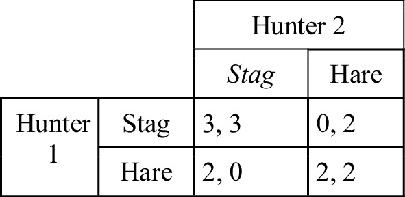
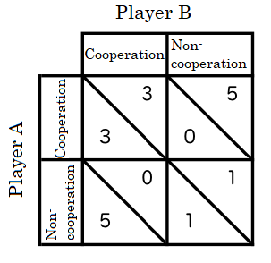
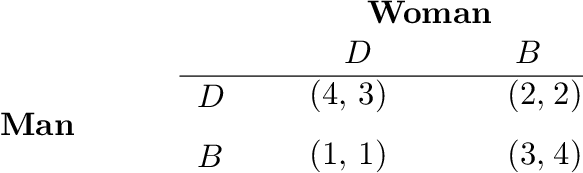

# Fase 3: Teori Permainan dan SBR *Warm-Start*

## Pengantar Teori Permainan
* Mengkaji bagaimana agen rasional membuat keputusan strategis di bawah ketergantungan tindakan agen yang lain.
* Komponen Utama: Agen (Pemain), Himpunan Strategi, dan Fungsi Utilitas (*Payoff*).
* **Nash Equilibrium:** Kondisi paling stabil di mana tidak ada satu pun agen yang bisa meningkatkan utilitasnya dengan mengubah strateginya sendiri secara sepihak.

## Jenis-Jenis Permainan (*Game Types*)
Contoh klasik *Game Theory* dengan matriks *payoff*:

:::: {.columns}
::: {.column width="33%"}

*Stag Hunt*

:::
::: {.column width="33%"}

*Prisoner's Dilemma*

:::
::: {.column width="33%"}

*Battle of the Sexes*

:::
::::

---

## Exact Potential Game (EPG)
* Model permainan yang memetakan seluruh utilitas pemain menjadi satu fungsi potensial global ($\Phi$).
* Berfungsi sebagai kerangka analitik untuk mencari *Nash Equilibrium* (NE) secara terstruktur melalui maksimisasi nilai $\Phi$.
* Perubahan utilitas lokal ($\Delta u_i$) sebanding persis dengan perubahan potensial global ($\Delta \Phi$).
  $$ \Delta \Phi = \Phi(s_i', s_{-i}) - \Phi(s_i, s_{-i}) = u_i(s_i', s_{-i}) - u_i(s_i, s_{-i}) $$
* Jika $\Delta \Phi > 0$, agen termotivasi untuk bertukar strategi. Jika $\Delta \Phi < 0$, agen akan menolak perubahan, sehingga sistem mencapai *Nash Equilibrium*.

---

## EPG pada Alokasi Portofolio {.scrollable}

::: {.panel-tabset}
### Rumus Utama
* Transformasi persamaan utilitas Markowitz biner menjadi fungsi potensial global EPG:
  $$ \Phi(\mathbf{x}) = \sum_{l=1}^N \mu_l \frac{x_l}{K} - \frac{\gamma}{2}\sum_{i=1}^N\sum_{j=1}^N \sigma_{ij} \frac{x_i}{K} \frac{x_j}{K} $$
* Representasi ini memudahkan integrasi antara teori ekonomi rasional (Markowitz) dan fisika statistik (Model Ising).
* Fungsi potensial ini langsung dikonversikan menjadi nilai energi Hamiltonian (dengan $\hat{H} = -\Phi(x)$) setelah disubstitusi dari biner $x_i \in \{0, 1\}$ ke spin $Z_i \in \{1, -1\}$.

### Penurunan Rumus

**Penurunan: Dari Model Markowitz Biner ke Fungsi Potensial EPG**

**Langkah 1 — Lagrangian Biner Markowitz:**

Dari transformasi $\omega_i = x_i/K$, diperoleh fungsi Lagrangian biner:

$$\mathcal{L}(\mathbf{x}) = \sum_{i,j} \sigma_{ij} \frac{x_i x_j}{K^2} - \lambda \sum_i \mu_i \frac{x_i}{K}$$

---

**Langkah 2 — Konversi ke Fungsi Utilitas:**

Definisikan faktor penghindaran risiko $\gamma = 2/\lambda$, sehingga:

$$U(\mathbf{x}) = - \frac{1}{\lambda} \mathcal{L}(\mathbf{x})$$

$$U(\mathbf{x}) = \sum_i \frac{\mu_i}{K} x_i - \frac{\gamma}{2K^2} \sum_{i,j} \sigma_{ij} x_i x_j$$

---

**Langkah 3 — Utilitas Individu Agen ke-$i$:**

$$u_i(\mathbf{x}) = \frac{\mu_i}{K} x_i - \frac{\gamma}{2K^2} x_i \left( \sum_{j \neq i} \sigma_{ij} x_j \right)$$

Jika varians dipisah dari matriks kovarians:

$$u_i(\mathbf{x}) = \frac{\mu_i}{K} x_i - \frac{\gamma}{2K^2} x_i \left( \sigma_{ii} + 2\sum_{j \neq i} \sigma_{ij} x_j \right)$$

---

**Langkah 4 — Fungsi Potensial Global $\Phi$:**

Dari utilitas sistem, fungsi potensial EPG:

$$\Phi(\mathbf{x}) = \sum_{l=1}^N \mu_l \frac{x_l}{K} - \frac{\gamma}{2}\sum_{i=1}^N\sum_{j=1}^N \sigma_{ij} \frac{x_i}{K} \frac{x_j}{K}$$

---

**Langkah 5 — Dekomposisi untuk Verifikasi $\Delta u_i = \Delta \Phi$:**

Dekomposisi suku yang mengandung $x_i$ (dengan $x_i^2 = x_i$):

$$\Phi(\mathbf{x}) = \frac{\mu_i}{K}x_i - \frac{\gamma}{2} \left( \frac{\sigma_{ii}}{K^2}x_i + \frac{2}{K^2}x_i \sum_{j \neq i} \sigma_{ij}x_j \right) + \underbrace{\sum_{l \neq i} \frac{\mu_l}{K}x_l - \frac{\gamma}{2} \sum_{l \neq i} \sum_{m \neq i} \frac{\sigma_{lm}}{K^2}x_l x_m}_{\text{tidak bergantung pada } x_i}$$

---

**Langkah 6 — Insentif Marginal:**

$$\Delta \Phi = \Phi(1, \mathbf{x}_{-i}) - \Phi(0, \mathbf{x}_{-i}) = \frac{\mu_i}{K} - \frac{\gamma \sigma_{ii}}{2K^2} - \frac{\gamma}{K^2} \sum_{j \neq i} \sigma_{ij} x_j$$

Karena $\Delta u_i = \Delta \Phi$ terjamin $\Rightarrow$ **terbukti** sebagai *Exact Potential Game*.

---

**Langkah 7 — Risk Aversion Endogen:**

$$\gamma = \frac{1}{1 + e^{(\bar{\mu}_l/\bar{\sigma}_l)}}$$

dengan $\bar{\mu}_l$ dan $\bar{\sigma}_l$ dari *log returns*.

   

:::

---

## Sequential Best Response (SBR) sebagai Warm-Start {.scrollable}

::: {.panel-tabset}
### Konsep Utama
* **Algoritma SBR:** Mencari *Nash Equilibrium* klasik dengan mengevaluasi pertukaran strategi (*swap* aset) yang menghasilkan nilai potensial $\Phi$ lebih tinggi secara iteratif.
* Konfigurasi aset dari titik ekuilibrium (misal: `|0101>`) akan digunakan sebagai status awal (**Warm-Start**) bagi sirkuit kuantum VQE.
* Strategi ini mencegah sirkuit kuantum melakukan pencarian di wilayah probabilitas yang sama sekali buta (*blind search*), sehingga proses optimasi parameter bisa langsung difokuskan pada sub-ruang Hilbert yang bermakna secara finansial.

### Algoritma SBR

**Algorithm 1: Iterative Best Response**

**Data:** Pilih strategi awal $\omega_n^0 \in K_n$ untuk semua $n = 1, \dots, N$, dan set $q = 0$.

**Step 1:** Jika $\mathbf{\omega}^q$ memenuhi kriteria penghentian yang sesuai: **STOP**.

**Step 2:** Perbarui strategi $\omega_n^{q+1}$ untuk $n = 1, \dots, N$ menggunakan salah satu metode:

> **Sequential (Gauss-Seidel) Update:**
>
> $$\omega_n^{q+1} \leftarrow \arg \min_{\omega_n \in K_n} u_n(\omega_1^{q+1}, \dots, \omega_{n-1}^{q+1}, \omega_n, \omega_{n+1}^q, \dots, \omega_N^q)$$
>
> **Simultaneous (Jacobi) Update:**
>
> $$\omega_n^{q+1} \leftarrow (1 - \tfrac{1}{N})\omega_n^q + \tfrac{1}{N} \cdot \arg \min_{\omega_n \in K_n} u_n(\omega_1^q, \dots, \omega_{n-1}^q, \omega_n, \omega_{n+1}^q, \dots, \omega_N^q)$$

**Step 3:** Set $q \leftarrow q + 1$; dan kembali ke **Step 1**.

---

**Catatan Implementasi:**

| Aspek | Gauss-Seidel | Jacobi |
|:---|:---:|:---:|
| Tipe pembaruan | Sekuensial | Simultan |
| Info yang digunakan | Strategi terbaru agen sebelumnya | Data iterasi sebelumnya |
| Konvergensi | Lebih cepat (umumnya) | Lebih stabil |
| Paralelisasi | Sulit | Mudah |

   

:::
