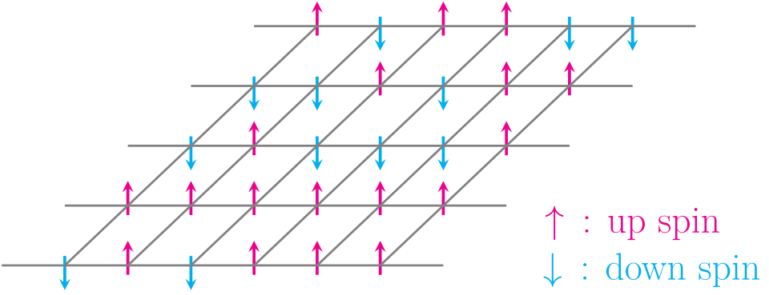

# Fase 4: Ekonofisika dan Model Ising

## Sejarah Ising

  
   
  
  
Model Ising 1D

---

## Perkembangan Ising ke Sistem Kompleks

:::: {.columns}
::: {.column width="50%"}
{fig-align="center" height="200px"}
:::
::: {.column width="50%"}
{fig-align="center" height="200px"}
:::
::::

Lars Onsager berhasil memecahkan model Ising 2D pada tahun 1944. Hal ini menyebabkan model Ising juga dapat digunakan untuk memetakan sistem kompleks di luar fisika material. 
Contoh kasus kompleks yang bisa diatasi:

* Optimasi jaringan logistik dan rantai pasok.
* Pemodelan dinamika sosial dan fenomena *herding* (perilaku ikut-ikutan).
* **Ekonofisika:** Mengatasi limitasi model Markowitz (seperti distribusi *fat-tailed* dan anomali pasar) dengan pendekatan komputasi fisika.

---

## Analogi Keputusan Investasi dan Ising
Memetakan fungsi biaya portofolio ke dalam struktur Hamiltonian sistem fisik.

| Komponen Investasi | Analogi Sistem Ising (Fisika) |
|:---:|:---:|
| Aset Keuangan | Partikel *Spin* (Atas/Bawah) |
| Keputusan Investasi (Beli/Jual) | Orientasi *Spin* (+1 / -1) |
| Tren/Ekspektasi Pasar | Medan Magnet Lokal ($h_i$) |
| Korelasi/Kovariansi Antar Aset | Interaksi Kopling Antar *Spin* ($J_{ij}$) |
| Alokasi Modal Paling Efisien | Konfigurasi Energi Terendah (*Ground State*) |

 
(Lucas, 2014; Galam, 2010)

---

## Hamiltonian Ising untuk Portofolio {.scrollable}

::: {.panel-tabset}
### Rumus Utama
**Hamiltonian Ising Lengkap:**

$$\hat{\mathcal{H}} = - \sum_{i=1}^N h_i \hat{Z}_i - \sum_{i<j}^N J_{ij} \hat{Z}_i \hat{Z}_j + C$$

dengan parameter:

* $h_i$ : **Medan bias** — kecenderungan arah orientasi *spin* lokal (kecenderungan harga pasar).
* $J_{ij}$ : **Kopling** — interaksi timbal balik antar *spin* (korelasi antar aset finansial).
* $C$ : Pergeseran skala energi (konstanta).
  

### Penurunan Rumus

**Penurunan: Dari Fungsi Potensial Game ke Hamiltonian Ising**

**Langkah 1 — Fungsi Energi dari Potensial:**

Konversi dari maksimasi potensial ke minimasi energi:

$$E(\mathbf{x}) = -\Phi(\mathbf{x})$$

Substitusi $\Phi$ dari fungsi potensial Markowitz:

$$E(\mathbf{x}) = \frac{\gamma}{2K^2}\sum_{i=1}^N\sum_{j=1}^N \sigma_{ij} x_i x_j - \sum_{i=1}^N \frac{\mu_i}{K} x_i$$

---

**Langkah 2 — Dekomposisi dengan $x_i^2 = x_i$:**

$$E(\mathbf{x}) = \frac{\gamma}{2K^2}\left(\sum_{i=1}^N\sigma_{ii} x_i^2 + \sum_{i\ne j}\sigma_{ij} x_ix_j\right) -\sum_{i=1}^N \frac{\mu_i}{K} x_i$$

$$= \frac{\gamma}{2K^2}\sum_{i=1}^N\sigma_{ii} x_i + \frac{\gamma}{2K^2}\sum_{i\ne j}\sigma_{ij} x_ix_j - \sum_{i=1}^N \frac{\mu_i}{K} x_i$$

$$\therefore E(\mathbf{x}) = \sum_{i=1}^N\left(\frac{\gamma \sigma_{ii}}{2K^2} - \frac{\mu_i}{K}\right)x_i + \sum_{i\ne j}\frac{\gamma \sigma_{ij}}{2K^2} x_ix_j$$

---

**Langkah 3 — Penambahan Fungsi Penalti:**

Penalti kuadratik untuk memenuhi kendala $\sum x_i = K$:

$$P(\mathbf{x}) = A\left(\sum_{i=1}^N x_i - K\right)^2$$

Penjabaran:

$$P(\mathbf{x}) = A\sum_{i=1}^N x_i^2 + A\sum_{i\ne j} x_ix_j - 2AK\sum_{i=1}^N x_i + AK^2$$

---

**Langkah 4 — Energi Total (QUBO):**

$$E_{total}(\mathbf{x}) = E(\mathbf{x}) + P(\mathbf{x})$$

$$\therefore E_{total}(\mathbf{x}) = \sum_i \left(\frac{\gamma \sigma_{ii}}{2K^2} + A - \frac{\mu_i}{K} - 2AK\right)x_i + \sum_{i\ne j}\left(\frac{\gamma \sigma_{ij}}{2K^2} + A\right) x_ix_j + AK^2$$

---

**Langkah 5 — Notasi Koefisien QUBO:**

$$Q_{ii} = \frac{\gamma \sigma_{ii}}{2K^2}+A-\frac{\mu_i}{K}-2AK$$

$$Q_{ij} = \frac{\gamma \sigma_{ij}}{2K^2}+A$$

Sehingga:

$$E_{total}(\mathbf{x}) = \sum_i Q_{ii} x_i + \sum_{i\ne j} Q_{ij} x_ix_j + AK^2$$

---

**Langkah 6 — Transformasi Affine ke Domain Spin:**

Pemetaan biner $x_i \in \{0, 1\}$ ke *spin* $s_i \in \{-1, 1\}$:

$$x_i = \frac{(1 - s_i)}{2}, \quad x_ix_j = \frac{(1-s_i)(1-s_j)}{4}$$

Substitusi:

$$E_{total}(\mathbf{s}) = \sum_i Q_{ii} \frac{1-s_i}{2} + \sum_{i\ne j} Q_{ij} \frac{1 - s_i - s_j + s_is_j}{4} + AK^2$$

$$\therefore E_{total}(\mathbf{s}) = \sum_i \left(- \frac{Q_{ii}}{2} - \sum_{j \neq i} \frac{Q_{ij}}{2}\right) s_i + \sum_{i\ne j} \frac{Q_{ij}}{4} s_i s_j + \left(\sum_i \frac{Q_{ii}}{2} + \sum_{i\ne j} \frac{Q_{ij}}{4} + AK^2\right)$$

---

**Langkah 7 — Identifikasi Parameter Hamiltonian:**

| Parameter | Definisi | Makna Fisis |
|:---:|:---:|:---|
| $h_i$ | $- \frac{Q_{ii}}{2} - \sum_{j \neq i} \frac{Q_{ij}}{2}$ | Medan bias lokal |
| $J_{ij}$ | $\frac{Q_{ij}}{4}$ | Kopling antar *spin* |
| $C$ | $\sum_i \frac{Q_{ii}}{2} + \sum_{i\ne j} \frac{Q_{ij}}{4} + AK^2$ | Konstanta energi |

**Hasil Akhir — Hamiltonian Ising:**

$$\boxed{\hat{\mathcal{H}} = - \sum_{i=1}^N h_i \hat{Z}_i - \sum_{i<j}^N J_{ij} \hat{Z}_i \hat{Z}_j + C}$$

   

:::
