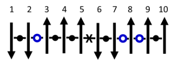

# Fase 4: Ekonofisika dan Model Ising

## Sejarah Ising
* **1920-an:** Wilhelm Lenz dan Ernst Ising merumuskan model interaksi spin elektron diskrit pada 1 dimensi.
* **1944:** Lars Onsager membuktikan transisi fase dan mengatasi model Ising untuk 2 dimensi.
* **Kontemporer:** Ising menjadi "bahasa standar" dalam optimasi kombinatorial berkat kemajuan komputasi kuantum.

Model Ising 1D

---

## Perkembangan Ising ke Sistem Kompleks
Model Ising terbukti efektif memetakan sistem kompleks di luar fisika material. 
Contoh kasus kompleks yang bisa diatasi:
* Optimasi jaringan logistik dan rantai pasok.
* Pemodelan dinamika sosial dan fenomena *herding* (perilaku ikut-ikutan).
* **Ekonofisika:** Mengatasi tantangan limitasi model Markowitz (seperti anomali pasar dan distribusi *fat-tailed*) dengan pendekatan komputasi fisika.

---

## Analogi Keputusan Investasi dan Ising
Memetakan fungsi biaya portofolio ke dalam struktur Hamiltonian sistem fisik.

| Komponen Investasi | Analogi Sistem Ising (Fisika) |
|:---:|:---:|
| Aset Keuangan | Partikel *Spin* (Atas/Bawah) |
| Keputusan Investasi (Beli/Jual) | Orientasi *Spin* (+1 / -1) |
| Tren/Ekspektasi Pasar | Medan Magnet Lokal ($h_i$) |
| Korelasi/Kovariansi Antar Aset | Interaksi Kopling Antar *Spin* ($J_{ij}$) |
| Alokasi Modal Paling Efisien | Konfigurasi Energi Terendah (*Ground State*) |
