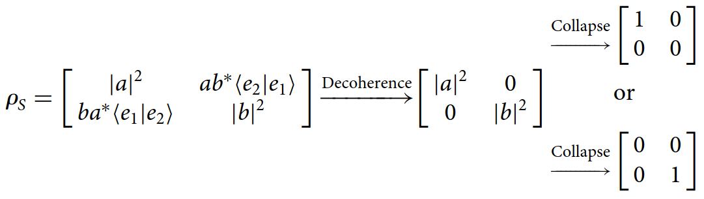
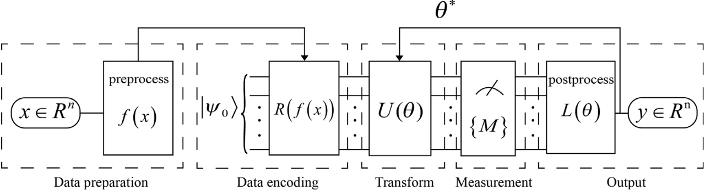

# Fase 5: Komputer Kuantum

## Bit Klasik vs Qubit Kuantum
:::: {.columns}
::: {.column width="50%"}
**Bit Klasik:**
* Unit informasi fundamental komputer konvensional.
* Bersifat deterministik: hanya bernilai 0 atau 1.
* Representasi fisik: 0 (tidak ada arus listrik), 1 (ada arus listrik).

<div style="display: flex; justify-content: center; align-items: center; gap: 10px; margin-top: 15px;">
  <div style="border: 2px solid #555; border-radius: 5px; padding: 10px; background: #f0f0f0; color: black; font-weight: bold; width: 40px; text-align: center;">0</div>
  <div style="font-size: 1.5em;">⇄</div>
  <div style="border: 2px solid #555; border-radius: 5px; padding: 10px; background: #f0f0f0; color: black; font-weight: bold; width: 40px; text-align: center;">1</div>
</div>
<div style="font-size: 0.7em; text-align: center; margin-top: 5px;">Transistor: 1 dan 0 secara bergantian</div>
:::
::: {.column width="50%"}
**Qubit Kuantum:**
* Unit informasi fundamental komputer kuantum.
* Memanfaatkan prinsip Superposisi: 0, 1, atau kombinasi linear keduanya.
  $$ |\psi\rangle = \alpha|0\rangle + \beta|1\rangle $$

<div style="display: flex; justify-content: center; align-items: center; margin-top: 15px;">
  <div style="border: 2px solid #555; border-radius: 50%; padding: 15px 10px; background: linear-gradient(135deg, #a8edea 0%, #fed6e3 100%); color: black; font-weight: bold; text-align: center; width: 100px;">
    0 &amp; 1<br>
    <span style="font-size: 0.6em;">Bersamaan</span>
  </div>
</div>
<div style="font-size: 0.7em; text-align: center; margin-top: 5px;">Qubit: 1 dan 0 secara bersamaan</div>
:::
::::

---

## Representasi Qubit
* Status qubit didefinisikan sebagai vektor kolom di ruang Hilbert kompleks.
* **Basis Komputasi:**
  $$ |0\rangle = \begin{pmatrix} 1 \\ 0 \end{pmatrix}, \quad |1\rangle = \begin{pmatrix} 0 \\ 1 \end{pmatrix} $$
* **Syarat Normalisasi:** Total probabilitas harus bernilai 1 ($|\alpha|^2 + |\beta|^2 = 1$).

---

## Geometri Qubit: Bola Bloch
:::: {.columns}
::: {.column width="60%"}
* Keadaan kuantum dapat divisualisasikan dalam bentuk *Bloch Sphere*.
* Dua parameter sudut:
  * $\theta$ (Polar): Menentukan probabilitas $|0\rangle$ vs $|1\rangle$.
  * $\phi$ (Azimuthal): Menentukan fase kuantum.
* Fungsi gelombang qubit:
  $$ |\psi\rangle = \cos\frac{\theta}{2}|0\rangle + e^{i\phi}\sin\frac{\theta}{2}|1\rangle $$
:::
::: {.column width="40%"}
<iframe src="bloch_interactive.html" width="100%" height="550px" style="border:none;"></iframe>
<div style="font-size: 0.7em; text-align: center;">Interaktif: Atur parameter & putar objek 3D</div>
:::
::::

---

## Gerbang 1 Qubit (Pauli & Hadamard) {.scrollable}

::: {.panel-tabset}
### Rumus Utama
* Matriks Pauli beroperasi sebagai operator uniter pemetaan deterministik:
  $$ X = \begin{pmatrix} 0 & 1 \\ 1 & 0 \end{pmatrix}, \quad Y = \begin{pmatrix} 0 & -i \\ i & 0 \end{pmatrix}, \quad Z = \begin{pmatrix} 1 & 0 \\ 0 & -1 \end{pmatrix} $$
* **Penurunan Gerbang Hadamard ($H$):**
  Pencarian nilai eigen ($\lambda$) dari matriks Pauli-$X$:
  $$ \det(X - \lambda I) = \det \begin{pmatrix} -\lambda & 1 \\ 1 & -\lambda \end{pmatrix} = \lambda^2 - 1 = 0 \implies \lambda_{1,2} = \pm 1 $$
* Substitusi nilai eigen menghasilkan vektor eigen ortogonal:
  $$ |+\rangle = \frac{1}{\sqrt{2}} \begin{pmatrix} 1 \\ 1 \end{pmatrix} = \frac{|0\rangle + |1\rangle}{\sqrt{2}}, \quad |-\rangle = \frac{1}{\sqrt{2}} \begin{pmatrix} 1 \\ -1 \end{pmatrix} = \frac{|0\rangle - |1\rangle}{\sqrt{2}} $$
* Matriks Hadamard dibentuk dengan menyusun vektor-vektor eigen tersebut sebagai kolom:
  $$ H = \begin{pmatrix} |+\rangle & |-\rangle \end{pmatrix} = \frac{1}{\sqrt{2}} \begin{pmatrix} 1 & 1 \\ 1 & -1 \end{pmatrix} $$

### Penurunan Rumus
<div style="font-size: 0.7em;">
**Penurunan: Bentuk Umum Matriks Uniter SU(2)**

**Langkah 1 — Matriks Umum Kompleks $2 \times 2$:**

$$U = \begin{pmatrix} u_{11} & u_{12} \\ u_{21} & u_{22} \end{pmatrix}$$

Syarat SU(2): $U^\dagger U = I$ dan $\det(U) = 1$.

---

**Langkah 2 — Konjugat Hermitian:**

$$U^\dagger = \begin{pmatrix} u_{11}^* & u_{21}^* \\ u_{12}^* & u_{22}^* \end{pmatrix}$$

---

**Langkah 3 — Perkalian $U^\dagger U = I$ menghasilkan:**

$$|u_{11}|^2 + |u_{21}|^2 = 1$$

$$|u_{12}|^2 + |u_{22}|^2 = 1$$

$$u_{11}^* u_{12} + u_{21}^* u_{22} = 0 \quad \text{(ortogonalitas kolom)}$$

---

**Langkah 4 — Parameterisasi Trigonometri Kolom 1:**

Dari $|u_{11}|^2 + |u_{21}|^2 = 1$, parameterisasi lingkaran satuan:

$$u_{11} = e^{i\gamma_1} \cos\theta, \quad u_{21} = e^{i\gamma_2} \sin\theta$$

---

**Langkah 5 — Ortogonalitas untuk Kolom 2:**

Misalkan kolom kedua: $(u_{12}, u_{22})^T = (a, b)^T$. Dari syarat ortogonalitas:

$$e^{-i\gamma_1} \cos\theta \cdot a + e^{-i\gamma_2} \sin\theta \cdot b = 0$$

Solusi umum (dengan fase $\delta$):

$$a = -e^{i\delta} e^{i\gamma_1} \sin\theta, \quad b = e^{i\delta} e^{i\gamma_2} \cos\theta$$

---

**Langkah 6 — Matriks Terparameterisasi:**

$$U = \begin{pmatrix} e^{i\gamma_1}\cos\theta & -e^{i\delta}e^{i\gamma_1}\sin\theta \\ e^{i\gamma_2}\sin\theta & e^{i\delta}e^{i\gamma_2}\cos\theta \end{pmatrix}$$

---

**Langkah 7 — Pemfaktoran Fase Global:**

Definisikan: $\alpha = \frac{\gamma_1 + \gamma_2}{2}$, $\beta = \frac{\gamma_1 - \gamma_2}{2}$

$$e^{i\gamma_1} = e^{i\alpha} e^{i\beta}, \quad e^{i\gamma_2} = e^{i\alpha} e^{-i\beta}$$

$$U = e^{i\alpha} \begin{pmatrix} e^{i\beta}\cos\theta & -e^{i(\delta+\beta)}\sin\theta \\ e^{-i\beta}\sin\theta & e^{i(\delta-\beta)}\cos\theta \end{pmatrix}$$

---

**Langkah 8 — Syarat Determinan $\det(U) = 1$:**

$$\det(U) = e^{i(2\alpha+\delta)} = 1 \implies \delta = -2\alpha$$

Definisikan $\gamma = \delta + \beta$, sehingga:

$$\boxed{U = e^{i\alpha} \begin{pmatrix} e^{i\beta}\cos\theta & e^{i\gamma}\sin\theta \\ -e^{-i\gamma}\sin\theta & e^{-i\beta}\cos\theta \end{pmatrix}}$$

dengan $|a|^2 + |b|^2 = 1$ terjamin oleh konstruksi trigonometri.

<br><br><br>
</div>
:::

---

## Implementasi Rotasi: Gerbang $R_x$, $R_y$, $R_z$ {.scrollable}

::: {.panel-tabset}
### Rumus Utama
* Gerbang kuantum adalah operator unitari untuk memanipulasi status qubit berdasarkan matriks Pauli:
  $$ \sigma_x = \begin{pmatrix} 0 & 1 \\ 1 & 0 \end{pmatrix}, \quad \sigma_y = \begin{pmatrix} 0 & -i \\ i & 0 \end{pmatrix}, \quad \sigma_z = \begin{pmatrix} 1 & 0 \\ 0 & -1 \end{pmatrix} $$
* Dengan rumus dasar $R_{\sigma}(\theta) = e^{-i \frac{\theta}{2} \sigma} = \cos\frac{\theta}{2} I - i \sin\frac{\theta}{2} \sigma$, matriks rotasi menjadi:
  $$ R_x(\theta) = \begin{pmatrix} \cos\frac{\theta}{2} & -i\sin\frac{\theta}{2} \\ -i\sin\frac{\theta}{2} & \cos\frac{\theta}{2} \end{pmatrix}, \quad R_y(\theta) = \begin{pmatrix} \cos\frac{\theta}{2} & -\sin\frac{\theta}{2} \\ \sin\frac{\theta}{2} & \cos\frac{\theta}{2} \end{pmatrix} $$
  $$ R_z(\phi) = \begin{pmatrix} e^{-i\phi/2} & 0 \\ 0 & e^{i\phi/2} \end{pmatrix} $$

### Penurunan Rumus
<div style="font-size: 0.7em;">
**Penurunan Gerbang Rotasi dari Matriks Uniter Umum SU(2)**

Bentuk umum matriks uniter SU(2) adalah:

$$ U = e^{i\alpha} \begin{pmatrix} e^{i\beta}\cos\theta & e^{i\gamma}\sin\theta \\ -e^{-i\gamma}\sin\theta & e^{-i\beta}\cos\theta \end{pmatrix} $$

---

**1. Gerbang Rotasi $R_x(\theta_{rot})$:**

Mensubstitusikan parameter $\alpha = 0$, $\theta = \frac{\theta_{rot}}{2}$, $\beta = 0$, dan $\gamma = -\frac{\pi}{2}$:

$$ e^{i(-\pi/2)} = -i, \quad e^{-i(-\pi/2)} = i $$

Substitusi ke dalam matriks $U$:

$$ R_x(\theta_{rot}) = \begin{pmatrix} \cos\frac{\theta_{rot}}{2} & (-i)\sin\frac{\theta_{rot}}{2} \\ -(i)\sin\frac{\theta_{rot}}{2} & \cos\frac{\theta_{rot}}{2} \end{pmatrix} = \begin{pmatrix} \cos\frac{\theta_{rot}}{2} & -i\sin\frac{\theta_{rot}}{2} \\ -i\sin\frac{\theta_{rot}}{2} & \cos\frac{\theta_{rot}}{2} \end{pmatrix} $$

---

**2. Gerbang Rotasi $R_y(\theta_{rot})$:**

Mensubstitusikan parameter $\alpha = 0$, $\theta = \frac{\theta_{rot}}{2}$, $\beta = 0$, dan $\gamma = \pi$:

$$ e^{i\pi} = -1, \quad e^{-i\pi} = -1 $$

Substitusi ke dalam matriks $U$:

$$ R_y(\theta_{rot}) = \begin{pmatrix} \cos\frac{\theta_{rot}}{2} & (-1)\sin\frac{\theta_{rot}}{2} \\ -(-1)\sin\frac{\theta_{rot}}{2} & \cos\frac{\theta_{rot}}{2} \end{pmatrix} = \begin{pmatrix} \cos\frac{\theta_{rot}}{2} & -\sin\frac{\theta_{rot}}{2} \\ \sin\frac{\theta_{rot}}{2} & \cos\frac{\theta_{rot}}{2} \end{pmatrix} $$

---

**3. Gerbang Rotasi $R_z(\theta_{rot})$:**

Mensubstitusikan parameter $\alpha = 0$, $\theta = 0$, $\beta = -\frac{\theta_{rot}}{2}$, dan nilai $\gamma$ sembarang (karena $\sin(0)=0$):

$$ R_z(\theta_{rot}) = \begin{pmatrix} e^{-i\theta_{rot}/2}(1) & 0 \\ 0 & e^{i\theta_{rot}/2}(1) \end{pmatrix} = \begin{pmatrix} e^{-i\theta_{rot}/2} & 0 \\ 0 & e^{i\theta_{rot}/2} \end{pmatrix} $$
</div>
:::

---

## Simulasi Gerbang 1 Qubit

<iframe src="bloch_gates_v2.html" width="100%" height="600px" style="border:none;"></iframe>
<div style="font-size: 0.7em; text-align: center;">Interaktif: Klik tombol gerbang untuk mengubah posisi status $|\psi\rangle$ pada bola Bloch.</div>

---

## Gerbang 2 Qubit (Keterbelitan / Entanglement) {.scrollable}

::: {.panel-tabset}
### Rumus Utama
* **Interaksi Non-Lokal:** Status satu qubit menjadi bergantung pada qubit lainnya.
* **Gerbang CNOT:** Membalik keadaan qubit target jika qubit kontrol bernilai 1.
* **Bentuk Umum $\text{CNOT}_{total}$ (N-Qubit):**
  Matriks CNOT secara matematis dapat diekspresikan dengan produk tensor proyektor dari qubit kontrol ($c$) dan operator Pauli X pada qubit target ($t$):
  $$ \text{CNOT}_{c,t} = |0\rangle\langle0|_c \otimes I_t + |1\rangle\langle1|_c \otimes X_t $$
  Bentuk ini memberikan bayangan visual apabila sistem memiliki lebih dari 2 qubit, di mana operasi spesifik pada sepasang qubit akan dikenakan, sementara identitas $I$ diterapkan pada qubit lain yang tidak saling berinteraksi.

### Matriks $\text{CNOT}_{10}$ dan $\text{CNOT}_{01}$
:::: {.columns}
::: {.column width="50%"}
**Control Qubit 0, Target Qubit 1 ($\text{CNOT}_{01}$)**

Operasi dengan qubit indeks 0 sebagai kontrol dan qubit indeks 1 sebagai target:

$$ \text{CNOT}_{01} = \begin{pmatrix} 1 & 0 & 0 & 0 \\ 0 & 1 & 0 & 0 \\ 0 & 0 & 0 & 1 \\ 0 & 0 & 1 & 0 \end{pmatrix} $$

**Perubahan Basis:**
$$ \begin{split} &|00\rangle \to |00\rangle \\ &|01\rangle \to |01\rangle \\ &|10\rangle \to |11\rangle \\ &|11\rangle \to |10\rangle \end{split} $$
:::
::: {.column width="50%"}
**Control Qubit 1, Target Qubit 0 ($\text{CNOT}_{10}$)**

Operasi dengan qubit indeks 1 sebagai kontrol dan qubit indeks 0 sebagai target:

$$ \text{CNOT}_{10} = \begin{pmatrix} 1 & 0 & 0 & 0 \\ 0 & 0 & 0 & 1 \\ 0 & 0 & 1 & 0 \\ 0 & 1 & 0 & 0 \end{pmatrix} $$

**Perubahan Basis:**
$$ \begin{split} &|00\rangle \to |00\rangle \\ &|01\rangle \to |11\rangle \\ &|10\rangle \to |10\rangle \\ &|11\rangle \to |01\rangle \end{split} $$
:::
::::
:::

---

## Pembangkitan Keterbelitan (Entanglement) {.scrollable}

* Keadaan terbelit maksimum (seperti *Bell States*) umumnya dibangkitkan menggunakan kombinasi gerbang **Hadamard** dan **CNOT**.
* Jika qubit pertama diberikan gerbang Hadamard dan qubit kedua dipertahankan, superposisi awal terbentuk:
  $$ (H \otimes I)|00\rangle = \frac{|00\rangle + |10\rangle}{\sqrt{2}} $$
* Penerapan CNOT dengan qubit pertama sebagai kontrol dan qubit kedua sebagai target akan membalik keadaan secara bersyarat, menghasilkan keterbelitan:
  $$ \text{CNOT} \left( \frac{|00\rangle + |10\rangle}{\sqrt{2}} \right) = \frac{|00\rangle + |11\rangle}{\sqrt{2}} = |\Phi^+\rangle $$
* **Keterbelitan via Gerbang Rotasi:**
  Gerbang Hadamard ekuivalen dengan kombinasi rotasi $R_z$ dan $R_y$:
  $$ H = e^{i\pi/2} R_z(\pi) R_y\left(\frac{\pi}{2}\right) \sim R_z(\pi) R_y\left(\frac{\pi}{2}\right) $$
* Karena $R_z(\pi)$ pada keadaan $|0\rangle$ hanya memberikan fase global tanpa mengubah probabilitas, superposisi murni dapat dihasilkan oleh $R_y(\pi/2)$ saja:
  $$ R_y\left(\frac{\pi}{2}\right) |0\rangle = \begin{pmatrix} \cos\frac{\pi}{4} & -\sin\frac{\pi}{4} \\ \sin\frac{\pi}{4} & \cos\frac{\pi}{4} \end{pmatrix} \begin{pmatrix} 1 \\ 0 \end{pmatrix} = \frac{1}{\sqrt{2}} \begin{pmatrix} 1 \\ 1 \end{pmatrix} = \frac{|0\rangle + |1\rangle}{\sqrt{2}} $$
* Dengan demikian, keadaan terbelit $|\Phi^+\rangle$ dapat diproduksi langsung dari kombinasi gerbang rotasi berparameter dengan CNOT:
  $$ \text{CNOT} \left( R_y\left(\frac{\pi}{2}\right) \otimes I \right) |00\rangle = |\Phi^+\rangle $$

---

## Simulasi Gerbang 2 Qubit & Keterbelitan

<iframe src="bloch_2qubit_interactive.html" width="100%" height="650px" style="border:none;"></iframe>
<div style="font-size: 0.7em; text-align: center;">Interaktif: Gunakan kombinasi H dan CNOT untuk mengamati hilangnya informasi lokal (vektor menyusut) saat terjadi keterbelitan maksimal.</div>

---

## Pengukuran Kuantum (Quantum Measurement) {.scrollable}

::: {.panel-tabset}
### Konsep & Dekoherensi

{width=80% fig-align="center"}

### Penurunan Rumus

<div style="font-size: 0.6em;">
Secara matematis, probabilitas hasil pengukuran diprediksi menggunakan Kaidah Born melalui operasi proyektor $\hat{P}_n = |e_n\rangle\langle e_n|$. Untuk keadaan $|\psi\rangle = a|0\rangle + b|1\rangle$, probabilitasnya adalah:

$$ P(0) = |a|^2, \quad P(1) = |b|^2 $$

Setelah diobservasi, keadaan sistem mengalami keruntuhan (*collapse*) menuju salah satu basis sesuai dengan normalisasi proyektor:
$$ |\psi'\rangle = \frac{\hat{P}_n|\psi\rangle} {\sqrt{\langle\psi|\hat{P}_n|\psi\rangle}} $$

Dalam formalisme matriks densitas, keadaan murni dari vektor tersebut diturunkan menjadi $\rho = |\psi\rangle\langle\psi|$:
$$ \rho = \begin{bmatrix} |a|^2 & ab^* \\ a^*b & |b|^2 \end{bmatrix} $$
Elemen diagonal mendeskripsikan probabilitas populasi secara absolut, sedangkan elemen *off-diagonal* merepresentasikan koherensi fasa yang secara krusial membangun interferensi sistem.

Saat sistem terganggu oleh observasi atau berinteraksi dengan lingkungan ($E$), integrasi derajat kebebasan lingkungan memicu operasi *partial trace* $\rho_S = \text{Tr}_E(|\Psi\rangle\langle\Psi|)$. Hilangnya tumpang tindih fungsi lingkungan ($\langle e_1|e_0\rangle \to 0$) akhirnya mengeliminasi seluruh elemen *off-diagonal*:
$$ \rho_S \to \begin{bmatrix} |a|^2 & 0 \\ 0 & |b|^2 \end{bmatrix} $$
Reduksi menjadi matriks diagonal inilah yang membuktikan bahwa sifat koheren sistem mekanika kuantum merosot sepenuhnya menjadi distribusi probabilitas klasik biasa pasca-pengukuran.
</div>
:::

---

## Implementasi Algoritma Kuantum pada Machine Learning {.scrollable}

:::: {.columns}
::: {.column width="50%"}
```{mermaid}
%%| fig-align: center
%%| fig-cap: "Gambar: Hierarki Quantum Machine Learning"
flowchart TD
    QML["Quantum Machine<br/>Learning (QML)"] --> QDL["Quantum Deep<br/>Learning (QDL)"]
    QDL --> PQC["Parameterized<br/>Quantum Circuit<br/>(PQC)"]
    PQC --> VQA["Variational<br/>Quantum Algorithms<br/>(VQA)"]
    VQA --> VQE["VQE"]
    VQA --> QAOA["QAOA"]
    VQA --> VQC["VQC"]
    VQA --> QNN["QNN"]
```
:::
::: {.column width="50%"}
<br><br>
{width=100% fig-align="center"}
:::
::::
