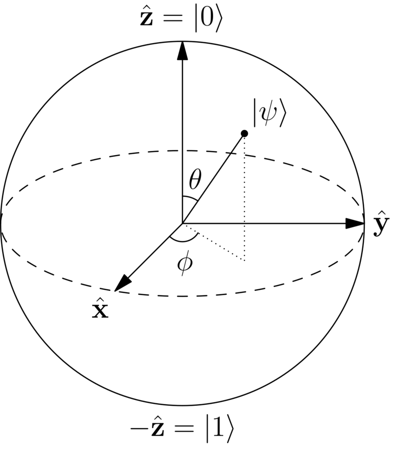
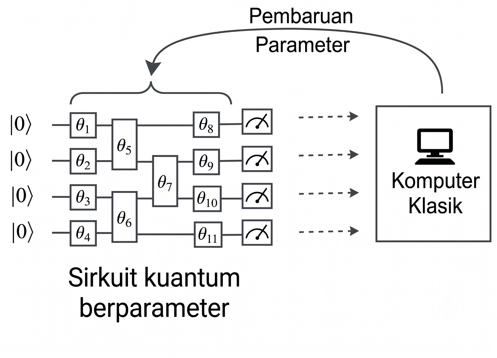

# Fase 5: Komputer Kuantum

## Bit Klasik vs Qubit Kuantum
:::: {.columns}
::: {.column width="50%"}
**Bit Klasik:**
* Unit informasi fundamental komputer konvensional.
* Bersifat deterministik: hanya bernilai 0 atau 1.
* Representasi fisik: 0 (tidak ada arus listrik), 1 (ada arus listrik).
:::
::: {.column width="50%"}
**Qubit Kuantum:**
* Unit informasi fundamental komputer kuantum.
* Memanfaatkan prinsip Superposisi: 0, 1, atau kombinasi linear keduanya.
  $$ |\psi\rangle = \alpha|0\rangle + \beta|1\rangle $$
:::
::::

---

## Representasi Qubit dan Quantum Measurement
* Status qubit didefinisikan sebagai vektor kolom di ruang Hilbert kompleks.
* **Basis Komputasi:**
  $$ |0\rangle = \begin{pmatrix} 1 \\ 0 \end{pmatrix}, \quad |1\rangle = \begin{pmatrix} 0 \\ 1 \end{pmatrix} $$
* **Aturan Born (Born Rule):** Probabilitas menemukan sistem pada status $i$ adalah $P(i) = |\langle i | \psi \rangle|^2$.
  * $|\psi\rangle$: Keadaan sistem kuantum sebelum diukur
  * $|i\rangle$: Keadaan sistem kuantum setelah diukur
  * $\langle i | \psi \rangle$: Amplitudo probabilitas
* **Syarat Normalisasi:** Total probabilitas harus bernilai 1 ($|\alpha|^2 + |\beta|^2 = 1$).

---

## Geometri Qubit: Bola Bloch
:::: {.columns}
::: {.column width="60%"}
* Keadaan kuantum dapat divisualisasikan dalam bentuk *Bloch Sphere*.
* Dua parameter sudut:
  * $\theta$ (Polar): Menentukan probabilitas $|0\rangle$ vs $|1\rangle$.
  * $\phi$ (Azimuthal): Menentukan fase kuantum.
* Fungsi gelombang qubit:
  $$ |\psi\rangle = \cos\frac{\theta}{2}|0\rangle + e^{i\phi}\sin\frac{\theta}{2}|1\rangle $$
:::
::: {.column width="40%"}

Sumber: Qiskit Documentation

:::
::::

---

## Gerbang 1 Qubit (Rotasi SU2)
* Gerbang kuantum adalah operator unitari untuk memanipulasi status qubit berdasarkan matriks Pauli:
  $$ \sigma_x = \begin{pmatrix} 0 & 1 \\ 1 & 0 \end{pmatrix}, \quad \sigma_y = \begin{pmatrix} 0 & -i \\ i & 0 \end{pmatrix}, \quad \sigma_z = \begin{pmatrix} 1 & 0 \\ 0 & -1 \end{pmatrix} $$
* Dengan rumus dasar $R_{\sigma}(\theta) = e^{-i \frac{\theta}{2} \sigma} = \cos\frac{\theta}{2} I - i \sin\frac{\theta}{2} \sigma$, matriks rotasi menjadi:
  $$ R_x(\theta) = \begin{pmatrix} \cos\frac{\theta}{2} & -i\sin\frac{\theta}{2} \\ -i\sin\frac{\theta}{2} & \cos\frac{\theta}{2} \end{pmatrix}, \quad R_y(\theta) = \begin{pmatrix} \cos\frac{\theta}{2} & -\sin\frac{\theta}{2} \\ \sin\frac{\theta}{2} & \cos\frac{\theta}{2} \end{pmatrix} $$
  $$ R_z(\phi) = \begin{pmatrix} e^{-i\phi/2} & 0 \\ 0 & e^{i\phi/2} \end{pmatrix} $$

---

## Gerbang 2 Qubit (Keterbelitan / Entanglement)
:::: {.columns}
::: {.column width="50%"}
* **Interaksi Non-Lokal:** Status satu qubit menjadi bergantung pada qubit lainnya.
* **Gerbang CNOT:** Membalik fasa qubit target jika qubit kontrol bernilai 1.
  $$ \begin{split} \text{CNOT}_{01} \quad &|00\rangle \to |00\rangle \\ &|01\rangle \to |01\rangle \\ &|10\rangle \to |11\rangle \\ &|11\rangle \to |10\rangle \end{split} $$
:::
::: {.column width="50%"}
* Bentuk matriks transformasi CNOT:
  $$ \text{CNOT}_{01} = \begin{pmatrix} 1 & 0 & 0 & 0 \\ 0 & 1 & 0 & 0 \\ 0 & 0 & 0 & 1 \\ 0 & 0 & 1 & 0 \end{pmatrix} $$
:::
::::

---

## VQE: Parameterized Quantum Circuit (PQC)
* Sirkuit kuantum berparameter (PQC) merupakan rangkaian gerbang kuantum yang nilai parameternya ($\boldsymbol{\theta}$) dapat diatur/dioptimasi.
* **Variational Quantum Eigensolver (VQE):** Algoritma hybrid klasik-kuantum (*Quantum Machine Learning*).
* Tahapan PQC:
  1. *Data Encoding*
  2. *Variational Layers* (Ansatz)
  3. *Measurement* (Pengukuran)
* Pengukuran energi dievaluasi oleh optimasi klasik untuk memperbarui nilai parameter $\boldsymbol{\theta}$.

{width=40% fig-align="center"}
