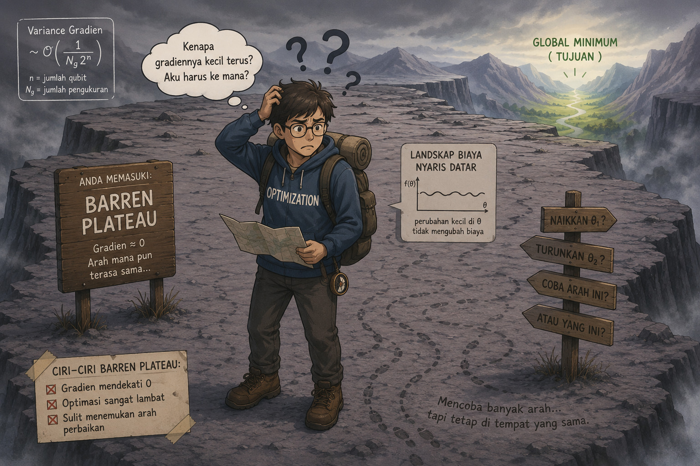
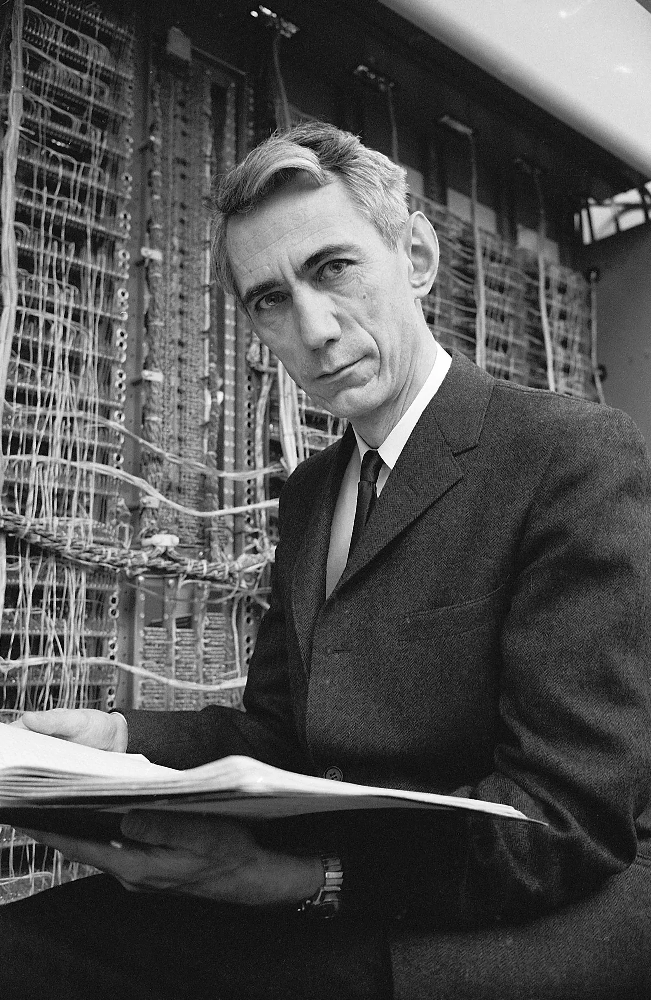

# Fase 7: Tantangan Kuantum dan Diagnostik Entropi

## Fenomena *Barren Plateau*

:::: {.columns}
::: {.column width="50%"}

:::
::: {.column width="50%"}

:::
::::

---

## Analisis *Barren Plateau* pada Simulasi
:::: {.columns}
::: {.column width="60%"}
* Sirkuit dengan *depth* rendah memiliki fungsi biaya yang sederhana dan gradien yang informatif.
* Penambahan gerbang *entanglement* (CNOT) secara berulang menyebabkan parameter saling terhubung dan bercampur secara kompleks.
* Karena efek *Central Limit Theorem*, banyak komponen gradien yang saling membatalkan hingga ekspektasinya mendekati nol.
* Akibatnya, **semakin banyak *depth* dan *qubit*, maka akan semakin rentan terhadap *barren plateau*** karena perilakunya mendekati acak penuh (*unitary 2-design*).
* **Solusi Simulasi:** Inisialisasi parameter (*warm-start*) menggunakan *Nash Equilibrium* terbukti menghindari jebakan *barren plateau* pada sistem $N=4$.
:::
::: {.column width="40%"}

Visualisasi pemilihan kedalaman sirkuit (Depth) optimal.

:::
::::

---

## Entropi Shannon $\to$ Entropi Von Neumann {.scrollable}

::: {.panel-tabset}
### Rumus Utama

:::: {.columns}
::: {.column width="25%"}

Claude Shannon (Bapak Teori Informasi)

:::
::: {.column width="75%"}
* **Ide Fundamental Shannon:** Menginterpretasikan "keacakan" atau ketidakpastian informasi dalam suatu sistem dan merumuskannya menjadi **entropi** dalam satuan bit.
* **Entropi Shannon** (klasik): 
  $$ H = - \sum_i p_i \log_2 (p_i) $$
* **Entropi Von Neumann** menggeneralisasi konsep Shannon ke dalam mekanika kuantum menggunakan matriks densitas ($\rho$):
  $$ S(\rho) = -\text{Tr}(\rho \log_2 \rho) $$
* Jika $S \approx 0$: Sistem stabil pada *pure state* (satu konfigurasi dominan).
* Jika $S$ tinggi: Probabilitas tersebar merata (indikasi *Barren Plateau*).
:::
::::

### Penurunan Rumus

**Generalisasi: Dari Entropi Shannon ke Entropi Von Neumann**

**Langkah 1 — Entropi Shannon (Klasik):**

Untuk distribusi probabilitas diskrit $p_i$, entropi informasi didefinisikan sebagai:

$$H = - \sum_i p_i \log_2 (p_i)$$

---

**Langkah 2 — Definisi Entropi Von Neumann:**

Dalam mekanika kuantum, probabilitas digantikan oleh operator densitas $\rho$. Entropi Von Neumann didefinisikan langsung melalui fungsi operator tersebut:

$$S(\rho) = -\text{Tr}(\rho \log_2 \rho)$$

---

**Langkah 3 — Teorema Spektral:**

Karena operator densitas $\rho$ bersifat Hermitian, ia selalu dapat didiagonalisasi (dekomposisi spektral):

$$\rho = U \Lambda U^\dagger$$

dengan $\Lambda$ adalah matriks diagonal yang berisi nilai eigen $\lambda_i$, dan $U$ adalah matriks uniter.

---

**Langkah 4 — Logaritma Matriks:**

Berdasarkan definisi fungsi matriks, logaritma diterapkan pada nilai eigennya:

$$\log_2(\rho) = U (\log_2 \Lambda) U^\dagger$$

---

**Langkah 5 — Operasi *Trace* dan Invariansi:**

Kita kalikan $\rho$ dengan $\log_2(\rho)$:

$$\rho \log_2(\rho) = (U \Lambda U^\dagger) (U (\log_2 \Lambda) U^\dagger) = U (\Lambda \log_2 \Lambda) U^\dagger$$

Gunakan sifat invariansi *trace* ($\text{Tr}(U A U^\dagger) = \text{Tr}(A)$):

$$S(\rho) = -\text{Tr}(U (\Lambda \log_2 \Lambda) U^\dagger) = -\text{Tr}(\Lambda \log_2 \Lambda)$$

Karena $\Lambda$ adalah matriks diagonal, perhitungan *trace*-nya hanyalah jumlahan dari elemen diagonal:

$$\boxed{S(\rho) = -\sum_i \lambda_i \log_2 (\lambda_i)}$$

---

**Langkah 6 — Reduksi ke Bentuk Klasik:**

Jika $\rho$ sudah dalam bentuk diagonal murni di mana matriksnya mewakili campuran klasik murni, maka nilai eigen $\lambda_i$ akan sama dengan probabilitas $p_i$, sehingga rumusnya akan mereduksi secara identik menjadi Entropi Shannon biasa.

---

**Indikator *Barren Plateau*:**

Jika entropi mendekati batas maksimum $S(\rho_A) \approx \log(d_A)$, maka:

$$\nabla\langle\psi(\theta)| \hat{H}|\psi(\theta)\rangle \to 0$$

karena distribusi probabilitas semakin homogen dalam ruang keadaan.

   

:::

---

## Evolusi Entropi: Studi Kasus Numerik {.smaller}

Pemanfaatan Entropi Von Neumann dalam memantau jejak persebaran probabilitas di titik konvergensi akhir VQE.

:::: {.columns}
::: {.column width="50%"}
**Sistem $N=2$**

| Parameter | Nilai |
|:---|:---:|
| Probabilitas mayoritas ($p_1$) | $0{,}98$ |
| Sisa probabilitas ($p_\text{rest}$) | $0{,}02$ |

**Kalkulasi:**

$$ S = -(0{,}98 \cdot \log_2(0{,}98) + 0{,}02 \cdot \log_2(0{,}02)) $$
$$ S \approx 0{,}1414 \text{ bit} $$

→ Probabilitas sangat tersentralisasi dan stabil.
:::
::: {.column width="50%"}
**Sistem $N=4$**

| Parameter | Nilai |
|:---|:---:|
| Prob. Optimal ($p_1$) | $0{,}94$ |
| Prob. Alternatif 1 ($p_2$) | $0{,}02$ |
| Prob. Alternatif 2 ($p_3$) | $0{,}02$ |
| Prob. Alternatif 3 ($p_4$) | $0{,}02$ |

*Total 4 keadaan dengan probabilitas relevan karena pembatasan ruang pencarian oleh fungsi penalti.*

**Kalkulasi:**

$$ S = -\left(0{,}94 \log_2(0{,}94) + 3 \times (0{,}02 \log_2(0{,}02))\right) $$
$$ S \approx 0{,}4225 \text{ bit} $$

→ Sedikit melebar karena dimensi bertambah, namun jauh di bawah batas entropi maksimum $\log_2(4) = 2$ bit → deteksi *ground state* handal.
:::
::::
