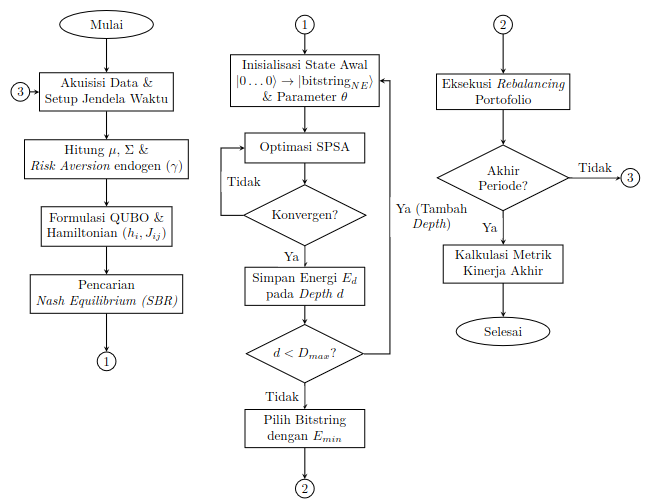

# Fase 8: Metodologi Penelitian

## Alur Penelitian
{fig-align="center" width=45%}

---

## Tahap 1: Akuisisi dan Pra-pemrosesan Data {.scrollable}

::: {.panel-tabset}
### Algoritma Akuisisi
```pseudocode
Procedure DataPreprocessing(tickers, start_time, end_time)
  1. P <- DownloadClosingPrice(tickers)
  2. r_log <- ln(P_t / P_t-1)  // Kalkulasi Log Return
  3. mu_log <- Mean(r_log) - 0.5 * Var(r_log) // Volatility Drag
  4. Sigma <- Covariance(r_log)
  5. gamma <- ComputeEndogenousLambda(mu_log, Sigma)
  6. Return mu_log, Sigma, gamma
EndProcedure
```
* **Catatan:** *Volatility drag* dihitung untuk mencegah divergensi linearitas aset terhadap parameter fluktuasi ekspektasi logaritmik dalam periode panjang.

### Contoh Numerik
<div class="scrollable" style="max-height: 450px; font-size: 0.7em;">
**Contoh Perhitungan Parameter Risiko dan Return (Kasus N=2 BBCA)**

Berdasarkan data harga penutupan yang meningkat dari 4515,50 menjadi 4869,32:
* *Simple Return:*
  $ R_{BBCA,1} = \frac{4869,32-4515,50}{4515,50} \approx 0,0783 $
* *Log Return:*
  $ r_{BBCA,1} = \ln(1+0,0783) \approx 0,0754 $

Matriks Kovariansi ($N=2$):
$ \Sigma_{N2} = \begin{pmatrix} 0,0915 & 0,0202 \\ 0,0202 & 0,0367 \end{pmatrix} $

Parameter *Risk Aversion* Endogen:
Dengan $\mu_{l,1}=0,3164$, $\sigma_{l,1}=0,3024$ (BBCA) dan $\mu_{l,2}=0,1756$, $\sigma_{l,2}=0,1916$ (ADRO):
* Rata-rata ekspektasi: $\bar{\mu}_l = \frac{0,3164+0,1756}{2} = 0,2460$
* Rata-rata volatilitas: $\bar{\sigma}_l = \frac{0,3024+0,1916}{2} = 0,2470$
* Rasio Sharpe Agregat: $Z = \frac{0,2460}{0,2470} \approx 0,9960$
* Parameter *Risk Aversion*:
  $ \gamma = \frac{1}{1+e^{0,9960}} = 0,2697 $

<br><br><br>
</div>
:::

---

## Tahap 2: Pemodelan Hamiltonian Portofolio

```pseudocode
Procedure BuildHamiltonian(mu, Sigma, gamma, K, lambda_penalti)
  1. Q_ii <- (gamma * Sigma_ii) / (2 * K^2) - (mu_i / K) + lambda_penalti * (1 - 2K)
  2. Q_ij <- (gamma * Sigma_ij) / (2 * K^2) + lambda_penalti
  3. h_i <- -0.5 * (Q_ii + Sum_over_j!=i (Q_ij))
  4. J_ij <- 0.25 * Q_ij
  5. H <- Sum(h_i * Z_i) + Sum(J_ij * Z_i * Z_j) + C * I
  6. Return H
EndProcedure
```
* **Catatan:** Suku penalti kardinalitas ($\lambda$) menjamin alokasi portofolio sesuai dengan *budget* ketersediaan dana ($K$).

---

## Tahap 3: EPG *Sequential Best Response* (SBR) {.scrollable}

::: {.panel-tabset}
### Algoritma SBR
Algoritma pencarian *Nash Equilibrium* untuk digunakan sebagai strategi *warm-start*.

```pseudocode
Procedure NashSBR(mu, Sigma, gamma, N, K)
  1. x <- InitialSelection(K)
  2. For iter = 1 to max_iter:
  3.     For i in S_in and j in S_out:
  4.         x_new <- Swap(x, i, j)
  5.         If Phi(x_new) > Phi(x):
  6.             x <- x_new, Phi <- Phi_new, improved <- True
  7.             Break
  8.     If not improved: Break
  9. Return x // Bitstring ekuilibrium (contoh: |0101>)
EndProcedure
```

### Contoh Numerik
<div class="scrollable" style="max-height: 450px; font-size: 0.70em;">

**Contoh Pencarian *Nash Equilibrium* dengan SBR**

Misalkan terdapat tiga aset dengan parameter

$\gamma = 1,\qquad \mu = \begin{bmatrix} 12\\ 11\\ 8 \end{bmatrix},\qquad \Sigma=\begin{bmatrix} 10 & 8 & 2\\ 8 & 10 & -2\\ 2 & -2 & 10 \end{bmatrix},$

dan jumlah aset yang harus dipilih adalah

$K=2.$

Fungsi potensial didefinisikan sebagai

$\Phi(x)=\frac{1}{K}\sum_i\mu_i x_i -\frac{\gamma}{2K^2}\sum_{i,j}\Sigma_{ij}x_ix_j.$

---

**Langkah 1 — Inisialisasi**

Sesuai algoritma,

$x=(1,1,0),$

sehingga

$S_{in}=\{1,2\},\qquad S_{out}=\{3\}.$

Nilai fungsi potensial awal adalah

$\Phi(110)=\frac{12+11}{2}-\frac{1}{8}(10+10+8+8)=7.$

---

**Langkah 2 — Evaluasi Kandidat Swap**

**Swap (1,3)**

$110\rightarrow 011$

$\Phi(011)=\frac{11+8}{2}-\frac18(10+10-2-2)=7.5$

Karena

$7.5>7,$

swap **diterima**.

---

**Langkah 3 — Pembaruan Sekuensial**

Bitstring diperbarui menjadi

$x=(0,1,1).$

Sekarang

$S_{in}=\{2,3\},\qquad S_{out}=\{1\}.$

Kandidat berikutnya

$011\rightarrow101.$

Diperoleh

$\Phi(101)=\frac{12+8}{2}-\frac18(10+10+2+2)=7.$

Karena

$7<7.5,$

swap **ditolak**.

---

**Langkah 4 — Terminasi**

Tidak terdapat lagi *swap* yang meningkatkan nilai fungsi potensial,

$\Phi' \le \Phi.$

Oleh karena itu algoritma berhenti dan menghasilkan

$\boxed{x=(0,1,1)}$

sebagai kandidat *Nash Equilibrium* yang akan digunakan sebagai strategi *warm-start* bagi VQE.

<br><br>
</div>
:::

---

## Tahap 4: Optimasi Variasional HE-VQE Adaptif

```pseudocode
Procedure AdaptiveVQE(H, x_NE, D_max, lambda_target)
  1. theta <- InitialParameters(x_NE) // Warm-Start Injection
  2. For depth d = 1 to D_max:
  3.     For k = 1 to N_iter:
  4.         lambda_k <- PenaltyAnnealing(k)
  5.         L(theta) <- <psi(theta)| H_obj + lambda_k H_pen |psi(theta)>
  6.         theta <- theta - a_k * SPSA_Gradient(L, theta)
  7.     theta <- LayerExpansion(theta) // Heuristic Ansatz
  8.     If Converged(theta): Break
  9. Return x_best <- Argmax(|<x|psi(theta_final)>|^2)
EndProcedure
```

---

## Tahap 5:Optimasi Klasik SLSQP {.scrollable}

::: {.panel-tabset}
### Algoritma SLSQP
Algoritma *Sequential Least Squares Programming* untuk menyelesaikan sub-masalah pemrograman kuadratik sebagai standar komparasi.

```pseudocode
Procedure SLSQPOptimizer(mu, Sigma, gamma)
  1. w_0 <- InitialWeights(1/N)
  2. B_0 <- I // Inisialisasi Hessian Identitas
  3. For k = 0, 1, 2, ... until converged:
  4.     g_k <- gamma * Sigma * w_k - mu // Hitung Gradien
  5.     Solve Sub-QP: min(g_k^T d + 0.5 d^T B_k d) s.t. constraints
  6.     a_k <- LineSearch(w_k, d)
  7.     w_{k+1} <- w_k + a_k * d
  8.     s_k <- w_{k+1} - w_k, y_k <- g_{k+1} - g_k
  9.     B_{k+1} <- UpdateBFGS(B_k, s_k, y_k)
  10. Return w_final
EndProcedure
```

### Contoh Numerik
<div class="scrollable" style="max-height: 450px; font-size: 0.70em;">

**Contoh Perhitungan SLSQP (Kasus $N=2$)**

Misalkan
$\mu=\begin{pmatrix}0.10\\0.05\end{pmatrix},\qquad\Sigma=\begin{pmatrix}0.04 & 0.01\\0.01 & 0.02\end{pmatrix},\qquad\gamma=1.$

**Inisialisasi**

$w_0=\begin{pmatrix}0.5\\0.5\end{pmatrix},\qquad B_0=\begin{pmatrix}1&0\\0&1\end{pmatrix}.$

**1. Hitung Gradien**

$g_0=\gamma\Sigma w_0-\mu.$

Karena

$\Sigma w_0=\begin{pmatrix}0.025\\0.015\end{pmatrix},$

maka

$g_0=\begin{pmatrix}-0.075\\-0.035\end{pmatrix}.$

---

**2. Selesaikan Sub-masalah Quadratic Programming**

Sub-QP yang diselesaikan adalah

$\min_d\left(g_0^Td+\frac12 d^TB_0d\right),$

dengan kendala

$d_1+d_2=0.$

Karena

$d_2=-d_1,$

fungsi objektif menjadi

$g(d_1)=-0.040d_1+d_1^2.$

Turunan pertama

$\frac{dg}{dd_1}=-0.040+2d_1=0$

memberikan solusi

$d=\begin{pmatrix}0.02\\-0.02\end{pmatrix}.$

---

**3. Line Search**

Misalkan hasil *line search* menghasilkan

$\alpha_0=1.$

---

**4. Update Bobot**

$w_1=w_0+\alpha_0d=\begin{pmatrix}0.52\\0.48\end{pmatrix}.$

---

**5. Update Hessian (BFGS)**

Hitung

$s_0=w_1-w_0=\begin{pmatrix}0.02\\-0.02\end{pmatrix},$

kemudian gradien baru

$g_1=\Sigma w_1-\mu=\begin{pmatrix}-0.0744\\-0.0352\end{pmatrix},$

sehingga

$y_0=g_1-g_0=\begin{pmatrix}0.0006\\-0.0002\end{pmatrix}.$

Selanjutnya matriks Hessian diperbarui menggunakan rumus BFGS

$B_1=B_0-\frac{B_0s_0s_0^TB_0}{s_0^TB_0s_0}+\frac{y_0y_0^T}{y_0^Ts_0},$

yang kemudian digunakan pada iterasi berikutnya.

**Iterasi selanjutnya mengulangi langkah yang sama hingga memenuhi kriteria konvergensi dan menghasilkan bobot portofolio optimal.**

<br><br><br>
</div>
:::

---

## Tahap 6: Validasi *Brute Force* {.scrollable}

::: {.panel-tabset}
### Algoritma Evaluasi
```pseudocode
Procedure BruteForce(H, N, K)
  1. best_E <- infinity
  2. For each x in Combinations(N, K):
  3.    E <- CalculateIsingEnergy(x, H)
  4.    If E < best_E:
  5.       best_E <- E
  6.       best_x <- x
  7. Return best_x, best_E
EndProcedure
```

### Contoh Numerik
<div class="scrollable" style="max-height: 450px; font-size: 0.7em;">
**Contoh Validasi *Brute Force* (Kasus N=2)**

Diberikan sebuah Hamiltonian sistem dua aset ($N=2$):
$$ \hat{\mathcal{H}}_{N2} = 0,1735 \hat{Z}_1 + 0,0931 \hat{Z}_2 + 0,5014 \hat{Z}_1 \hat{Z}_2 + 0,2320 $$

Evaluasi energi kombinatorial untuk setiap keadaan basis ($z_i = 1 - 2x_i$):

$$
\begin{aligned}
E(|00\rangle) &\approx 1,0000 \\
E(|01\rangle) &\approx -0,1890 \\
E(|10\rangle) &\approx -0,3498 \\
E(|11\rangle) &\approx 0,4667 
\end{aligned}
$$

Berdasarkan kalkulasi energi secara eksplisit, konfigurasi $|10\rangle$ memiliki energi terendah sehingga ditetapkan sebagai *ground state* global sistem.
Hasil pencarian *Brute Force* ini mengonfirmasi solusi yang dicapai oleh EPG *Nash Equilibrium* dan pencarian heuristik VQE.

<br><br><br>
</div>
:::

---

## Tahap 7: *Backtesting*

```pseudocode
Procedure BacktestLoop(Data, K)
  1. For t in Timeline:
  2.    mu, Sigma, gamma <- DataPreprocessing
  3.    H <- BuildHamiltonian
  4.    x_NE <- NashSBR
  5.    x_best_t <- AdaptiveVQE(H, x_NE)
  6.    R_t <- ExecuteRebalance(x_best_t)
  7. Return PerformanceMetrics
EndProcedure
```

