# Fase 9: Hasil Analisis dan Kesimpulan

## Simulasi Interaktif Konvergensi VQE

<iframe src="interactive_vqe.html" width="100%" height="600px" style="border:none; border-radius:15px; background:transparent;"></iframe>

Silakan sesuaikan parameter bias dan interaksi ($h_i$, $J_{ij}$) lalu klik <b>Mulai SPSA</b> untuk melihat simulasi konvergensi.

---

## Pergerakan Harga Saham ($N=4$)

Kombinasi saham BBCA, ADRO, TLKM, dan SMGR (2021-2023) dievaluasi dengan mekanisme *rebalancing* bulanan.

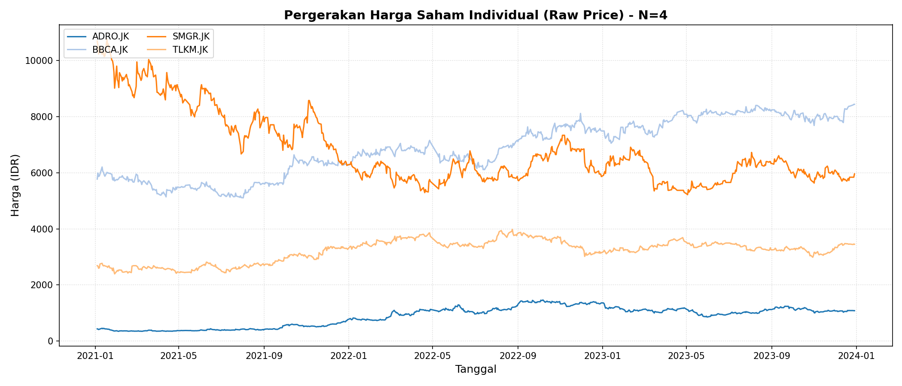

---

## Ringkasan Performa Simulasi Finansial

Tabel perbandingan *backtesting* strategi Kuantum, SLSQP, dan *Equal Weight* untuk Sistem $N=2$ dan $N=4$.

| Strategi Algoritma | Return ($N=2$) | Sharpe ($N=2$) | MDD ($N=2$) | Return ($N=4$) | Sharpe ($N=4$) | MDD ($N=4$) |
|:---|:---:|:---:|:---:|:---:|:---:|:---:|
| **GT-VQE (Hibrida)** | **145,07%** | **1,0185** | 30,33% | **73,15%** | **1,0107** | **16,68%** |
| VQE (Tanpa GT) | 121,30% | 0,9331 | 30,33% | 16,89% | 0,3592 | 20,89% |
| SLSQP (Klasik) | 51,34% | 0,6736 | **15,91%** | 12,91% | 0,2810 | 21,12% |
| *Equal Weight* | 97,88% | 0,9764 | 27,49% | 35,57% | 0,6790 | 18,42% |

**Catatan:** GT-VQE mendominasi performa pengembalian maupun rasio *Sharpe* karena inisialisasi *Nash Equilibrium* berhasil mengeksploitasi informasi struktural pasar.

---

## Perbandingan Pertumbuhan Modal Klasik ($N=2$)

:::: {.columns}
::: {.column width="50%"}
**SLSQP (Optimasi Klasik)**
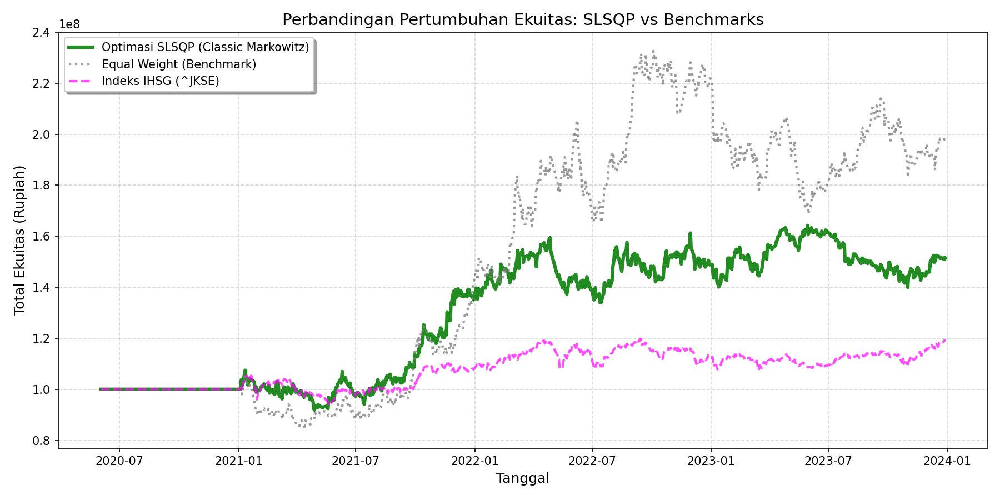
:::
::: {.column width="50%"}
**Nash Equilibrium (Klasik)**
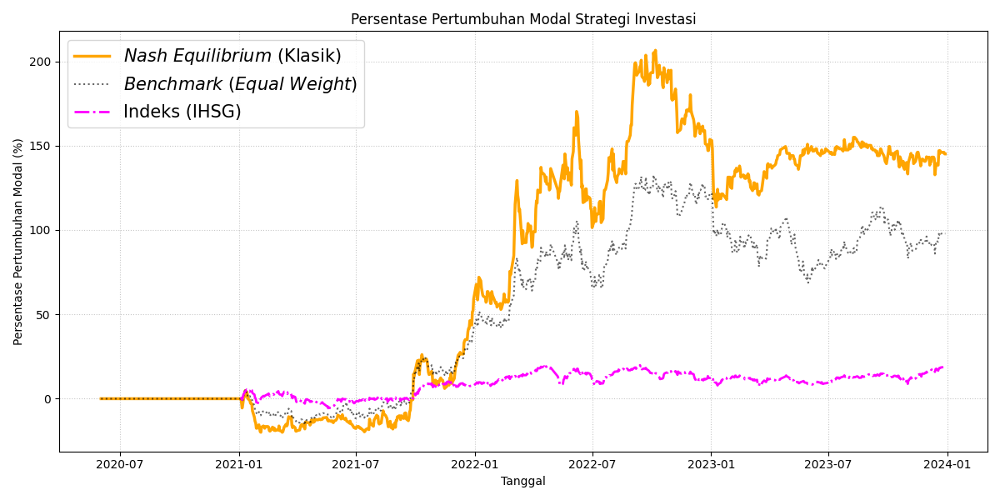
:::
::::

---

## Perbandingan Pertumbuhan Modal Klasik ($N=4$)

:::: {.columns}
::: {.column width="50%"}
**SLSQP (Optimasi Klasik)**
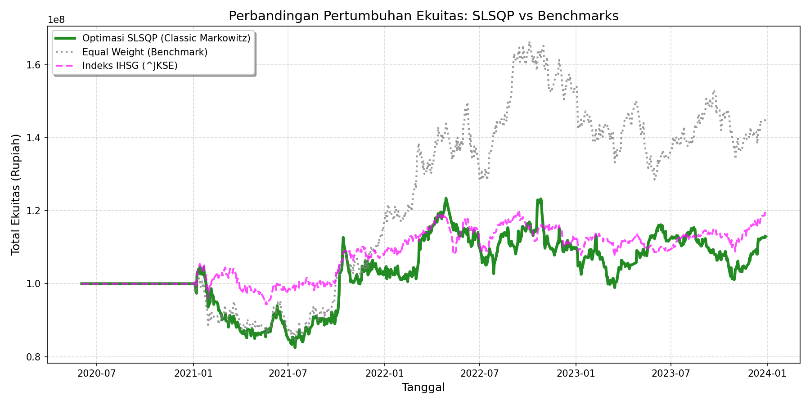
:::
::: {.column width="50%"}
**Nash Equilibrium (Klasik)**
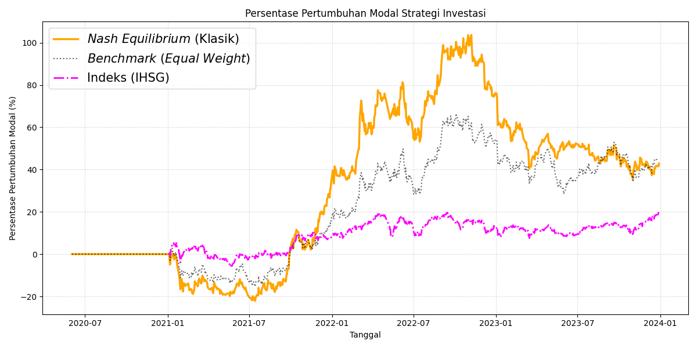
:::
::::

---

## Perbandingan Pertumbuhan Modal ($N=2$)

:::: {.columns}
::: {.column width="50%"}
**VQE Murni (Tanpa GT)**
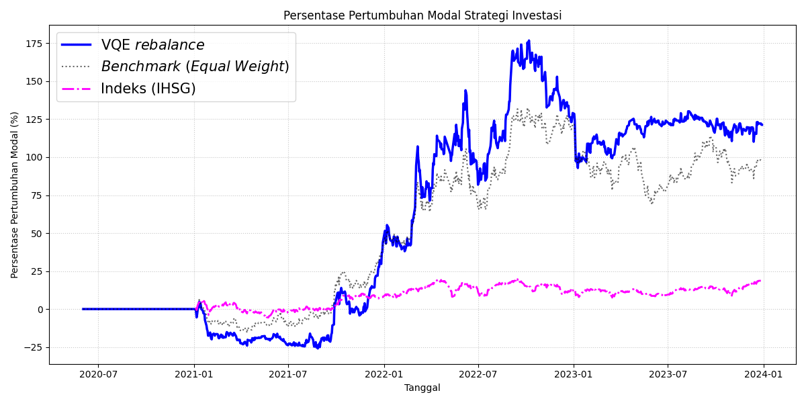
:::
::: {.column width="50%"}
**GT-VQE (Hibrida)**
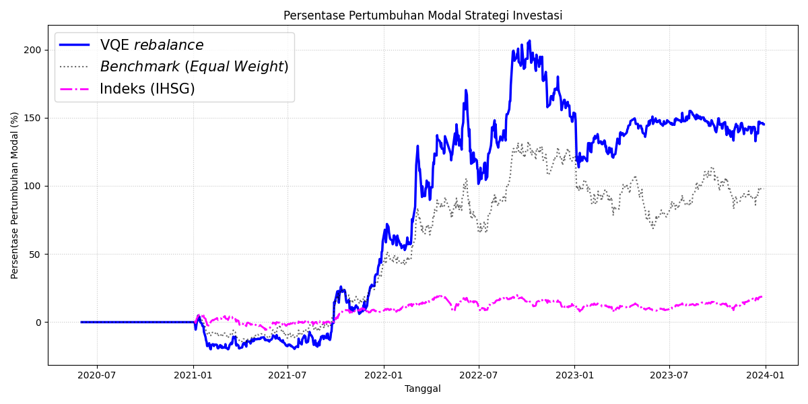
:::
::::

---

## Dinamika Adaptasi Kedalaman Sirkuit ($N=2$)

Efektivitas *warm-start* terlihat dari dominasi operasional GT-VQE pada kedalaman dangkal, mengurangi fluktuasi *depth* antar jendela observasi.

:::: {.columns}
::: {.column width="50%"}
**VQE Murni ($N=2$)**

:::
::: {.column width="50%"}
**GT-VQE Hibrida ($N=2$)**
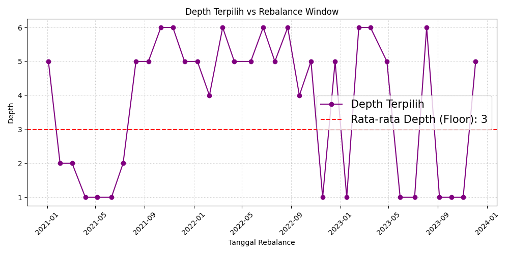
:::
::::

---

## Perbandingan Pertumbuhan Modal ($N=4$)

:::: {.columns}
::: {.column width="50%"}
**VQE Murni (Tanpa GT)**
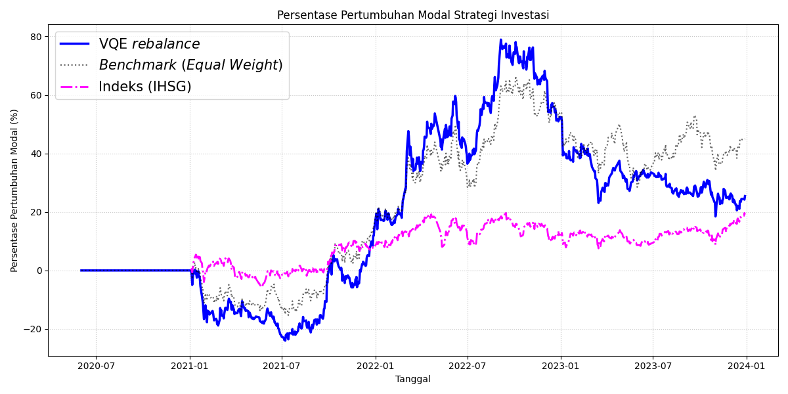
:::
::: {.column width="50%"}
**GT-VQE (Hibrida)**
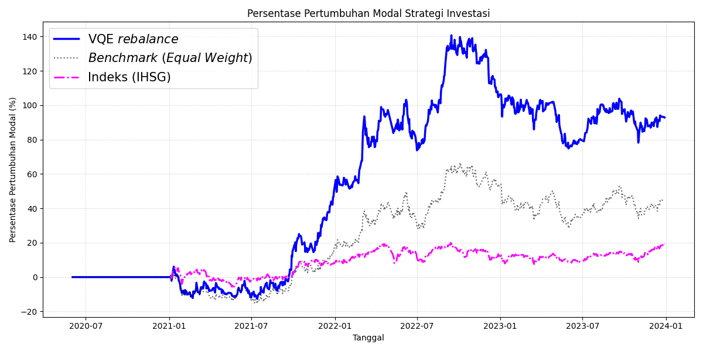
:::
::::

---

## Dinamika Adaptasi Kedalaman Sirkuit ($N=4$)

Efektivitas *warm-start* terlihat dari dominasi operasional GT-VQE pada kedalaman dangkal, mengurangi fluktuasi *depth* antar jendela observasi.

:::: {.columns}
::: {.column width="50%"}
**VQE Murni ($N=4$)**
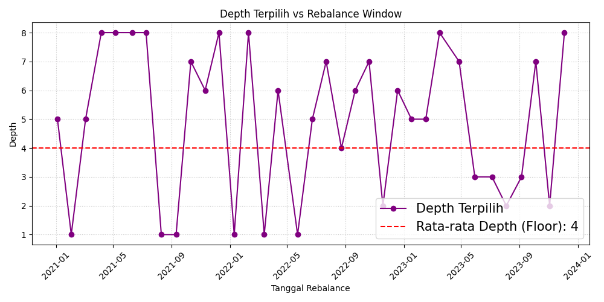
:::
::: {.column width="50%"}
**GT-VQE Hibrida ($N=4$)**
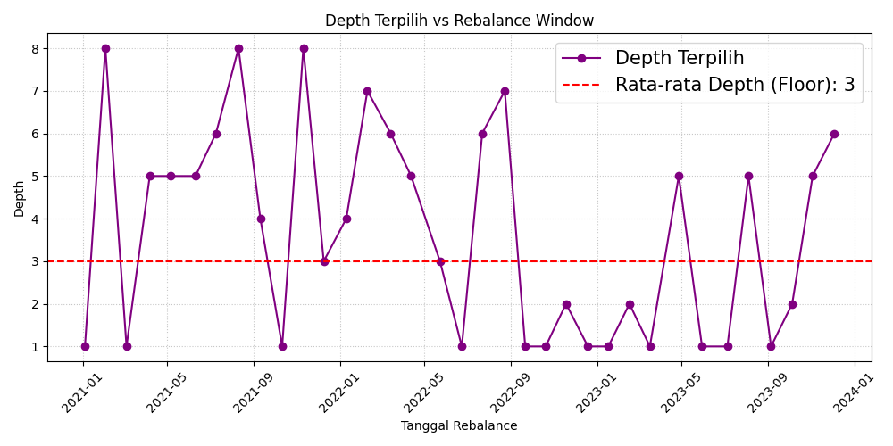
:::
::::

---

## Kesimpulan

:::: {.columns}

::: {.column width="28%"}
### Formulasi EPG

Formulasi model Markowitz ke dalam kerangka <i>Exact Potential Game</i> (EPG) telah berhasil memetakan utilitas ekonomi menjadi sistem Hamiltonian fisis secara akurat. Penggunaan <i>log return</i> efektif menjaga simetri interaksi risiko tanpa distorsi, sementara implementasi suku penalti mencegah sirkuit kuantum terjebak pada status portofolio yang melanggar diversifikasi.

:::

::: {.column width="8%"}

&#10140;

:::

::: {.column width="28%"}
### Warm-Start Nash

Penerapan <i>Pure Strategy Nash Equilibrium</i> (PSNE) terbukti meningkatkan efisiensi algoritma VQE. Injeksi solusi Nash memandu sirkuit melewati area <i>barren plateaus</i> dan memicu keruntuhan entropi <i>Von Neumann</i>, memungkinkan pencapaian <i>ground state</i> pada kedalaman sirkuit yang sangat dangkal ($L=2$ hingga $L=3$).

:::

::: {.column width="8%"}

&#10140;

:::

::: {.column width="28%"}
### Performa GT-VQE

Kombinasi arsitektur <i>Hardware-Efficient Ansatz</i> dengan optimasi SPSA memungkinkan sistem merespons volatilitas pasar melalui mekanisme rebalancing dinamis. Hasil <i>backtesting</i> memvalidasi bahwa algoritma GT-VQE menghasilkan pertumbuhan modal superior dibandingkan VQE murni dan metode klasik dengan <i>Sharpe Ratio</i> 1,0107 ($N=4$).

:::

::::

---

## Saran Pengembangan

:::: {.columns}

::: {.column width="28%"}
### Noise Sirkuit

Mempertimbangkan parameter <i>noise</i> sirkuit, seperti dekoherensi qubit dan <i>gate fidelity</i> dalam mengeksekusi algoritma ini agar divalidasi dan diaplikasikan pada infrastruktur perangkat keras kuantum sesungguhnya.

:::

::: {.column width="8%"}

&#10140;

:::

::: {.column width="28%"}
### Variasi Ansatz

Menggunakan variasi struktur <i>ansatz</i> lain (seperti <i>Qubit-Efficient</i> atau <i>Variational Quantum Circuit</i>) serta membandingkan performa berbagai algoritma optimasi klasik lainnya untuk menemukan kombinasi hibrida dengan laju konvergensi paling efisien.

:::

::: {.column width="8%"}

&#10140;

:::

::: {.column width="28%"}
### Black Swan

Menggunakan rentang periode data historis yang lebih panjang dan melakukan pengujian pada periode fenomena <i>Black Swan</i> atau krisis ekonomi untuk mengevaluasi agilitas dan reliabilitas algoritma dalam mempertahankan stabilitas portofolio di pasar ekstrem.

:::

::::

---

  

  <h1>Terima Kasih</h1>
  
Ada Pertanyaan?

