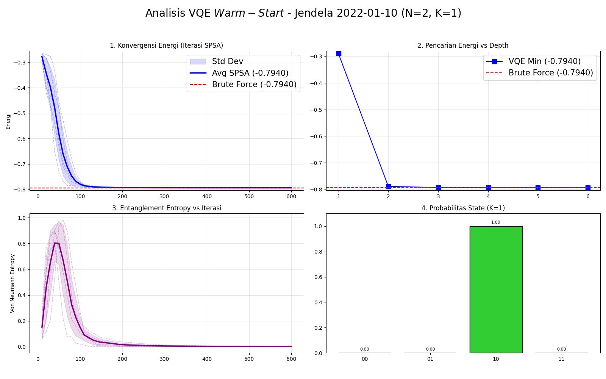
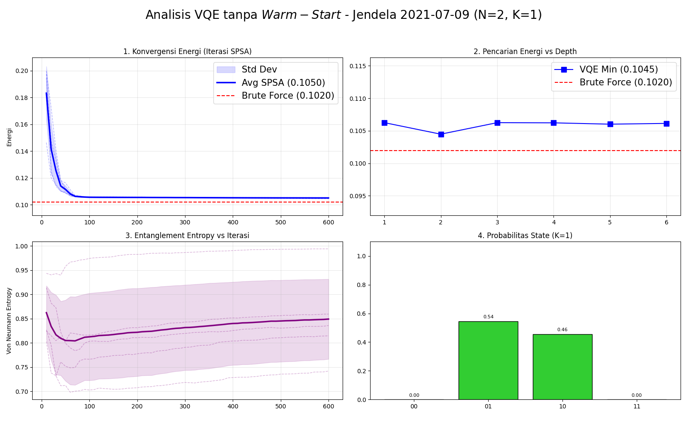

# Fase Hasil dan Pembahasan

## Simulasi Interaktif Konvergensi VQE

<iframe src="interactive_vqe.html" width="100%" height="600px" style="border:none; border-radius:15px; background:transparent;"></iframe>

Silakan sesuaikan parameter bias dan interaksi ($h_i$, $J_{ij}$) lalu klik <b>Mulai SPSA</b> untuk melihat simulasi konvergensi.

---

## Analisis Entropi: Solusi Optimal (Entropi Rendah)

::::: {.columns style="display: flex; align-items: center;"}

:::: {.column width="70%"}
{width="100%"}
::::

:::: {.column width="30%"}

* Probabilitas runtuh di satu *state* dominan
* Solusi telah konvergen ke titik minimum energi global

::::

:::::

---

## Analisis Entropi: Barren Plateau (Entropi Tinggi)

::::: {.columns style="display: flex; align-items: center;"}

:::: {.column width="70%"}
{width="100%"}
::::

:::: {.column width="30%"}

* Probabilitas tersebar merata
* Menunjukkan indikasi *barren plateau*

::::

:::::

---

## Pergerakan Harga Saham ($N=4$)

Kombinasi saham BBCA, ADRO, TLKM, dan SMGR (2021-2023) dievaluasi dengan mekanisme *rebalancing* bulanan.

---

## Perbandingan Pertumbuhan Modal Benchmark ($N=2$)

Perbandingan performa *backtesting* antara Portofolio Nash murni (tanpa VQE) dan optimasi portofolio klasik SLSQP untuk 2 aset.

::::: {.columns}

:::: {.column width="50%"}

**Portofolio Nash Murni**

::::

:::: {.column width="50%"}

**Optimasi Klasik (SLSQP)**

::::

:::::

---

## Perbandingan Pertumbuhan Modal Benchmark ($N=4$)

Perbandingan performa *backtesting* antara Portofolio Nash murni (tanpa VQE) dan optimasi portofolio klasik SLSQP untuk 4 aset.

::::: {.columns}

:::: {.column width="50%"}

**Portofolio Nash Murni**

::::

:::: {.column width="50%"}

**Optimasi Klasik (SLSQP)**

::::

:::::

---

## Perbandingan Pertumbuhan Modal ($N=2$)

Perbandingan antara VQE Murni (Tanpa GT) dan Algoritma GT-VQE (Hibrida) untuk 2 aset.

::::: {.columns}

:::: {.column width="50%"}

**VQE Murni (Tanpa GT)**

::::

:::: {.column width="50%"}

**GT-VQE (Hibrida)**

::::

:::::

---

## Perbandingan Pertumbuhan Modal ($N=4$)

Perbandingan antara VQE Murni (Tanpa GT) dan Algoritma GT-VQE (Hibrida) untuk 4 aset.

::::: {.columns}

:::: {.column width="50%"}

**VQE Murni (Tanpa GT)**

::::

:::: {.column width="50%"}

**GT-VQE (Hibrida)**

::::

:::::

---

## Dinamika Adaptasi Kedalaman Sirkuit ($N=2$)

Efektivitas *warm-start* terlihat dari dominasi operasional GT-VQE pada kedalaman dangkal, mengurangi fluktuasi *depth* antar jendela observasi.

:::: {.columns}
::: {.column width="50%"}
**VQE Murni ($N=2$)**

:::
::: {.column width="50%"}
**GT-VQE Hibrida ($N=2$)**

:::
::::

---

## Dinamika Adaptasi Kedalaman Sirkuit ($N=4$)

Efektivitas *warm-start* terlihat dari dominasi operasional GT-VQE pada kedalaman dangkal, mengurangi fluktuasi *depth* antar jendela observasi.

:::: {.columns}
::: {.column width="50%"}
**VQE Murni ($N=4$)**

:::
::: {.column width="50%"}
**GT-VQE Hibrida ($N=4$)**

:::
::::

---

## Ringkasan Performa Simulasi Finansial

Tabel perbandingan *backtesting* strategi Kuantum, SLSQP, dan *Equal Weight* untuk Sistem $N=2$ dan $N=4$.

| Strategi Algoritma | Return ($N=2$) | Sharpe ($N=2$) | MDD ($N=2$) | Return ($N=4$) | Sharpe ($N=4$) | MDD ($N=4$) |
|:---|:---:|:---:|:---:|:---:|:---:|:---:|
| **GT-VQE (Hibrida)** | **145,07%** | **1,0185** | 30,33% | **73,15%** | **1,0107** | **16,68%** |
| VQE (Tanpa GT) | 121,30% | 0,9331 | 30,33% | 16,89% | 0,3592 | 20,89% |
| SLSQP (Klasik) | 51,34% | 0,6736 | **15,91%** | 12,91% | 0,2810 | 21,12% |
| *Equal Weight* | 97,88% | 0,9764 | 27,49% | 35,57% | 0,6790 | 18,42% |

**Catatan:** GT-VQE mendominasi performa pengembalian maupun rasio *Sharpe* karena inisialisasi *Nash Equilibrium* berhasil mengeksploitasi informasi struktural pasar.

---

## Kesimpulan

::::: {.columns}

:::: {.column width="28%"}

### Formulasi EPG

Formulasi model Markowitz ke dalam kerangka *Exact Potential Game* (EPG) telah berhasil memetakan utilitas ekonomi menjadi sistem Hamiltonian fisis secara akurat. Penggunaan *log return* efektif menjaga simetri interaksi risiko tanpa distorsi, sementara implementasi suku penalti mencegah sirkuit kuantum terjebak pada status portofolio yang melanggar diversifikasi.

::::

:::: {.column width="8%"}

&#10140;

::::

:::: {.column width="28%"}

### Warm-Start Nash

Penerapan *Nash Equilibrium* sebagai *warm-start* terbukti meningkatkan efisiensi algoritma VQE. Solusi *Nash* yang diinjeksikan ke awal sirkuit membantu optimasi lolos dari area *barren plateaus* dan memicu keruntuhan entropi *Von Neumann*, sehingga memungkinkan pencapaian *ground state* pada kedalaman sirkuit dengan rata-rata yang lebih dangkal.

::::

:::: {.column width="8%"}

&#10140;

::::

:::: {.column width="28%"}

### Performa GT-VQE

Kombinasi arsitektur *Hardware-Efficient Ansatz* dengan optimasi SPSA memungkinkan sistem merespons volatilitas pasar secara dinamis. Hasil *backtesting* memvalidasi bahwa algoritma GT-VQE mampu memaksimalkan *Return* secara superior (73,15%) namun tetap meminimalkan risiko kerugian secara optimal (MDD 16,68%) dibandingkan VQE murni dan metode klasik ($N=4$).

::::

:::::

---

## Saran Pengembangan

::::: {.columns}

:::: {.column width="28%"}

### Noise Sirkuit

Mempertimbangkan parameter *noise* sirkuit, seperti dekoherensi qubit dan *gate fidelity* dalam mengeksekusi algoritma ini agar divalidasi dan diaplikasikan pada infrastruktur perangkat keras kuantum sesungguhnya.

::::

:::: {.column width="8%"}

&#10140;

::::

:::: {.column width="28%"}

### Variasi Ansatz

Menggunakan variasi struktur *ansatz* lain (seperti *Qubit-Efficient* atau *Variational Quantum Circuit*) serta membandingkan performa berbagai algoritma optimasi klasik lainnya untuk menemukan kombinasi hibrida dengan laju konvergensi paling efisien.

::::

:::: {.column width="8%"}

&#10140;

::::

:::: {.column width="28%"}

### Black Swan

Menggunakan rentang periode data historis yang lebih panjang dan melakukan pengujian pada periode fenomena *Black Swan* atau krisis ekonomi untuk mengevaluasi agilitas dan reliabilitas algoritma dalam mempertahankan stabilitas portofolio di pasar ekstrem.

::::

:::::

---

  

  <h1>Terima Kasih</h1>

