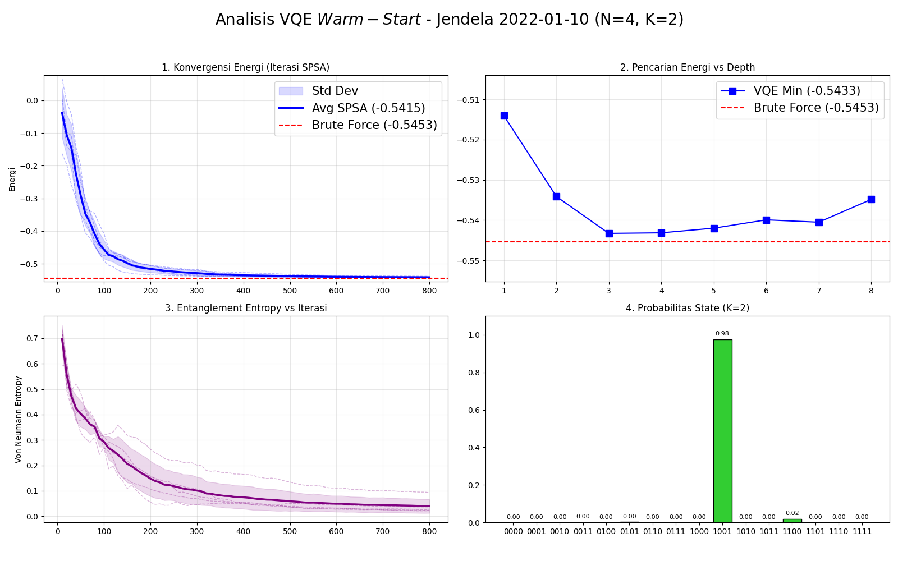
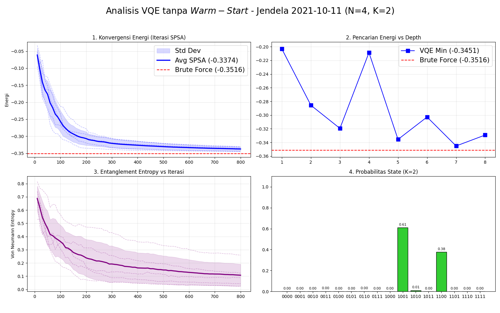

# Lampiran

## Lampiran: Grafik Simulasi GT-VQE ($N=4$)

::::: {.columns style="display: flex; align-items: center;"}

:::: {.column width="70%"}
{width="100%"}
::::

:::: {.column width="30%"}

::::

:::::

---

## Lampiran: Grafik Simulasi VQE Murni ($N=4$)

::::: {.columns style="display: flex; align-items: center;"}

:::: {.column width="70%"}
{width="100%"}
::::

:::: {.column width="30%"}

::::

:::::
