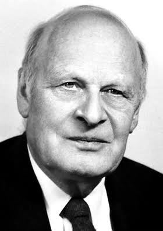
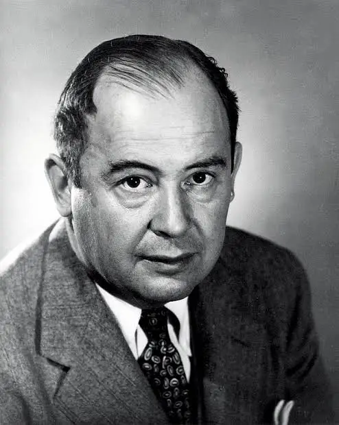
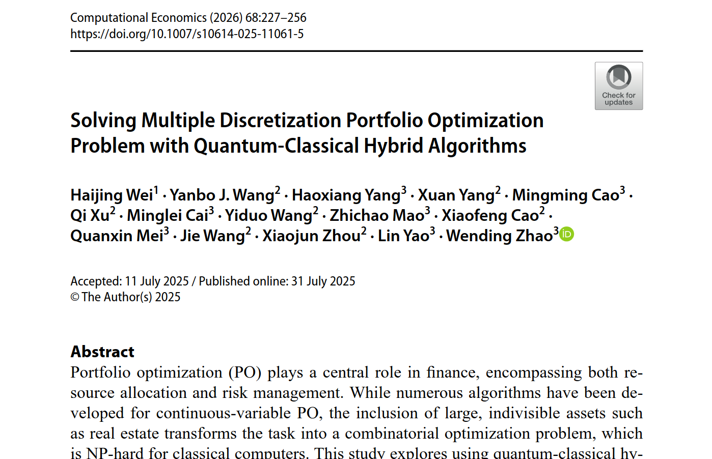
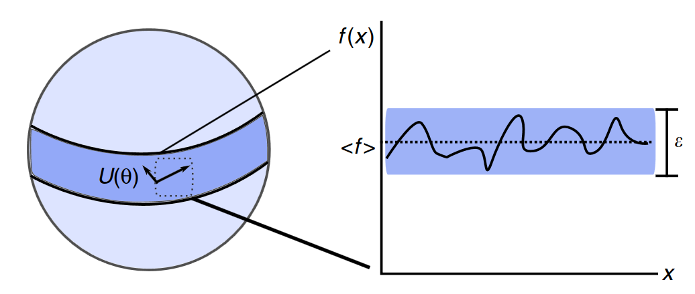
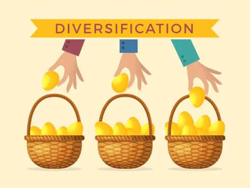
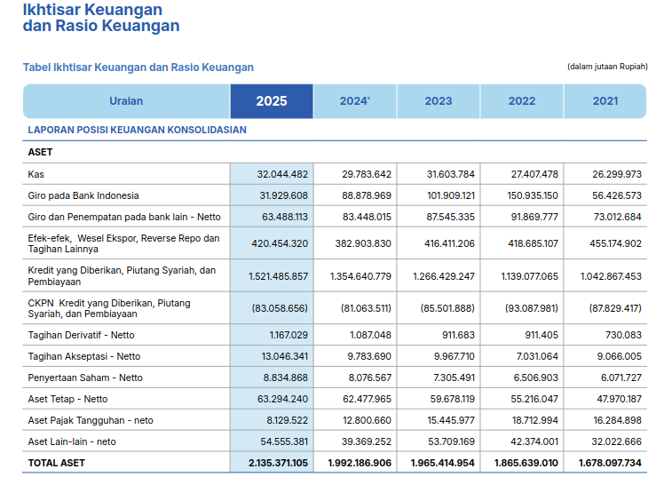
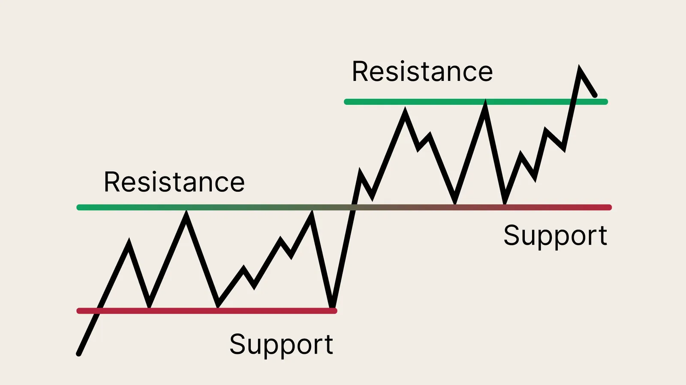
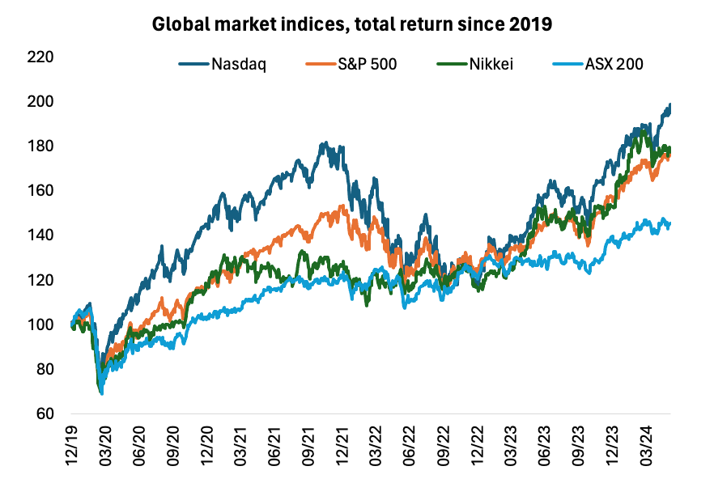
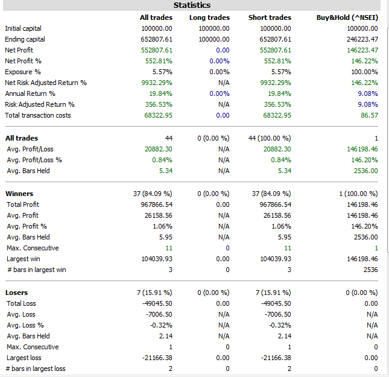

# Fase Latar Belakang

## Tokoh Penting yang Terlibat

:::: {style="display: flex; flex-wrap: wrap; justify-content: center; gap: 30px; margin-top: 20px;"}

::: {style="text-align: center; width: 28%;"}
{style="border-radius: 15px; height: 220px; object-fit: cover; box-shadow: 0 4px 8px rgba(0,0,0,0.2);"}
<div style="font-size: 0.8em; margin-top: 10px; font-weight: bold; color: #003366;">Harry Markowitz</div>
:::

::: {style="text-align: center; width: 28%;"}
{style="border-radius: 15px; height: 220px; object-fit: cover; box-shadow: 0 4px 8px rgba(0,0,0,0.2);"}
<div style="font-size: 0.8em; margin-top: 10px; font-weight: bold; color: #003366;">Wilhelm Lenz & Ernst Ising</div>
:::

::: {style="text-align: center; width: 28%;"}
{style="border-radius: 15px; height: 220px; object-fit: cover; box-shadow: 0 4px 8px rgba(0,0,0,0.2);"}
<div style="font-size: 0.8em; margin-top: 10px; font-weight: bold; color: #003366;">Lars Onsager</div>
:::

::: {style="text-align: center; width: 28%;"}
{style="border-radius: 15px; height: 220px; object-fit: cover; box-shadow: 0 4px 8px rgba(0,0,0,0.2);"}
<div style="font-size: 0.8em; margin-top: 10px; font-weight: bold; color: #003366;">John von Neumann</div>
:::

::: {style="text-align: center; width: 28%;"}
{style="border-radius: 15px; height: 220px; object-fit: cover; box-shadow: 0 4px 8px rgba(0,0,0,0.2);"}
<div style="font-size: 0.8em; margin-top: 10px; font-weight: bold; color: #003366;">Oskar Morgenstern</div>
:::

::: {style="text-align: center; width: 28%;"}
{style="border-radius: 15px; height: 220px; object-fit: cover; box-shadow: 0 4px 8px rgba(0,0,0,0.2);"}
<div style="font-size: 0.8em; margin-top: 10px; font-weight: bold; color: #003366;">Rosario N. Mantegna</div>
:::

::::

---

## Penelitian Terdahulu dan Research Gap

<style>
.card{
border:2px solid #d9d9d9;
border-radius:12px;
padding:12px;
min-height:340px;
background:#fafafa;
box-shadow:2px 2px 6px rgba(0,0,0,.08);
text-align:center;
font-size:0.9em;
}

.arrow{
font-size:2em;
text-align:center;
margin-top:120px;
color:#666;
}

.title{
font-weight:bold;
font-size:1.05em;
margin-top:8px;
margin-bottom:8px;
color:#003366;
}

.gap{
border:2px solid #cc3333;
background:#fff6f6;
}

.solusi{
border:2px solid #2e8b57;
background:#f3fff5;
}

.metric{
border:2px solid #5b3cc4;
background:#faf7ff;
}
</style>

:::: {.columns}

::: {.column width="23%"}

<div class="card">

<div class="title">
Penelitian Terdahulu
</div>


<div style="margin-top: 20px;">

**Wang dkk. (2025)**

VQE + WCVaR + CMA-ES

Stabilisasi konvergensi energi.

</div>

</div>

:::

::: {.column width="4%"}

<div class="arrow">

➜

</div>

:::

::: {.column width="23%"}

<div class="card">

<div class="title">
Penelitian Terdahulu
</div>



<div style="margin-top: 20px;">

**Wei dkk. (2025)**

Quantum-Classical Hybrid Annealing

Memecah masalah QUBO kompleks menjadi submasalah.

</div>

</div>

:::

::: {.column width="4%"}

<div class="arrow">

➜

</div>

:::

::: {.column width="23%"}

<div class="card gap">

<div class="title">
Research Gap
</div>



<div style="margin-top: 20px;">

Masih bergantung pada

**inisialisasi acak**

yang rentan mengalami

**Barren Plateau**

</div>

</div>

:::

::: {.column width="23%"}

<div class="card solusi">

<div class="title">
Solusi
</div>


<div style="margin-top: 20px;">

Menggunakan **Nash Equilibrium** sebagai **Warm-Start Initialization**

</div>
</div>
:::
::::

<div style="font-size:0.45em;margin-top:20px;color:#666;text-align:center;">

Sumber: Wang *et al.* (2025); Wei *et al.* (2025)

</div>

---

## Ekonomi dan Investasi

:::: {style="display: flex; justify-content: center; align-items: center; height: 70vh; gap: 30px;"}
::: {.column width="33%"}
{width="100%"}
{width="100%"}
<div style="font-size: 0.7em; text-align: center; margin-top:10px;">Inflasi & Guncangan Ekonomi</div>
:::
::: {.column width="33%"}
{width="100%"}
<div style="font-size: 0.7em; text-align: center; margin-top:10px;">Urgensi Investasi</div>
:::
::: {.column width="33%"}
{width="100%"}
<div style="font-size: 0.7em; text-align: center; margin-top:10px;">Diversifikasi Portofolio</div>
:::
::::

---

## Analisis Fundamental dan Teknikal

:::: {.columns}
::: {.column width="45%"}
**Analisis Fundamental**

<div style="text-align: center;">
{width="60%"}
<div style="font-size: 0.7em;">Struktur laporan arus kas fundamental.</div>
</div>

::: {style="font-size: 0.85em; margin-top: 15px;"}
* Ekonometrik Perusahaan
* Kesehatan Fiskal
* Sentimen Pasar
:::
:::

::: {.column width="55%"}
**Analisis Teknikal**

:::: {style="display: flex; justify-content: space-between; align-items: flex-end; text-align: center;"}
::: {style="width: 32%;"}

<div style="font-size: 0.6em;">*Candlestick*</div>
:::
::: {style="width: 32%;"}

<div style="font-size: 0.6em;">*Price Chart*</div>
:::
::: {style="width: 32%;"}

<div style="font-size: 0.6em;">*Support & Resistance*</div>
:::
::::

<br><br><br>

::: {style="font-size: 0.85em; margin-top: 15px;"}
* Representasi Psikologi Kolektif dari Agen Pasar
:::
:::
::::

---

## Analisis Kuantitatif
::::: {.columns}
:::: {.column width="35%"}
::: {style="font-size: 0.6em;"}
* **Simple Return ($R$):**
  $$ R_t = \frac{P_t - P_{t-1}}{P_{t-1}} $$
* **Expected Return ($\bar{R}$):**
  $$ \bar{R} = \frac{1}{n} \sum_{t=1}^n R_t $$
* **Variance ($\sigma^2$):**
  $$ \sigma^2 = \frac{1}{n-1} \sum_{t=1}^n (R_t - \bar{R})^2 $$
* **Covariance ($\sigma_{ij}$):**
  $$ \sigma_{ij} = \frac{1}{n-1} \sum_{t=1}^n (R_{i,t} - \bar{R}_i)(R_{j,t} - \bar{R}_j) $$
:::
::::
:::: {.column width="35%"}
::: {style="font-size: 0.6em;"}
* **Log Return ($r$):**
  $$ r_t = \ln\left(\frac{P_t}{P_{t-1}}\right) $$
* **Expected Return ($\bar{r}$):**
  $$ \bar{r} = \frac{1}{n} \sum_{t=1}^n r_t $$
* **Variance ($\sigma^2$):**
  $$ \sigma^2 = \frac{1}{n-1} \sum_{t=1}^n (r_t - \bar{r})^2 $$
* **Covariance ($\sigma_{ij}$):**
  $$ \sigma_{ij} = \frac{1}{n-1} \sum_{t=1}^n (r_{i,t} - \bar{r}_i)(r_{j,t} - \bar{r}_j) $$
:::
::::
:::: {.column width="30%"}
<div style="text-align: center; margin-top: 10px;">
{width="100%"}
<div style="font-size: 0.6em;">Transformasi pergerakan harga saham.</div>
</div>
::: {style="font-size: 0.6em; margin-top: 15px;"}
* $P_t$: Harga pada waktu $t$
:::
::::
:::::

---

## Model Markowitz {.scrollable}

::: {.panel-tabset}
### Rumus Utama
::::: {.columns}
:::: {.column width="60%"}
::: {style="font-size: 0.75em;"}
* **Mean-Variance:**
  $$ \mathcal{L}(\mathbf{\omega}) = \sum_{i,j} \sigma_{ij} \omega_i \omega_j - \lambda \sum_i \mu_i \omega_i $$
* **Binerisasi:**
  $$ \mathcal{L}(\mathbf{x}) = \sum_{i,j} \sigma_{ij} \frac{x_i x_j}{K^2} - \lambda \sum_i \mu_i \frac{x_i}{K} $$
:::

::: {style="font-size: 0.75em"}
* $\mu_i$: Imbal hasil rata-rata aset ke-$i$
* $\sigma_{ij}$: Kovarians antara aset $i$ dan $j$
* $\omega_i$: Proporsi bobot kontinu aset ke-$i$
* $\lambda$: Parameter toleransi risiko
:::
::::
:::: {.column width="40%"}
<div style="text-align: center; font-size: 0.8em; font-weight: bold; margin-bottom: 5px;">Contoh Alokasi Modal (Rp 10 Juta)</div>
<div style="display: flex; justify-content: center; margin-bottom: -10px;">
```{mermaid}
%%| fig-width: 4.5
%%{init: {"themeVariables": {"pieSectionTextSize": "36px", "pieLegendTextSize": "20px"}}}%%
pie 
  "Cash" : 40
  "BBCA" : 30
  "ADRO" : 30
```
</div>

<div style="font-size: 0.65em; display: flex; justify-content: center;">

| Aset | Persentase | Nominal |
|:---|:---:|:---|
| **Cash** | 40% | Rp 4.000.000 |
| **BBCA** | 30% | Rp 3.000.000 |
| **ADRO** | 30% | Rp 3.000.000 |

</div>
::::
:::::

### Penurunan Rumus
<div class="scrollable" style="max-height: 450px; font-size: 0.7em;">

**Langkah 1 — Formulasi Lagrangian Kontinu (Markowitz):**

Fungsi biaya Markowitz dalam domain bobot $\omega_i$:

$$\mathcal{L}(\mathbf{\omega}) = \sum_{i,j} \sigma_{ij} \omega_i \omega_j - \lambda \sum_i \mu_i \omega_i$$

dengan syarat $\sum_i \omega_i = 1$ dan $\omega_i \geq 0$.

---

**Langkah 2 — Substitusi Variabel Biner:**

Variabel bobot kontinu $\omega_i$ diubah menjadi variabel biner $x_i \in \{0, 1\}$ melalui hubungan:

$$\omega_i = \frac{x_i}{K}$$

di mana $K$ adalah jumlah aset yang dipilih dari total $N$ kandidat.

---

**Langkah 3 — Substitusi ke Lagrangian:**

Substitusi $\omega_i = x_i/K$ ke dalam fungsi Lagrangian:

$$\mathcal{L}(\mathbf{x}) = \sum_{i,j} \sigma_{ij} \frac{x_i}{K} \frac{x_j}{K} - \lambda \sum_i \mu_i \frac{x_i}{K}$$

$$\therefore \mathcal{L}(\mathbf{x}) = \sum_{i,j} \sigma_{ij} \frac{x_i x_j}{K^2} - \lambda \sum_i \mu_i \frac{x_i}{K}$$

Nilai $x_i = 1$ merepresentasikan **beli**, sedangkan $x_i = 0$ merepresentasikan **tidak membeli**.

---

| Simbol | Domain Kontinu | Domain Biner |
|:---:|:---:|:---:|
| Variabel keputusan | $\omega_i \in [0, 1]$ | $x_i \in \{0, 1\}$ |
| Kendala | $\sum \omega_i = 1$ | $\sum x_i = K$ |

<br><br><br>
</div>
:::

---

## Metode Evaluasi Performa (Backtesting)

:::: {.columns}
::: {.column width="50%"}

<div style="font-size: 0.7em; text-align: center; margin-top: 10px;">Simulasi riwayat harga dan rebalance portofolio secara periodik</div>
:::
::: {.column width="50%"}

<div style="font-size: 0.7em; text-align: center; margin-top: 10px;">Data backtesting pada sebuah strategi trading</div>
:::
::::

---

## Tujuan Penelitian

1. Menganalisis formulasi bias aset sebagai parameter medan lokal ($h_i$) dan interaksi antar aset sebagai koefisien kopling ($J_{ij}$) melalui pendekatan fungsi potensial dalam sistem Hamiltonian berbasis *Exact Potential Game* (EPG).
2. Mengevaluasi kontribusi strategi *warm-start* berbasis *Nash Equilibrium* dalam meningkatkan efisiensi pencarian solusi optimal pada algoritma VQE.
3. Menguji kapabilitas algoritma VQE yang menggunakan optimasi SPSA dan *Ansatz EfficientSU(2)* untuk menghasilkan keputusan alokasi aset yang optimal dalam kondisi pasar yang kompleks.

---

## Batasan Masalah (1/2)

1. Portofolio yang dianalisis dibatasi pada pemilihan 1 aset dari 2 pilihan aset pada sistem $N=2$ dan 2 aset dari 4 pilihan aset pada sistem $N=4$.
2. Model permainan yang digunakan adalah skema *non zero-sum game* dalam kerangka *Exact Potential Game*.
3. Simulasi dan implementasi algoritma dilakukan menggunakan simulator *Pennylane* tanpa mempertimbangkan *noise*.

---

## Batasan Masalah (2/2)

4. Tugas akhir ini hanya merupakan *proof-of-concept* dari implementasi *warm-start* ekuilibrium Nash terhadap performa algoritma VQE dalam menemukan solusi *ground state* pada model portofolio hibrida.
5. Analisis Entropi Von Neumann dibatasi sebagai indikator perubahan distribusi probabilitas keadaan kuantum selama proses optimasi VQE dan tidak digunakan sebagai kajian mendalam mengenai sifat keterbelitan dari *ansatz*.
6. Analisis berfokus pada pengaruh *warm-start* ekuilibrium Nash terhadap proses optimasi VQE, bukan untuk membuktikan keunggulan komputasi kuantum terhadap metode klasik.
