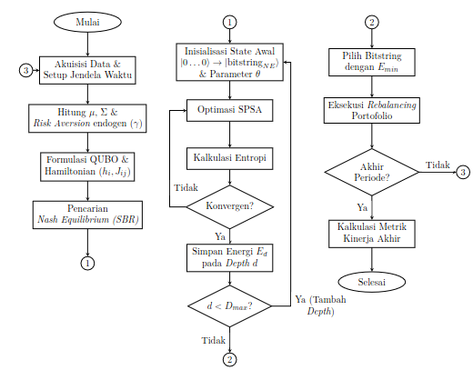
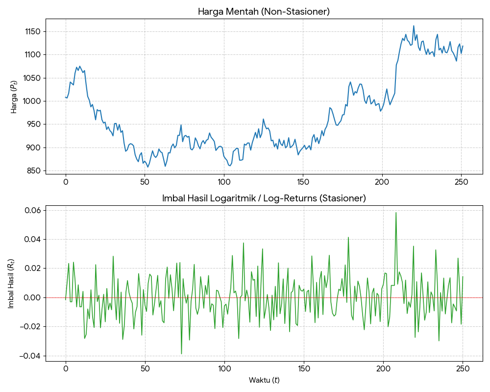
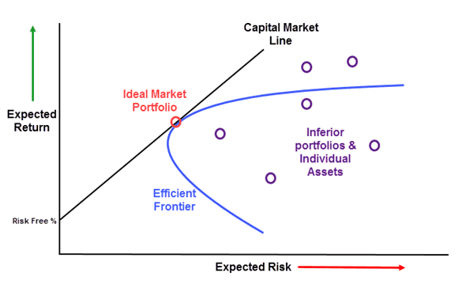
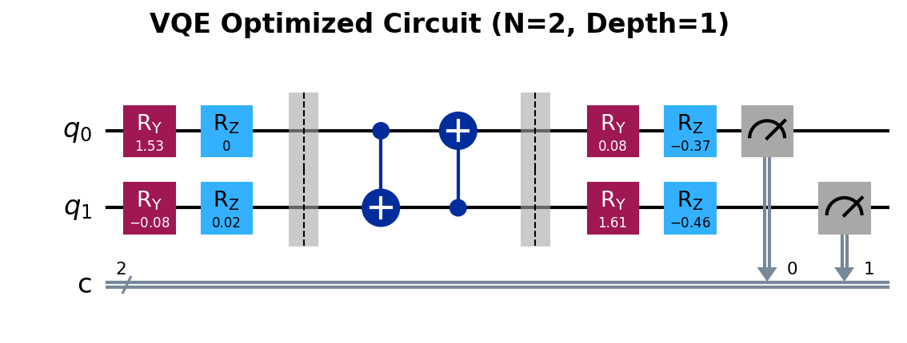

# Fase Metodologi

## Diagram Alir Utama

{fig-align="center" width=45%}

---

## Analisis Kuantitatif
::::: {.columns}
:::: {.column width="35%"}
::: {style="font-size: 0.6em;"}
* **Simple Return ($R$):**
  $$ R_t = \frac{P_t - P_{t-1}}{P_{t-1}} $$
* **Expected Return ($\bar{R}$):**
  $$ \bar{R} = \frac{1}{n} \sum_{t=1}^n R_t $$
* **Variance ($\sigma^2$):**
  $$ \sigma^2 = \frac{1}{n-1} \sum_{t=1}^n (R_t - \bar{R})^2 $$
* **Covariance ($\sigma_{ij}$):**
  $$ \sigma_{ij} = \frac{1}{n-1} \sum_{t=1}^n (R_{i,t} - \bar{R}_i)(R_{j,t} - \bar{R}_j) $$
:::
::::
:::: {.column width="35%"}
::: {style="font-size: 0.6em;"}
* **Log Return ($r$):**
  $$ r_t = \ln\left(\frac{P_t}{P_{t-1}}\right) $$
* **Expected Return ($\bar{r}$):**
  $$ \bar{r} = \frac{1}{n} \sum_{t=1}^n r_t $$
* **Variance ($\sigma^2$):**
  $$ \sigma^2 = \frac{1}{n-1} \sum_{t=1}^n (r_t - \bar{r})^2 $$
* **Covariance ($\sigma_{ij}$):**
  $$ \sigma_{ij} = \frac{1}{n-1} \sum_{t=1}^n (r_{i,t} - \bar{r}_i)(r_{j,t} - \bar{r}_j) $$
:::
::::
:::: {.column width="30%"}
<div style="text-align: center; margin-top: 10px;">
{width="100%"}
<div style="font-size: 0.6em;">Transformasi pergerakan harga saham.</div>
</div>
::: {style="font-size: 0.6em; margin-top: 15px;"}
* $P_t$: Harga pada waktu $t$
:::
::::
:::::

---

## Model Markowitz {.scrollable}

::: {.panel-tabset}
### Rumus Utama
::::: {.columns}
:::: {.column width="60%"}
::: {style="font-size: 0.75em;"}
* **Mean-Variance:**
  $$ \mathcal{L}(\mathbf{\omega}) = \sum_{i,j} \sigma_{ij} \omega_i \omega_j - \lambda \sum_i \mu_i \omega_i $$
* **Binerisasi:**
  $$ \mathcal{L}(\mathbf{x}) = \sum_{i,j} \sigma_{ij} \frac{x_i x_j}{K^2} - \lambda \sum_i \mu_i \frac{x_i}{K} $$
:::

::: {style="font-size: 0.75em"}
* $\mu_i$: Imbal hasil rata-rata aset ke-$i$
* $\sigma_{ij}$: Kovarians antara aset $i$ dan $j$
* $\omega_i$: Proporsi bobot kontinu aset ke-$i$
* $\lambda$: Parameter toleransi risiko
:::

<br><br>
::::
:::: {.column width="45%"}
<div style="text-align: center;">
{width="75%"}
<div style="font-size: 0.7em;">Grafik Efficient Frontier</div>
</div>
<br>

::: {style="font-size: 0.75em;"}
* Investor cenderung mencari portofolio pada *Efficient Frontier* untuk memaksimalkan *return* dengan risiko yang minimal.
:::
::::
:::::

### Penurunan Rumus
<div class="scrollable" style="max-height: 450px; font-size: 0.7em;">

**Langkah 1 — Formulasi Lagrangian Kontinu (Markowitz):**

Fungsi biaya Markowitz dalam domain bobot $\omega_i$:

$$\mathcal{L}(\mathbf{\omega}) = \sum_{i,j} \sigma_{ij} \omega_i \omega_j - \lambda \sum_i \mu_i \omega_i$$

dengan syarat $\sum_i \omega_i = 1$ dan $\omega_i \geq 0$.

---

**Langkah 2 — Substitusi Variabel Biner:**

Variabel bobot kontinu $\omega_i$ diubah menjadi variabel biner $x_i \in \{0, 1\}$ melalui hubungan:

$$\omega_i = \frac{x_i}{K}$$

di mana $K$ adalah jumlah aset yang dipilih dari total $N$ kandidat.

---

**Langkah 3 — Substitusi ke Lagrangian:**

Substitusi $\omega_i = x_i/K$ ke dalam fungsi Lagrangian:

$$\mathcal{L}(\mathbf{x}) = \sum_{i,j} \sigma_{ij} \frac{x_i}{K} \frac{x_j}{K} - \lambda \sum_i \mu_i \frac{x_i}{K}$$

$$\therefore \mathcal{L}(\mathbf{x}) = \sum_{i,j} \sigma_{ij} \frac{x_i x_j}{K^2} - \lambda \sum_i \mu_i \frac{x_i}{K}$$

Nilai $x_i = 1$ merepresentasikan **beli**, sedangkan $x_i = 0$ merepresentasikan **tidak membeli**.

---

| Simbol | Domain Kontinu | Domain Biner |
|:---:|:---:|:---:|
| Variabel keputusan | $\omega_i \in [0, 1]$ | $x_i \in \{0, 1\}$ |
| Kendala | $\sum \omega_i = 1$ | $\sum x_i = K$ |

<br><br><br>
</div>
:::

---

## Exact Potential Game (EPG)

::: {.r-stack}
:::: {.fragment .fade-out data-fragment-index="1" style="width: 100%;"}
* **Definisi:** Model permainan yang memiliki fungsi potensial global ($\Phi$), di mana setiap perubahan utilitas individu akibat perubahan strategi sepenuhnya tercermin oleh perubahan nilai $\Phi$.
* **Makna "Potensial" & "Global":**
  - **Potensial:** Sistem agen berdinamika menuju nilai ekuilibrium (maksimalisasi utilitas), yang secara fundamental ekuivalen dengan prinsip minimisasi energi ($H = -\Phi$) dalam fisika fisis.
  - **Global:** $\Phi$ merangkum seluruh utilitas individu ke dalam satu fungsi skalar tunggal untuk merepresentasikan kualitas konfigurasi strategi permainan secara keseluruhan.
::::

:::: {.fragment .fade-in data-fragment-index="1" style="width: 100%;"}
* **Kondisi *Nash Equilibrium*:** Perubahan utilitas lokal ($\Delta u_i$) sebanding persis dengan perubahan potensial global ($\Delta \Phi$).
  $$ \Delta \Phi = \Phi(s_i', s_{-i}) - \Phi(s_i, s_{-i}) = u_i(s_i', s_{-i}) - u_i(s_i, s_{-i}) $$
* Dinamika sistem akan terhenti dan mencapai *Nash Equilibrium* ketika tidak ada lagi strategi yang menghasilkan peningkatan potensial ($\Delta \Phi < 0$).
::::
:::

---

## EPG pada Alokasi Portofolio {.scrollable}

::: {.panel-tabset}
### Rumus Utama
* Transformasi persamaan utilitas Markowitz biner menjadi fungsi potensial global EPG:
  $$ \Phi(\mathbf{x}) = \sum_{l=1}^N \mu_l \frac{x_l}{K} - \frac{\gamma}{2}\sum_{i=1}^N\sum_{j=1}^N \sigma_{ij} \frac{x_i}{K} \frac{x_j}{K} $$
* dengan $\gamma$ mendefinisikan faktor penghindaran risiko (*risk aversion*) pada fungsi utilitas agen.

### Penurunan Rumus
<div class="scrollable" style="max-height: 450px; font-size: 0.7em;">
**Penurunan: Dari Model Markowitz Biner ke Fungsi Potensial EPG**

**Langkah 1 — Lagrangian Biner Markowitz:**

Dari transformasi $\omega_i = x_i/K$, diperoleh fungsi Lagrangian biner:

$$\mathcal{L}(\mathbf{x}) = \sum_{i,j} \sigma_{ij} \frac{x_i x_j}{K^2} - \lambda \sum_i \mu_i \frac{x_i}{K}$$

---

**Langkah 2 — Konversi ke Fungsi Utilitas:**

Definisikan faktor penghindaran risiko $\gamma = 2/\lambda$, sehingga:

$$U(\mathbf{x}) = - \frac{1}{\lambda} \mathcal{L}(\mathbf{x})$$

$$U(\mathbf{x}) = \sum_i \frac{\mu_i}{K} x_i - \frac{\gamma}{2K^2} \sum_{i,j} \sigma_{ij} x_i x_j$$

---

**Langkah 3 — Utilitas Individu Agen ke-$i$:**

$$u_i(\mathbf{x}) = \frac{\mu_i}{K} x_i - \frac{\gamma}{2K^2} x_i \left( \sum_{j \neq i} \sigma_{ij} x_j \right)$$

Jika varians dipisah dari matriks kovarians:

$$u_i(\mathbf{x}) = \frac{\mu_i}{K} x_i - \frac{\gamma}{2K^2} x_i \left( \sigma_{ii} + 2\sum_{j \neq i} \sigma_{ij} x_j \right)$$

---

**Langkah 4 — Fungsi Potensial Global $\Phi$:**

Dari utilitas sistem, fungsi potensial EPG:

$$\Phi(\mathbf{x}) = \sum_{l=1}^N \mu_l \frac{x_l}{K} - \frac{\gamma}{2}\sum_{i=1}^N\sum_{j=1}^N \sigma_{ij} \frac{x_i}{K} \frac{x_j}{K}$$

---

**Langkah 5 — Dekomposisi untuk Verifikasi $\Delta u_i = \Delta \Phi$:**

Dekomposisi suku yang mengandung $x_i$ (dengan $x_i^2 = x_i$):

$$\Phi(\mathbf{x}) = \frac{\mu_i}{K}x_i - \frac{\gamma}{2} \left( \frac{\sigma_{ii}}{K^2}x_i + \frac{2}{K^2}x_i \sum_{j \neq i} \sigma_{ij}x_j \right) + \underbrace{\sum_{l \neq i} \frac{\mu_l}{K}x_l - \frac{\gamma}{2} \sum_{l \neq i} \sum_{m \neq i} \frac{\sigma_{lm}}{K^2}x_l x_m}_{\text{tidak bergantung pada } x_i}$$

---

**Langkah 6 — Insentif Marginal:**

$$\Delta \Phi = \Phi(1, \mathbf{x}_{-i}) - \Phi(0, \mathbf{x}_{-i}) = \frac{\mu_i}{K} - \frac{\gamma \sigma_{ii}}{2K^2} - \frac{\gamma}{K^2} \sum_{j \neq i} \sigma_{ij} x_j$$

Karena $\Delta u_i = \Delta \Phi$ terjamin $\Rightarrow$ **terbukti** sebagai *Exact Potential Game*.

---

**Langkah 7 — Risk Aversion Endogen:**

$$\gamma = \frac{1}{1 + e^{(\bar{\mu}_l/\bar{\sigma}_l)}}$$

dengan $\bar{\mu}_l$ dan $\bar{\sigma}_l$ dari *log returns*.

<br><br><br>
</div>
:::

---

## Transformasi EPG ke Model Ising {.scrollable}

::: {.panel-tabset}
### Transformasi QUBO
<div style="font-size: 0.75em;">

**Fungsi Energi dari Potensial (Markowitz Biner):**
$$E(\mathbf{x}) = \frac{\gamma}{2K^2}\sum_{i=1}^N\sum_{j=1}^N \sigma_{ij} x_i x_j - \sum_{i=1}^N \frac{\mu_i}{K} x_i$$

**Hamiltonian Ising Akhir:**
Setelah memetakan variabel biner $x_i \in \{0,1\}$ ke variabel spin $s_i \in \{-1,1\}$:
$$\boxed{\hat{\mathcal{H}} = - \sum_{i=1}^N h_i \hat{Z}_i - \sum_{i<j}^N J_{ij} \hat{Z}_i \hat{Z}_j + C}$$

</div>

### Penurunan Rumus
<div class="scrollable" style="max-height: 500px; font-size: 0.7em;">
**Penurunan: Dari Fungsi Potensial Game ke Hamiltonian Ising**

**Langkah 1 — Fungsi Energi dari Potensial:**

Konversi dari maksimasi potensial ke minimasi energi:

$$E(\mathbf{x}) = -\Phi(\mathbf{x})$$

Substitusi $\Phi$ dari fungsi potensial Markowitz:

$$E(\mathbf{x}) = \frac{\gamma}{2K^2}\sum_{i=1}^N\sum_{j=1}^N \sigma_{ij} x_i x_j - \sum_{i=1}^N \frac{\mu_i}{K} x_i$$

---

**Langkah 2 — Dekomposisi dengan $x_i^2 = x_i$:**

$$E(\mathbf{x}) = \frac{\gamma}{2K^2}\left(\sum_{i=1}^N\sigma_{ii} x_i^2 + \sum_{i\ne j}\sigma_{ij} x_ix_j\right) -\sum_{i=1}^N \frac{\mu_i}{K} x_i$$

$$= \frac{\gamma}{2K^2}\sum_{i=1}^N\sigma_{ii} x_i + \frac{\gamma}{2K^2}\sum_{i\ne j}\sigma_{ij} x_ix_j - \sum_{i=1}^N \frac{\mu_i}{K} x_i$$

$$\therefore E(\mathbf{x}) = \sum_{i=1}^N\left(\frac{\gamma \sigma_{ii}}{2K^2} - \frac{\mu_i}{K}\right)x_i + \sum_{i\ne j}\frac{\gamma \sigma_{ij}}{2K^2} x_ix_j$$

---

**Langkah 3 — Penambahan Fungsi Penalti:**

Penalti kuadratik untuk memenuhi kendala $\sum x_i = K$:

$$P(\mathbf{x}) = A\left(\sum_{i=1}^N x_i - K\right)^2$$

Penjabaran:

$$P(\mathbf{x}) = A\sum_{i=1}^N x_i^2 + A\sum_{i\ne j} x_ix_j - 2AK\sum_{i=1}^N x_i + AK^2$$

---

**Langkah 4 — Energi Total (QUBO):**

$$E_{total}(\mathbf{x}) = E(\mathbf{x}) + P(\mathbf{x})$$

$$\therefore E_{total}(\mathbf{x}) = \sum_i \left(\frac{\gamma \sigma_{ii}}{2K^2} + A - \frac{\mu_i}{K} - 2AK\right)x_i + \sum_{i\ne j}\left(\frac{\gamma \sigma_{ij}}{2K^2} + A\right) x_ix_j + AK^2$$

---

**Langkah 5 — Notasi Koefisien QUBO:**

$$Q_{ii} = \frac{\gamma \sigma_{ii}}{2K^2}+A-\frac{\mu_i}{K}-2AK$$

$$Q_{ij} = \frac{\gamma \sigma_{ij}}{2K^2}+A$$

Sehingga:

$$E_{total}(\mathbf{x}) = \sum_i Q_{ii} x_i + \sum_{i\ne j} Q_{ij} x_ix_j + AK^2$$

---

**Langkah 6 — Transformasi Affine ke Domain Spin:**

Pemetaan biner $x_i \in \{0, 1\}$ ke *spin* $s_i \in \{-1, 1\}$:

$$x_i = \frac{(1 - s_i)}{2}, \quad x_ix_j = \frac{(1-s_i)(1-s_j)}{4}$$

Substitusi:

$$E_{total}(\mathbf{s}) = \sum_i Q_{ii} \frac{1-s_i}{2} + \sum_{i\ne j} Q_{ij} \frac{1 - s_i - s_j + s_is_j}{4} + AK^2$$

$$\therefore E_{total}(\mathbf{s}) = \sum_i \left(- \frac{Q_{ii}}{2} - \sum_{j \neq i} \frac{Q_{ij}}{2}\right) s_i + \sum_{i\ne j} \frac{Q_{ij}}{4} s_i s_j + \left(\sum_i \frac{Q_{ii}}{2} + \sum_{i\ne j} \frac{Q_{ij}}{4} + AK^2\right)$$

---

**Langkah 7 — Identifikasi Parameter Hamiltonian:**

| Parameter | Definisi | Makna Fisis |
|:---:|:---:|:---|
| $h_i$ | $- \frac{Q_{ii}}{2} - \sum_{j \neq i} \frac{Q_{ij}}{2}$ | Medan bias lokal |
| $J_{ij}$ | $\frac{Q_{ij}}{4}$ | Kopling antar *spin* |
| $C$ | $\sum_i \frac{Q_{ii}}{2} + \sum_{i\ne j} \frac{Q_{ij}}{4} + AK^2$ | Konstanta energi |

**Hasil Akhir — Hamiltonian Ising:**

$$\boxed{\hat{\mathcal{H}} = - \sum_{i=1}^N h_i \hat{Z}_i - \sum_{i<j}^N J_{ij} \hat{Z}_i \hat{Z}_j + C}$$

<br><br>
</div>
:::

---

## Desain Sirkuit Kuantum {.scrollable}

::: {.panel-tabset}
### Arsitektur Sirkuit
{fig-align="center" width="80%"}
<div style="font-size: 0.7em; text-align: center;">Arsitektur *Hardware-Efficient Ansatz* dengan *depth* $D=1$</div>

### Gerbang Rotasi Total
<div class="scrollable" style="max-height: 450px; font-size: 0.7em;">
**Matriks Rotasi $U_q(\theta)$ untuk 2 Qubit**

Berdasarkan definisi gerbang rotasi $R_y(\theta)$ dan $R_z(\theta)$:
$$
\begin{align}
U_{1q}(\theta) &= R_z(\theta_{1z}) R_y(\theta_{1y}) \\
&= \begin{pmatrix} e^{-i\theta_{1z}/2} & 0 \\ 0 & e^{i\theta_{1z}/2} \end{pmatrix} \begin{pmatrix} \cos(\theta_{1y}/2) & -\sin(\theta_{1y}/2) \\ \sin(\theta_{1y}/2) & \cos(\theta_{1y}/2) \end{pmatrix} \\
&= \begin{pmatrix} e^{-i\theta_{1z}/2} \cos(\theta_{1y}/2) & -e^{-i\theta_{1z}/2} \sin(\theta_{1y}/2) \\ e^{i\theta_{1z}/2} \sin(\theta_{1y}/2) & e^{i\theta_{1z}/2} \cos(\theta_{1y}/2) \end{pmatrix}
\end{align}
$$

Maka untuk sistem 2 qubit:
$$
\begin{align}
U_{q}(\theta) &= [R_z(\theta_{1z}) R_y(\theta_{1y})] \otimes [R_z(\theta_{2z}) R_y(\theta_{2y})]\\
&= \begin{pmatrix} e^{-i\theta_{1z}/2} \cos(\theta_{1y}/2) & -e^{-i\theta_{1z}/2} \sin(\theta_{1y}/2) \\ e^{i\theta_{1z}/2} \sin(\theta_{1y}/2) & e^{i\theta_{1z}/2} \cos(\theta_{1y}/2) \end{pmatrix} \otimes \begin{pmatrix} e^{-i\theta_{2z}/2} \cos(\theta_{2y}/2) & -e^{-i\theta_{2z}/2} \sin(\theta_{2y}/2) \\ e^{i\theta_{2z}/2} \sin(\theta_{2y}/2) & e^{i\theta_{2z}/2} \cos(\theta_{2y}/2) \end{pmatrix} \\
&= \begin{pmatrix} e^{-i(\theta_{1z}+\theta_{2z})/2} c_1c_2 & e^{-i(\theta_{1z}+\theta_{2z})/2} c_1s_2 & e^{-i(\theta_{1z}+\theta_{2z})/2} s_1c_2 & e^{-i(\theta_{1z}+\theta_{2z})/2}  s_1s_2  \\ e^{-i\theta_{1z}/2}e^{i\theta_{2z}/2} c_1s_2& e^{-i\theta_{1z}/2}e^{i\theta_{2z}/2}  c_1c_2& e^{-i\theta_{1z}/2}e^{i\theta_{2z}/2}  s_1s_2& e^{-i\theta_{1z}/2}e^{i\theta_{2z}/2}  s_1c_2  \\ e^{i\theta_{1z}/2}e^{-i\theta_{2z}/2} s_1c_2& e^{i\theta_{1z}/2}e^{-i\theta_{2z}/2} s_1s_2& e^{i\theta_{1z}/2}e^{-i\theta_{2z}/2} c_1c_2& e^{i\theta_{1z}/2}e^{-i\theta_{2z}/2}  c_1s_2  \\ e^{i(\theta_{1z}+\theta_{2z})/2}  s_1s_2& e^{i(\theta_{1z}+\theta_{2z})/2}  s_1c_2& e^{i(\theta_{1z}+\theta_{2z})/2}  c_1s_2& e^{i(\theta_{1z}+\theta_{2z})/2} c_1c_2 \end{pmatrix} \end{align}
$$
dengan
$$ c_i=\cos\frac{\theta_{iy}}2,\qquad s_i=\sin\frac{\theta_{iy}}2.  $$
<br><br><br><br>
</div>

### Gerbang CNOT Total
<div class="scrollable" style="max-height: 450px; font-size: 0.7em;">
**Matriks Gerbang Keterbelitan ($U_{ent}$) untuk 2 Qubit**

Untuk lapisan keterbelitan, secara umum didefinisikan:
$$
U_{ent} = CNOT_{(N-1,0)} \prod_{q=0}^{N-2} CNOT_{(q,q+1)}
$$

Untuk sistem 2 qubit, hal ini mereduksi menjadi:
$$
U_{ent} = CNOT_{(1,0)} \cdot CNOT_{(0,1)}
$$

di mana matriks untuk masing-masing gerbang adalah:
$$
CNOT_{(1,0)} = \begin{pmatrix} 1 & 0 & 0 & 0 \\ 0 & 0 & 0 & 1 \\ 0 & 0 & 1 & 0 \\ 0 & 1 & 0 & 0 \end{pmatrix} \quad CNOT_{(0,1)} = \begin{pmatrix} 1 & 0 & 0 & 0 \\ 0 & 1 & 0 & 0 \\ 0 & 0 & 0 & 1 \\ 0 & 0 & 1 & 0 \end{pmatrix}
$$

Sehingga matriks total keterbelitannya adalah:
$$
U_{ent} = \begin{pmatrix} 1 & 0 & 0 & 0 \\ 0 & 0 & 0 & 1 \\ 0 & 0 & 1 & 0 \\ 0 & 1 & 0 & 0 \end{pmatrix} \cdot \begin{pmatrix} 1 & 0 & 0 & 0 \\ 0 & 1 & 0 & 0 \\ 0 & 0 & 0 & 1 \\ 0 & 0 & 1 & 0 \end{pmatrix} = \begin{pmatrix} 1 & 0 & 0 & 0 \\ 0 & 0 & 1 & 0 \\ 0 & 0 & 0 & 1 \\ 0 & 1 & 0 & 0 \end{pmatrix}
$$
<br><br><br><br>
</div>
:::

---

## Optimizer SPSA {.scrollable}

::: {.panel-tabset}
### Rumus Utama
**SPSA (Simultaneous Perturbation Stochastic Approximation)**

* **Inovasi:** Mengestimasi gradien *seluruh* parameter secara simultan hanya menggunakan dua pengukuran (satu vektor perturbasi acak $\Delta$).
  $$ \hat{g}_k = \frac{E(\theta_k + c_k \Delta_k) - E(\theta_k - c_k \Delta_k)}{2 c_k \Delta_k} $$
* Dengan ekspektasi estimasi gradien yang terbukti ekuivalen dengan gradien eksak:
  $$ \mathbb{E} \left[ \hat{g}_k \right] = \nabla E(\theta_k) $$

### Penurunan Rumus
<div class="scrollable" style="max-height: 450px; font-size: 0.7em;">
**Penurunan: Estimator Gradien SPSA**

**Langkah 1 — Vektor Perturbasi Acak:**

$$\Delta_k = (\Delta_{k,1}, \Delta_{k,2}, \ldots, \Delta_{k,p}), \quad \Delta_{k,i} = \begin{cases} +1, & P = 1/2 \\ -1, & P = 1/2 \end{cases}$$

Setiap komponen mengikuti distribusi *Rademacher*.

---

**Langkah 2 — Evaluasi Fungsi Biaya:**

$$E_+ = E(\boldsymbol{\theta}_k + c_k\Delta_k), \quad E_- = E(\boldsymbol{\theta}_k - c_k\Delta_k)$$

---

**Langkah 3 — Ekspansi Taylor:**

$$E_+ = E(\boldsymbol{\theta}_k) + c_k \sum_{j=1}^{p} \Delta_j \frac{\partial E}{\partial \theta_j} + \frac{1}{2}c_k^2 \sum_{j=1}^{p} \Delta_j^2 \frac{\partial^2 E}{\partial \theta_j^2} + O(c_k^3)$$

$$E_- = E(\boldsymbol{\theta}_k) - c_k \sum_{j=1}^{p} \Delta_j \frac{\partial E}{\partial \theta_j} + \frac{1}{2}c_k^2 \sum_{j=1}^{p} \Delta_j^2 \frac{\partial^2 E}{\partial \theta_j^2} + O(c_k^3)$$

---

**Langkah 4 — Selisih (suku genap saling hilang):**

$$E_+ - E_- = 2c_k \sum_{j=1}^{p} \Delta_j \frac{\partial E}{\partial \theta_j} + O(c_k^3)$$

---

**Langkah 5 — Estimator Gradien:**

$$\hat{g}_i = \frac{E_+ - E_-}{2c_k \Delta_i} = \frac{\partial E}{\partial \theta_i} + \sum_{j \neq i} \frac{\Delta_j}{\Delta_i} \frac{\partial E}{\partial \theta_j}$$

---

**Langkah 6 — Bukti Tak-Bias:**

Karena $\Delta_j$ independen dan $\mathbb{E}\left[\frac{\Delta_j}{\Delta_i}\right] = 0$ untuk $j \neq i$:

$$\mathbb{E}[\hat{g}_i] = \frac{\partial E}{\partial \theta_i} + \sum_{j \neq i} \underbrace{\mathbb{E}\left[\frac{\Delta_j}{\Delta_i}\right]}_{= 0} \frac{\partial E}{\partial \theta_j} = \frac{\partial E}{\partial \theta_i}$$

$$\therefore \boxed{\mathbb{E}[\hat{\mathbf{g}}_k] = \nabla E(\boldsymbol{\theta}_k)}$$

---

**Langkah 7 — Pembaruan Parameter & Peluruhan:**

$$\boldsymbol{\theta}_{k+1} = \boldsymbol{\theta}_k - a_k \hat{\mathbf{g}}_k$$

dengan hiperparameter peluruhan:

$$a_k = \frac{a}{(A+k+1)^\alpha}, \quad c_k = \frac{c}{(k+1)^\gamma}$$

<br><br><br>
</div>
:::

---

## Evaluasi Distribusi Probabilitas (Entropi) {.scrollable}

::: {.panel-tabset}
### Evolusi Entropi: Studi Kasus Numerik

<div style="font-size: 0.7em;">
Pemanfaatan Entropi Von Neumann dalam memantau jejak persebaran probabilitas di titik konvergensi akhir VQE.
</div>

:::: {.columns}
::: {.column width="50%"}
<div style="font-size: 0.6em;">
**Sistem $N=2$**

| Parameter | Nilai |
|:---|:---:|
| Probabilitas mayoritas ($p_1$) | $0{,}98$ |
| Sisa probabilitas ($p_\text{rest}$) | $0{,}02$ |

**Kalkulasi:**
$$ S = -(0{,}98 \cdot \log_2(0{,}98) + 0{,}02 \cdot \log_2(0{,}02)) \approx 0{,}1414 \text{ bit} $$
→ Probabilitas sangat tersentralisasi dan stabil.
</div>
:::
::: {.column width="50%"}
<div style="font-size: 0.6em;">
**Sistem $N=4$**

| Parameter | Nilai |
|:---|:---:|
| Prob. Optimal ($p_1$) | $0{,}94$ |
| Prob. Alternatif ($p_2, p_3, p_4$) | @ $0{,}02$ |

**Kalkulasi:**
$$ S = -\left(0{,}94 \log_2(0{,}94) + 3 \times (0{,}02 \log_2(0{,}02))\right) \approx 0{,}4225 \text{ bit} $$
→ Jauh di bawah batas entropi maksimum $\log_2(4) = 2$ bit → deteksi *ground state* handal.
</div>
:::
::::

### Penurunan Rumus
<div class="scrollable" style="max-height: 450px; font-size: 0.7em;">
**Generalisasi: Dari Entropi Shannon ke Entropi Von Neumann**

**Langkah 1 — Entropi Shannon (Klasik):**

Untuk distribusi probabilitas diskrit $p_i$, entropi informasi didefinisikan sebagai:

$$H = - \sum_i p_i \log_2 (p_i)$$

---

**Langkah 2 — Definisi Entropi Von Neumann:**

Dalam mekanika kuantum, probabilitas digantikan oleh operator densitas $\rho$. Entropi Von Neumann didefinisikan langsung melalui fungsi operator tersebut:

$$S(\rho) = -\text{Tr}(\rho \log_2 \rho)$$

---

**Langkah 3 — Teorema Spektral:**

Karena operator densitas $\rho$ bersifat Hermitian, ia selalu dapat didiagonalisasi (dekomposisi spektral):

$$\rho = U \Lambda U^\dagger$$

dengan $\Lambda$ adalah matriks diagonal yang berisi nilai eigen $\lambda_i$, dan $U$ adalah matriks uniter.

---

**Langkah 4 — Logaritma Matriks:**

Berdasarkan definisi fungsi matriks, logaritma diterapkan pada nilai eigennya:

$$\log_2(\rho) = U (\log_2 \Lambda) U^\dagger$$

---

**Langkah 5 — Operasi *Trace* dan Invariansi:**

Kita kalikan $\rho$ dengan $\log_2(\rho)$:

$$\rho \log_2(\rho) = (U \Lambda U^\dagger) (U (\log_2 \Lambda) U^\dagger) = U (\Lambda \log_2 \Lambda) U^\dagger$$

Gunakan sifat invariansi *trace* ($\text{Tr}(U A U^\dagger) = \text{Tr}(A)$):

$$S(\rho) = -\text{Tr}(U (\Lambda \log_2 \Lambda) U^\dagger) = -\text{Tr}(\Lambda \log_2 \Lambda)$$

Karena $\Lambda$ adalah matriks diagonal, perhitungan *trace*-nya hanyalah jumlahan dari elemen diagonal:

$$\boxed{S(\rho) = -\sum_i \lambda_i \log_2 (\lambda_i)}$$

---

**Langkah 6 — Reduksi ke Bentuk Klasik:**

Jika $\rho$ sudah dalam bentuk diagonal murni di mana matriksnya mewakili campuran klasik murni, maka nilai eigen $\lambda_i$ akan sama dengan probabilitas $p_i$, sehingga rumusnya akan mereduksi secara identik menjadi Entropi Shannon biasa.

<br><br>
</div>
:::

---

## Algoritma Evaluasi: *Backtesting*

**Skema *Rolling Window Backtesting*:**

```pseudocode
Procedure BacktestLoop(Data, K)
  1. For t in Timeline:
  2.    mu, Sigma, gamma <- DataPreprocessing(t)
  3.    H <- BuildHamiltonian(mu, Sigma, gamma)
  4.    x_NE <- NashSBR(H) // Pencarian Titik Ekuilibrium
  5.    x_best_t <- AdaptiveVQE(H, x_NE) // GT-VQE Optimization
  6.    R_t <- ExecuteRebalance(x_best_t) // Pindah Aset Berdasarkan Sinyal
  7. Return PerformanceMetrics
EndProcedure
```

* Siklus dieksekusi secara iteratif melalui jendela waktu berjalan (*sliding window*) untuk mengevaluasi adaptabilitas model terhadap fluktuasi riil data historis pasar.

---

## Perhitungan Metrik Performa Finansial {.scrollable}

::: {.panel-tabset}
### Metrik Finansial
<div style="font-size: 0.7em;">
Untuk membandingkan performa model GT-VQE dengan *Equal Weight* dan optimasi klasik (SLSQP), parameter evaluasi yang dihitung mencakup:

::::: {.columns}
:::: {.column width="50%"}
* **Return Kumulatif:**
  Mengukur total pertumbuhan persentase modal selama periode simulasi.
  $$ R_{cum} = \prod_{t=1}^T (1 + R_t) - 1 $$
* **Sharpe Ratio:**
  Rasio antara *return* ekspektasi terhadap risiko volatilitas portofolio ($\sigma_p$).
  $$ \text{Sharpe} = \frac{\bar{R}_p - R_f}{\sigma_p} $$
  <div style="font-size: 0.8em; margin-top: -15px;">
  $\bar{R}_p$: Rata-rata *return* portofolio<br>
  $R_f$: Suku bunga bebas risiko (*risk-free rate*)<br>
  $\sigma_p$: Volatilitas *return* portofolio
  </div>
::::
:::: {.column width="50%"}
* **Maximum Drawdown (MDD):**
  Risiko kerugian maksimal dari puncak historis portofolio.
  $$ MDD = \max \frac{P_{peak} - P_{t}}{P_{peak}} $$
* **Equal Weight & SLSQP:**
  Sebagai *benchmark*, nilai metrik juga dievaluasi untuk portofolio $w_i = 1/K$ (*Equal Weight*) dan penyelesaian Lagrangian kontinu berbasis *Sequential Least Squares Programming* (SLSQP).
::::
:::::
</div>

### Optimasi Klasik SLSQP
Algoritma *Sequential Least Squares Programming* untuk menyelesaikan sub-masalah pemrograman kuadratik sebagai standar komparasi.

```pseudocode
Procedure SLSQPOptimizer(mu, Sigma, gamma)
  1. w_0 <- InitialWeights(1/N)
  2. B_0 <- I // Inisialisasi Hessian Identitas
  3. For k = 0, 1, 2, ... until converged:
  4.     g_k <- gamma * Sigma * w_k - mu // Hitung Gradien
  5.     Solve Sub-QP: min(g_k^T d + 0.5 d^T B_k d) s.t. constraints
  6.     a_k <- LineSearch(w_k, d)
  7.     w_{k+1} <- w_k + a_k * d
  8.     s_k <- w_{k+1} - w_k, y_k <- g_{k+1} - g_k
  9.     B_{k+1} <- UpdateBFGS(B_k, s_k, y_k)
  10. Return w_final
EndProcedure
```

### Contoh Numerik
<div class="scrollable" style="max-height: 450px; font-size: 0.7em;">

**Contoh Perhitungan SLSQP (Kasus $N=2$)**

Misalkan
$\mu=\begin{pmatrix}0.10\\0.05\end{pmatrix},\qquad\Sigma=\begin{pmatrix}0.04 & 0.01\\0.01 & 0.02\end{pmatrix},\qquad\gamma=1.$

**Inisialisasi**

$w_0=\begin{pmatrix}0.5\\0.5\end{pmatrix},\qquad B_0=\begin{pmatrix}1&0\\0&1\end{pmatrix}.$

**1. Hitung Gradien**

$g_0=\gamma\Sigma w_0-\mu.$

Karena

$\Sigma w_0=\begin{pmatrix}0.025\\0.015\end{pmatrix},$

maka

$g_0=\begin{pmatrix}-0.075\\-0.035\end{pmatrix}.$

---

**2. Selesaikan Sub-masalah Quadratic Programming**

Sub-QP yang diselesaikan adalah

$\min_d\left(g_0^Td+\frac12 d^TB_0d\right),$

dengan kendala

$d_1+d_2=0.$

Karena

$d_2=-d_1,$

fungsi objektif menjadi

$g(d_1)=-0.040d_1+d_1^2.$

Turunan pertama

$\frac{dg}{dd_1}=-0.040+2d_1=0$

memberikan solusi

$d=\begin{pmatrix}0.02\\-0.02\end{pmatrix}.$

---

**3. Line Search**

Misalkan hasil *line search* menghasilkan

$\alpha_0=1.$

---

**4. Update Bobot**

$w_1=w_0+\alpha_0d=\begin{pmatrix}0.52\\0.48\end{pmatrix}.$

---

**5. Update Hessian (BFGS)**

Hitung

$s_0=w_1-w_0=\begin{pmatrix}0.02\\-0.02\end{pmatrix},$

kemudian gradien baru

$g_1=\Sigma w_1-\mu=\begin{pmatrix}-0.0744\\-0.0352\end{pmatrix},$

sehingga

$y_0=g_1-g_0=\begin{pmatrix}0.0006\\-0.0002\end{pmatrix}.$

Selanjutnya matriks Hessian diperbarui menggunakan rumus BFGS

$B_1=B_0-\frac{B_0s_0s_0^TB_0}{s_0^TB_0s_0}+\frac{y_0y_0^T}{y_0^Ts_0},$

yang kemudian digunakan pada iterasi berikutnya.

**Iterasi selanjutnya mengulangi langkah yang sama hingga memenuhi kriteria konvergensi dan menghasilkan bobot portofolio optimal.**

<br><br><br>
</div>
:::
