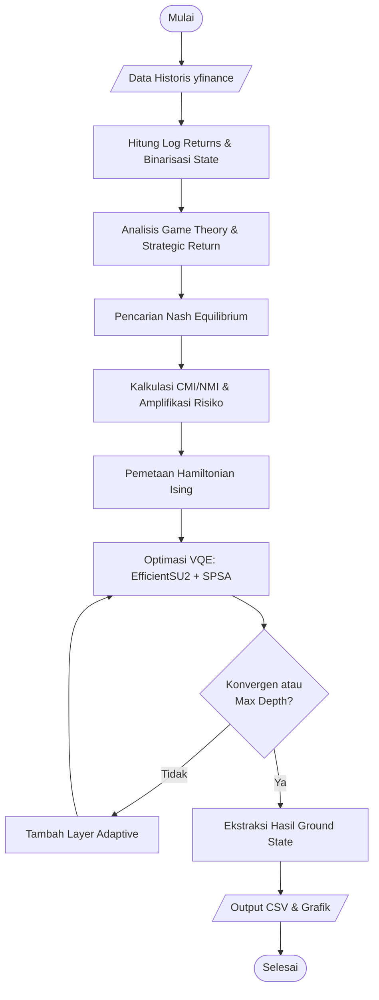

# Rencana Implementasi: Integrasi Potential Game & Ising Hamiltonian untuk Optimasi Portofolio

Dokumen ini merinci rencana pengembangan algoritma pencarian Hamiltonian menggunakan kombinasi *Exact Potential Game* dan *Classical Mutual Information* (CMI), diikuti dengan optimasi kuantum menggunakan *Variational Quantum Eigensolver* (VQE).

## 1. Tujuan Utama
- Mengimplementasikan formulasi Hamiltonian Ising berdasarkan konsep *Potential Game* dari `@Kombinasi_GT_Ising.pdf`.
- Melakukan pencarian *Nash Equilibrium* secara klasikal sebagai pembanding.
- Menjalankan optimasi VQE dengan ansatz `EfficientSU2` dan optimizer `SPSA` (referensi: `@All_HG.py`).
- Mengekstrak data hasil optimasi ke dalam format CSV dan visualisasi grafik tanpa melalui proses *backtesting*.

## 2. Alur Algoritma (Workflow)

### A. Tahap Pra-pemrosesan Data
1. **Data Acquisition**: Mengunduh data historis harga aset menggunakan `yfinance`.
2. **Returns Calculation**: Menghitung *log returns* harian.
3. **Binarization**: Pemetaan imbal hasil ke dalam *state* biner $\{u, d\}$ (up/down) berdasarkan *threshold* nol.

### B. Analisis Teori Permainan (Game Theory)
1. **Microstate Distribution**: Membangun distribusi probabilitas gabungan $P(s_1, s_2, \dots, s_N)$ untuk semua kemungkinan konfigurasi pasar.
2. **Strategic Return ($\tilde{\mu}_i$)**:
   - Menghitung *conditional expected return* $\bar{R}_i$ untuk setiap *microstate*.
   - Menghitung $\tilde{\mu}_i = \sum P(s) \times \bar{R}_i(s)$.
3. **Nash Equilibrium Search**:
   - Menggunakan *Best Response Dynamics* atau maksimisasi langsung fungsi potensial $\Phi(\mathbf{x})$ untuk menemukan titik kesetimbangan Nash dalam ruang biner.

### C. Integrasi Informasi Bersama (CMI/NMI)
1. **Entropy & MI**: Menghitung *Shannon Entropy* dan *Mutual Information* antar pasangan aset.
2. **Normalized Mutual Information (NMI)**: Melakukan skalarisasi informasi agar konsisten secara dimensional.
3. **Risk Matrix Amplification**: Modifikasi matriks kovariansi tradisional: $\tilde{\sigma}_{ij} = \sigma_{ij}[1 + NMI(i, j)]$.

### D. Konstruksi Hamiltonian Ising
1. **QUBO Parameters**:
   - $Q_{ii} = \left(\frac{\gamma}{2} \sigma_{ii} - \tilde{\mu}_i\right) + \lambda(1 - 2K)$
   - $Q_{ij} = \gamma \tilde{\sigma}_{ij} + 2\lambda$
2. **Ising Mapping**:
   - Kopling $J_{ij} = \frac{Q_{ij}}{4}$
   - Bias lokal $h_i = -\frac{Q_{ii}}{2} - \sum_{j \neq i} \frac{Q_{ij}}{4}$

### E. Optimasi VQE (Quantum Processing)
1. **Ansatz**: `EfficientSU2` (lapisan RY-RZ dengan *entanglement* CNOT ring).
2. **Optimizer**: SPSA dengan mekanisme *adaptive layers* dan deteksi konvergensi otomatis.
3. **Execution**: Menghitung *ground state energy* dan probabilitas state biner.

## 3. Rencana Output Data

### A. Data Ekstraksi (CSV)
- **Energies**: Perbandingan energi minimum (E_min) antara VQE, Nash Equilibrium, dan Brute Force (jika N kecil).
- **Selections**: Daftar aset yang terpilih dalam portofolio optimal.
- **Convergence**: Riwayat iterasi SPSA dan penurunan energi per *depth*.
- **Metrics**: Nilai $\tilde{\mu}_i$ dan $\tilde{\sigma}_{ij}$ final.

### B. Visualisasi (Grafik)
- **Convergence Plot**: Grafik penurunan energi terhadap jumlah iterasi/depth.
- **State Probability**: Histogram probabilitas kemunculan *state* dari pengukuran VQE.
- **Comparison Chart**: Perbandingan nilai utilitas/potensial antara berbagai metode pencarian.

## 4. Spesifikasi Teknis
- **Library Utama**: `pennylane`, `numpy`, `pandas`, `scipy`, `matplotlib`, `yfinance`.
- **Hardware Target**: `default.qubit` (Simulator).
- **Struktur File**: `Main_GT_Ising_VQE.py`.

---
*Rencana ini disusun untuk memastikan akurasi matematis sesuai derivasi dalam dokumen referensi.*

## 5. Diagram Alir (Flowchart)



## 6. Algoritma Nash Equilibrium (Pseudocode)

Algoritma ini menggunakan pendekatan *Best Response Dynamics* untuk mencari titik kesetimbangan Nash pada *Exact Potential Game* yang telah didefinisikan.

```text
ALGORITHM FindNashEquilibrium
INPUT: 
    N (Jumlah Aset), 
    StrategicReturns (mu_tilde), 
    RiskMatrix (sigma_tilde), 
    Gamma (Risk Aversion), 
    Lambda (Penalty Multiplier), 
    K (Target Cardinality)
OUTPUT: 
    x_nash (Vektor profil strategi biner)

BEGIN
    1. Inisialisasi x = [x_1, x_2, ..., x_N] secara acak atau nol (x_i in {0, 1})
    2. Tentukan Fungsi Potensial Phi(x):
       Phi(x) = sum(mu_tilde_i * x_i) - (gamma/2) * sum_sum(sigma_tilde_ij * x_i * x_j) - Lambda * (sum(x_i) - K)^2
    
    3. REPEAT (Iterasi Lahir/Luar):
        changed = FALSE
        
        4. FOR EACH player i FROM 1 TO N:
            a. Hitung Utilitas jika x_i = 0: u_0 = Phi(x[i=0])
            b. Hitung Utilitas jika x_i = 1: u_1 = Phi(x[i=1])
            
            c. IF u_1 > u_0 AND x_i == 0:
                x_i = 1
                changed = TRUE
            ELSE IF u_0 > u_1 AND x_i == 1:
                x_i = 0
                changed = TRUE
            END IF
        END FOR
        
    5. UNTIL changed == FALSE (Konvergensi tercapai)
    
    6. RETURN x AS x_nash
END
```


